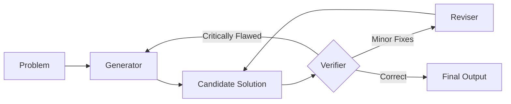

> [!IMPORTANT]
> **AI Assist Note (Knowledge Heritage)**:
> This document is part of the "Sovereign Reality" documentation.
> - **@docs ARCHITECTURE:Registry:Skills**
> - **Failure Path**: Information drift, legacy terminology, or documentation mismatch.
> - **Telemetry Link**: Cross-reference with `execution/parity_guard.py` results.
>
> ### AI Assist Note
> Core technical resource for the Tadpole OS Sovereign infrastructure.
>
> ### 🔍 Debugging & Observability
> Traceability via `parity_guard.py`.

---
name: aletheia-reasoning
description: Structured iterative reasoning framework for deep problem solving, featuring verification loops and refinement stages.

command: ""
---

# 🧠 Aletheia Reasoning Protocol
**Intelligence Level**: High (ECC Optimized)
**Source of Truth**: `.agent/skills/aletheia-reasoning/SKILL.md`, `directives/GEMINI.md`
**Last Hardened**: 2026-04-01
**Standard Compliance**: ECC-CORE (Enhanced Contextual Clarity - Core Reasoning)

> [!IMPORTANT]
> **AI Assist Note (Cognitive Logic)**:
> This is the foundational reasoning engine for all Tadpole agents.
> - **Loop Strictness**: Never bypass the **Verifier** stage.
> - **Fault Attribution**: Rejections MUST include a specific failure reason to guide the **Reviser**.
> - **Context Awareness**: The **Generator** must prioritize the user's specific OS and environment constraints.

---

# Aletheia Reasoning Protocol

Aletheia is a high-fidelity reasoning framework designed to bridge the gap between simple prediction and rigorous proof/verification. It utilizes an agentic loop to ensure logical consistency and peak accuracy for complex tasks.

## Architecture

The Aletheia workflow follows a strict iterative loop:

### 1. Generator
The initial engine that consumes the problem statement and produces a high-probability **Candidate Solution**. It focuses on breadth and creative approach selection.

### 2. Verifier
The critic. Its job is to audit the Candidate Solution for logical fallacies, edge-case failures, or inaccuracies.
- **Critically Flawed**: If the core logic or approach is broken, the Verifier triggers a hard reset back to the **Generator** with a description of why the approach failed.
- **Minor Fixes Needed**: If the solution is mostly correct but contains syntax errors, small omissions, or minor logical leaps, it forwards the solution to the **Reviser**.
- **Correct**: If it passes all checks, it proceeds to the **Final Output**.

### 3. Reviser
The refiner. It takes specific feedback from the Verifier and makes targeted adjustments to the Candidate Solution without starting from scratch. Once revised, the solution is sent back to the **Verifier** for re-evaluation.

## When to Use
- **Complex Mathematics**: Multi-step proofs or competition-level problems.
- **System Architecture**: Designing resilient infrastructure where failures are expensive.
- **Bug Root-Cause Analysis**: Verifying that a fix doesn't introduce regressions.
- **Code Refactoring**: Ensuring structural changes maintain functional parity.

## Operational Principles
1. **Never Assume**: The Verifier must treat every candidate as suspect until proven otherwise.
2. **Failure Attribution**: When rejecting a solution, the Verifier must state precisely *why* it failed (e.g., "hallucinated theorem" or "off-by-one error").
3. **Draft Context**: The Reviser should keep the history of previous failures to avoid repeating the same mistakes.

[//]: # (Metadata: [SKILL])

[//]: # (Metadata: [SKILL])
