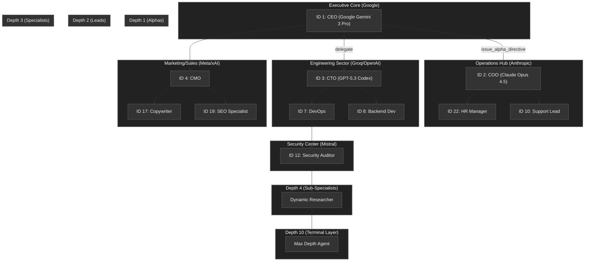

<div align="center">
  

  # 🐸 AI-Tadpole-OS Engine
  **The high-performance, local-first runtime for sovereign multi-agent swarms.**

  [](https://www.rust-lang.org/)
  [](https://react.dev/)
  [](https://tailwindcss.com/)
  [](https://github.com/DDS-Solutions/AI-Tadpole-OS/actions/workflows/ci.yml)
  [](https://github.com/DDS-Solutions/AI-Tadpole-OS/releases)
  [](docs/ARCHITECTURE.md#12-obliteratus-integration)
  [](docs/ARCHITECTURE.md#11-reliability-layer-hardening)
  [](LICENSE)
  [](SECURITY.md)
  [](https://github.com/DDS-Solutions/AI-Tadpole-OS/discussions)
  [](CONTRIBUTING.md)
  
  ---
</div>

AI-Tadpole-OS is a local-first runtime for orchestrating autonomous teams of AI agents — without sending your data to the cloud. You define a goal, assign a hierarchy of specialized agents (each with its own model, memory, and toolset), and the engine coordinates them in parallel. With **Agent 99: Self-Annealing**, the system autonomously extracts architectural wisdom from every mission, persisting institutional knowledge into its long-term memory for cross-mission learning. Whether you're automating a financial audit, a marketing pipeline, or a software deployment, Tadpole OS gives you the infrastructure to run complex, multi-step AI workflows with full visibility, strict budget controls, and the option to keep every token of data completely private.

> [!NOTE]
> **Status**: Production-Ready / OBLITERATUS Hardened / 100% Audit Verified  
> **Version**: 1.1.12  
> **Documentation Level**: Sovereign (Last Hardened: 2026-04-16)

## Table of Contents

- [🚀 Getting Started](#-getting-started)
- [🎯 Test Missions](#-test-missions)
- [🧩 Core Features](#-core-features)
- [🤖 Multi-Model Management](#-multi-model-management-triple-slot-architecture)
- [📚 Documentation Excellence](#-documentation-excellence)
- [🔱 Sovereign Forking Protocol](#-sovereign-forking-protocol)
- [🛡️ License](#-license)

---

## 🎯 Test Missions

Ready to take the swarm for a spin? We've curated a set of **[Small Missions](docs/TEST_MISSIONS.md)** to help you verify and experience the core skills of **Tadpole OS**, from basic model connectivity to autonomous background execution.

[👉 Start Testing Now](docs/TEST_MISSIONS.md)

---

## 🧩 Core Features

AI-Tadpole-OS is organized around **six capability pillars**. Each pillar covers a distinct domain — click "Full details" to expand the complete feature list for that area.

---

## 🖥️ 1. Reactive Interface & Observability

A sovereign multi-monitor dashboard built for high-density swarm oversight.

- **Multi-Tab Interface** — persistent navigation across operations, missions, and configs
- **Unified Observability Sidebar** — combines System Log, Neural Waterfall, and Swarm Pulse into one context-aware panel
- **Detachable Portals** — spread tactical sectors across multiple physical displays
- **10Hz Swarm Pulse** — sub-millisecond binary telemetry for real-time agent performance
- **Hardware Telemetry (Compute Stats)** — real-time CPU, RAM, and Process load visualization in the dashboard
- **Reconnection Intelligence** — WebSocket auto-reconnects on settings change

<details>
<summary>Full details →</summary>

- **Multi-Tab Sovereign Interface**: Persistent navigation via a multi-tab bar, allowing seamless switching between operations, missions, and configurations.
- **Observability Stack (Unified Sidebar)**: A smart, context-aware `Observability_Sidebar` that unifies the **System Log**, **Neural Waterfall**, and **Swarm Pulse**. It automatically synchronizes with detachable portals to prevent duplicate data streams.
- **Multi-Monitor Optimized**: Support for **Detachable Portals**, enabling operators to spread tactical sectors across multiple physical displays for high-density oversight.
- **Unified Tactical Header**: Dynamic, context-aware header featuring a **Smooth Carousel** for telemetry metrics and action buttons.
- **Live Stat Metrics**: Real-time visualization of agent performance, recruitment velocity, and system health.
- **Reconnection Intelligence**: WebSocket auto-connects when settings (URL/Key) change—no refresh needed.
- **Zustand Reactive Stores**: Unitary source of truth for settings, agents, and providers.
- **Lazy Singleton Socket**: Performance-optimized socket initialization via Proxy.
- **Command Palette**: Global `Cmd/Ctrl+K` or `Cmd/Ctrl+/` navigation for agents and actions.
- **Neural Lineage Breadcrumbs**: Real-time visibility into the swarm's recursive hierarchy.
- **Swarm Visualizer (God-View)**: High-performance 2D Force-Graph with animated MessagePack pulse traces and real-time node "heartbeat" indicators.

</details>

---

## 🤖 2. Multi-Agent Intelligence & Swarm Orchestration

The core engine for recruiting, coordinating, and governing hierarchical agent swarms.

- **CEO/COO Patterns** — explicit recursive delegation from strategic to tactical layers
- **Parallel Swarming** — high-throughput, concurrent sub-agent recruitment via `FuturesUnordered`
- **Autonomic Fallback** — self-healing OOM (Out Of Memory) detection with automatic `:q4_K_M` quantization fallback
- **Sovereign Recipes** — YAML-based declarative swarm blueprints with auto-ingestion from `.agent/recipes/`
- **Triple-Slot Model Routing** — every agent has Primary, Secondary, and Tertiary model slots

<details>
<summary>Full details →</summary>

- **Strategic Intent Handoffs**: Parent agents inject tactical context into sub-agent neural pathways.
- **Recursive Swarm Protocols**: Explicit **CEO (Agent of Nine)** and **COO (Tadpole Alpha)** patterns for strategic-to-tactical delegation.
- **Hierarchical Recruitment**: High-level agents can recruit ephemeral sub-agents via the **`recruit_specialist`** MCP tool.
- **Parallel Swarming**: Concurrent multi-agent recruitment via `FuturesUnordered`.
- **Lifecycle Hooks**: `pre-tool` and `post-tool` executable governance for security auditing.
- **Intelligence Forge**: Configure multiple modalities (LLM, REASONING, Vision) for the same model node.
- **Local LLM Support (Ollama)**: Seamless integration with local Ollama nodes for zero-latency, truly private execution.
- **Mission Analysis (Agent 99)**: Automated post-mission debriefs and **Self-Annealing** logic that extracts architectural wisdom from logs and persists it to institutional memory.
- **Triple-Slot Configuration**: Every agent possesses three model slots (Primary, Secondary, Tertiary) with granular per-slot provider, system prompt, and temperature control.
- **Manual Routing**: Using the "Zap" (Skill) icon on an agent node, operators can manually dispatch specific skills to specific slots.
- **Recursive Swarm Auto-Registration**: Parent agents automatically discover and register sub-agent capabilities into the **AI Services** registry, enabling cross-mission intelligence reuse.

</details>

---

## 🧠 3. Memory, Knowledge & RAG

Persistent, cross-session memory powered by a split-brain SQLite + LanceDB architecture.

- **Persistent Vector Memory** — LanceDB-backed semantic search across sessions
- **Mission RAG Scopes** — sandboxed per-mission search spaces, aggregated before synthesis
- **Identity & Long-Term Memory** — global `IDENTITY.md` and `LONG_TERM_MEMORY.md` injected at runtime
- **Cross-Mission Pattern Recognition** — Agent 99 detects behavioral drift and deduplicates swarm memory
- **Orphaned Scope Cleanup** — background Tokio service sweeps completed mission vector stores automatically

<details>
<summary>Full details →</summary>

- **Persistent Vector Memory**: Powered by LanceDB for cross-session institutional knowledge.
- **Mission RAG Scopes**: Agents spin up localized, sandboxed semantic search spaces per-mission to aggregate findings before synthesis.
- **Persistent Memory & Identity**: Global `directives/IDENTITY.md` and `directives/LONG_TERM_MEMORY.md` injection.
- **Mission Analysis & Wisdom Write-Back (Agent 99)**: Automated post-mission debriefs featuring **Self-Annealing** logic. The system distills architectural insights from mission logs and autonomously updates `directives/LONG_TERM_MEMORY.md`, ensuring the swarm learns and evolves across missions.
- **Split-Brain Memory Architecture**: SQLite handles deterministic relational data (logs, budgets), while LanceDB handles high-dimensional vector embeddings — a top-tier industry standard for RAG applications.
- **Orphaned Scope Cleanup**: A Tokio background service automatically sweeps completed/failed mission vector stores, preventing unbounded disk bloat.
- **Unified Persistence**: All agents and skill templates persist strictly via a unified SQLite schema — no disparate JSON registry or manual file synchronization required.

</details>

---

## 🛡️ 4. Security, Sovereignty & Compliance

Zero-trust governance with a hard gate for sensitive actions and full local-only operation.

- **Sapphire Shield** — strict schema validation; flags `budget:spend` and `shell:execute` for mandatory human approval
- **Privacy Mode** — hard gate that blocks all external cloud traffic for 100% data sovereignty
- **Continuity Scheduler** — cron-driven background swarm execution with per-mission budget caps and auto-disable safety
- **Graceful Degradation** — Null Provider fallback ensures the UI degrades gracefully (Amber Badging) rather than hard-crashing
- **CodeQL Verified** — automated vulnerability scanning on every commit

<details>
<summary>Full details →</summary>

- **Sapphire Shield (Phase 1)**: Strict schema validation and an automated security gate that flags `budget:spend` or `shell:execute` for mandatory human oversight. Includes **BroadcastChannel** session synchronization for `Neural_Vault` state consistency across multiple browser tabs.
- **Autonomous Continuity (Phase 2)**: Cron-driven **Continuity Scheduler** enabling background, proactive swarm execution with strict per-mission budget caps and auto-disable safety mechanisms for runaway failure prevention.
- **Graceful Degradation (Phase 3)**: Trait-driven **Null Provider** fallback ensures integration tests pass seamlessly without API keys and the UI degrades gracefully (Amber Badging) rather than hard-crashing during provider outages.
- **Privacy Mode (Shield)**: A "Hard Gate" that explicitly blocks all external cloud traffic for 100% data sovereignty.
- **Pre-deployment Verification Suite**: `verify_all.py` enforces documentation parity, security audit, system health, and latency benchmarking before every deploy.
- **Yield Phase Transition**: Rigid lock-step transitions for secure `Security_Hub` overwatch.
- **ADG Governance**: 100% automated sync between code and docs via the `parity_guard.py` system.

</details>

---

## ⚡ 5. Performance Architecture

A Rust-native engine engineered for sub-millisecond initialization and zero idle overhead.

- **10Hz Binary Telemetry** — Sub-millisecond `tadpole-pulse-v1` protocol using MessagePack for zero-latency swarm updates
- **Neural Context Pruning** — automatic truncation based on TPM limits using `tiktoken-rs`
- **Raw Tool Output** — tool handlers return results directly, eliminating redundant per-tool LLM synthesis calls
- **Cached Context** — `IDENTITY.md` and `LONG_TERM_MEMORY.md` loaded once at startup via `parking_lot::Mutex`
- **Unified Provider Dispatch** — all LLM calls route through a single `dispatch_to_provider()`; adding a new provider is a one-line edit

<details>
<summary>Full details →</summary>

- **Shared Rate Limiting**: Model-level RPM/TPM quotas enforced across all concurrent agents.
- **Neural Context Pruning**: Automatic truncation based on TPM limits using `tiktoken-rs`.
- **Unified Provider Dispatch (PERF-09)**: All LLM provider calls route through a single `dispatch_to_provider()` — adding a new provider is a one-edit operation.
- **Raw Tool Output (PERF-10)**: Tool handlers return raw results directly instead of making redundant per-tool synthesis LLM calls, eliminating token cost doubling.
- **Cached Context (PERF-11)**: `IDENTITY.md` and `LONG_TERM_MEMORY.md` loaded once at startup; `parking_lot::Mutex` for all synchronous locks; bounded tool cache (64 entries); `VecDeque` oversight ledger.
- **First Principles Architecture**: Lazy-loaded core engine resources with `tokio::sync::OnceCell` for sub-millisecond initialization and zero idle RAM consumption.
- **Performance Analytics Hub**: Persistent benchmarking system for tracking latency (mean, p95, p99) and performance deltas across all agent actions.
- **Real-Time Telemetry**: Corrected TPM calculation and bridged backend-frontend token usage mapping for 100% accurate display.
- **HATEOAS & Pulse Alignment**: REST Level 3 discovery and binary WebSocket multiplexing for sub-millisecond parity.

</details>

---

## 🔌 6. Skills, Tools & Local Infrastructure

A plug-and-play ecosystem for extending agent capabilities and running fully air-gapped swarms.

- **Unified MCP Skill Model** — standardized tool discovery and execution via the Model Context Protocol
- **Capability Import Engine** — one-click `.md` skill import with a structured preview gate before registration
- **Zero-Conf Swarm Discovery** — one-click local network scanning via mDNS (`_tadpole._tcp.local.`)
- **Sovereign Intelligence Store** — browse and pull Ollama/Hugging Face models with integrated VRAM profiling
- **In-App Swarm Template Store** — browse and install industry-specific agent swarms directly from the dashboard

<details>
<summary>Full details →</summary>

- **Unified MCP Skill Model**: Standardized tool discovery and execution via the **Model Context Protocol**. Support for native `.md` skill/workflow imports.
- **Capability Import Engine**: One-click import for documented skills and workflows via the **"Import .md"** gate. Includes a structured **Import Preview** for safety verification before registration.
- **Zero-Conf Swarm Discovery**: One-click local network scanning via mDNS (`_tadpole._tcp.local.`).
- **Privacy Mode (Shield)**: A "Hard Gate" that explicitly blocks all external cloud traffic for 100% data sovereignty.
- **Sovereign Intelligence Store**: Browse and pull models (Ollama/Hugging Face) with integrated **VRAM Hardware Profiling** to prevent node-level OOM failures.
- **Multi-Bunker Registry**: Unified dashboard for multi-node swarm management across your entire local network.
- **Neural Voice Integration**: Local-first Piper TTS, Whisper STT, Silero VAD, SQLite-backed audio cache, and real-time PCM streaming over binary WebSocket.
- **In-App Store**: Browse and install industry-specific agent swarms directly from the dashboard.
- **GitHub Native Hub**: Leverages public GitHub repositories as a decentralized distribution hub for swarm templates, installed natively via Git.
- **Automated Settings Migration**: Seamless transition from legacy OpenClaw configurations to the Tadpole OS unified settings store.

</details>
---

## 🏭 Industry-Specific Solutions
AI-Tadpole-OS provides "One-Click" deployment for specialized industry swarms via our **[Template Ecosystem](https://github.com/DDS-Solutions/AI-Tadpole-OS-Industry-Templates)**.

- **💸 Financial Services**: Automated bookkeeping and real-time audit trails.
- **📣 Digital Marketing**: Full-funnel content and ad optimization.
- **🏠 Real Estate**: High-velocity lead and transaction management.
- **🏭 Manufacturing**: Multi-tier templates for Job Shops (25 seats) up to Smart Factories (100 seats).
- **⚖️ Legal & Medical**: Specialized compliance-first intake and review swarms.

[👉 Explore the Template Registry](https://github.com/DDS-Solutions/Tadpole-OS-Industry-Templates/blob/main/registry.json)

## 🚀 Getting Started

### Prerequisites

- **Rust (1.80+):** Required for compiling the backend.
- **Node.js 20+:** Required for the React dashboard.
- **AI Provider Key (Optional but Recommended):** Configure at least one provider key (`GOOGLE_API_KEY`, `OPENAI_API_KEY`, `ANTHROPIC_API_KEY`, or `GROQ_API_KEY`) or run local-only via Ollama.

### Installation

1.  **Install Frontend Dependencies:**
    ```bash
    npm install
    ```

2.  **Prepare Backend:**
    The backend is located in `server-rs/`. It will be compiled on the first run via the `npm` scripts.

3.  **Configure Environment:**
    Create a `.env` file in the root directory:
    ```env
    NEURAL_TOKEN=your_secret_token_here
    GOOGLE_API_KEY=your_api_key_here
    ```

> [!IMPORTANT]
> **Required**: `NEURAL_TOKEN` must be set — the engine panics at startup if it is missing.
> **Sovereign Warning**: At startup, the engine performs a diagnostic check for configured AI providers. If no keys are found, it will issue a warning and guide you to `docs/GETTING_STARTED.md`.

### Running the Engine

Start the high-performance Rust engine:

```bash
npm run engine
```

The engine will start on `http://localhost:8000`.

> [!NOTE]
> **Production Access**: When deployed via Docker, the engine serves both the API and the React dashboard on this same port (8000). You do not need port 5173 for production.

### Running the Dashboard

In a separate terminal, start the React development server:

```bash
npm run dev
```

### 🛡️ Pre-deployment Verification

Before pushing changes or deploying to a Production Bunker, you **MUST** run the full verification suite to ensure 100% system parity and security compliance:

```bash
python execution/verify_all.py . --url http://localhost:8000
```

This gate enforces:
- **Documentation Parity (P0)**: Zero-drift detection between codebases and distributed `.md` documentation via `parity_guard.py`.
- **Security Audit (P0)**: Deep vulnerability scanning, secret detection, and dependency risk analysis.
- **System Health (P1)**: Complete unit and integration test suite pass.
- **Performance Benchmarking**: Latency p95/p99 validation for the core engine.

##  Example of a Hyper-Swarm Scenario: Max Scale Visualization

Here is what a **Full-Capacity Swarm** looks like when utilizing all potential offerings (10 Providers, 25 Agents, 10 Clusters, Recursion Depth 10).

### Swarm Hierarchy (Sample Topology)



### Resource Allocation Matrix (Max Scale)

| Cluster | Focus | Provider (Sample) | Model Capacity |
| :--- | :--- | :--- | :--- |
| **Executive Core** | Strategic Direction | **Google** | Pro / Flash |
| **Operations Hub** | Orchestration | **Anthropic** | Opus / Sonnet |
| **Engineering Sector** | Implementation | **Groq / OpenAI** | Llama / Codex |
| **Marketing/Sales** | Growth | **Meta / xAI** | Maverick / Grok |
| **Security Center** | Auditing | **Mistral** | Medium / Large |
| **Product Lab** | R&D | **DeepSeek** | V3 / R1 |
| **Finance Sector** | Fiscal Control | **Perplexity** (API) | Sonar |
| **Human Capital** | HR/Logistics | **OpenSource** | Qwen / GLM |
| **Legal/Compliance** | Risk Mgmt | **Local** | Ollama/Llama3 |
| **Logistics** | Fleet Mgmt | **Azure** | GPT-4o |

### Operational Impact of "Max Scale"
- **Distributed Compute**: 10 clusters allow for complete physical or logical isolation of workloads, preventing mission interference.
- **Provider Redundancy**: If a primary provider (e.g., Google) hits a rate limit, the swarm can dynamically reassign agents to 9 other fallback providers.
- **Recursive Density**: With a depth of 10, a single strategic prompt can fan out into over **100 concurrent sub-tasks** if each layer recruits just 3-4 specialists.
- **Token Expenditure**: At this scale, real-time cost monitoring (USD budget gate) becomes critical, as the "Neural Pulse" generates massive event bus traffic.

## 🤖 Multi-Model Management (Triple-Slot Architecture)

AI-Tadpole-OS supports **Multi-Model Routing** for every agent, allowing for manual failover or task-specific specialized model selection.

1.  **Triple-Slot Configuration**: Every agent possesses three model slots (Primary, Secondary, Tertiary).
2.  **Granular Control**: Each slot can have its own provider (e.g., Gemini 1.5 Pro on Primary, Llama 3 on Secondary), system prompt, and temperature.
3.  **Manual Routing**: Using the "Zap" (Skill) icon on an agent node, operators can manually dispatch specific skills to specific slots.
4.  **Persistent Active Slot**: The frontend tracks the `activeModelSlot` (1, 2, or 3) to ensure the agent's "Neural Presence" reflects its current active intelligence.


## 📚 Documentation Excellence
AI-Tadpole-OS provides a comprehensive "Strategic Success" suite for both the Overlord (Entity 0) (AKA Human-in-the-loop) and AI assistants:

- **[System Architecture](docs/ARCHITECTURE.md)**: Technical deep dive and data flows.
- **[Getting Started Guide](docs/GETTING_STARTED.md)**: Hardware requirements and first deployment.
- **[Swarm Orchestration](docs/SWARM_ORCHESTRATION.md)**: Guide to designing hierarchical, autonomous intelligence clusters.
- **[Conceptual Glossary](docs/GLOSSARY.md)**: Standardized terminology for Human-AI alignment.
- **[AI Codebase Map](docs/CODEBASE_MAP.md)**: Relationship guide optimized for AI development and navigation.
- **[Contributing Standards](CONTRIBUTING.md)**: Guidelines for joining the swarm.
- **[Project Roadmap](ROADMAP.md)**: Future milestones and strategic goals.
- **[Support Guide](SUPPORT.md)**: How to get help and report issues.
- **[API Reference](docs/API_REFERENCE.md)**: Complete REST and WebSocket endpoint documentation.
- **[Troubleshooting](docs/TROUBLESHOOTING.md)**: Comprehensive diagnostics for swarm and engine issues.
- **[Release Process](docs/RELEASE_PROCESS.md)**: Parity-guarded deployment and versioning protocols.

### 📝 Standardized Feedback
To ensure fast triaging and high-quality responses, please use our **[Issue Templates](https://github.com/DDS-Solutions/AI-Tadpole-OS/issues/new/choose)** when submitting feedback:
- [🐛 Bug Report](.github/ISSUE_TEMPLATE/bug_report.md)
- [💡 Feature Request](.github/ISSUE_TEMPLATE/feature_request.md)
- [🛡️ Security Vulnerability](SECURITY.md)

## 🔱 Sovereign Forking Protocol

AI-Tadpole-OS is built to be a foundational layer for your own AI endeavors. To create your own instance:

1. **Fork this Repository**: Click the 'Fork' button to create your own tacticial branch.
2. **Setup Local Environment**: Follow the [Getting Started Guide](docs/GETTING_STARTED.md).
3. **Customize your Agents**: Use the SQLite database or Swarm Template ecosystem to dynamically deploy your own specialists.
4. **Deploy**: Use the `deploy-bunker-1.ps1` or `deploy-bunker-2.ps1` script to push to your own Swarm Bunker.

We encourage "Overlords" to share their unique agent configurations and skill-sets back to the core via Pull Requests.

> [!TIP]
> **AI Readiness**: You can ask any AI assistant (like Claude or Gemini) to read the `CODEBASE_MAP.md` and `GLOSSARY.md` to get an instant, expert-level understanding of this project's inner workings.

---

- **Rust Engine (`server-rs/`):** The Axum-based server handling WebSockets, agent routing, and AI execution.
- **Agent Memory (`server-rs/src/agent/memory.rs`):** The LanceDB and Arrow-powered vector memory module utilizing Gemini `text-embedding-004`.
- **Persistence (`server-rs/src/agent/persistence.rs`):** Unified SQLite tracking for Agents, Sub-Agents, and their configurations.
- **Runner (`server-rs/src/agent/runner/mod.rs` & `analysis.rs`):** The native Tokio-based loop managing LLM communication, lock-step phase transitions, and post-mission synthesis.
- **Oversight Dash:** The Overlord (Entity 0) (AKA Human-in-the-loop) safety gate for approving/rejecting sensitive actions.

## 📜 License

MIT
