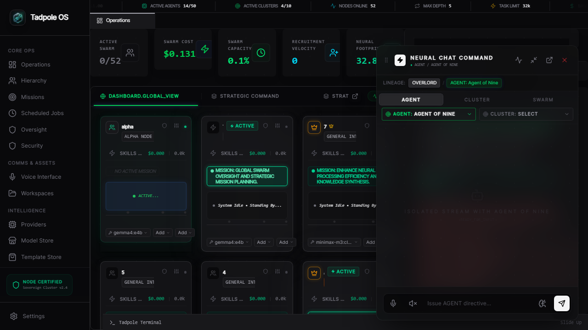
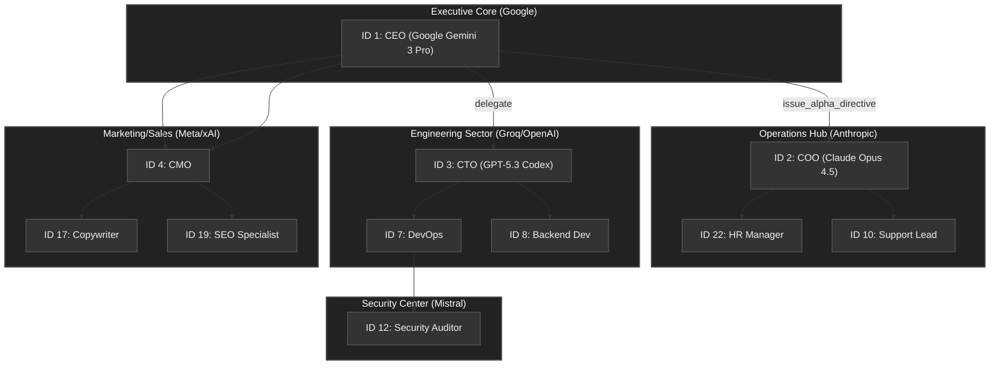

> [!IMPORTANT]
> **AI Assist Note (Knowledge Heritage)**:
> This document is part of the "Sovereign Reality" documentation.
> - **@docs ARCHITECTURE:Core**
> - **Failure Path**: Information drift, legacy terminology, or documentation mismatch.
> - **Telemetry Link**: Search `[README]` in audit logs.
>
> ### AI Assist Note
> Core technical resource for the Tadpole OS Sovereign infrastructure.
>
> ### 🔍 Debugging & Observability
> Traceability via `execution/parity_guard.py`.

<div align="center">
  

  # 🐸 AI-Tadpole-OS
  ### **Sovereign Intelligence. Deterministic Execution. Zero Data Leaks.**

  **The high-performance, local-first runtime for orchestrating autonomous multi-agent swarms.**

  **Version**: 1.1.351

  [](https://www.rust-lang.org/)
  [](https://react.dev/)
  [](https://tailwindcss.com/)
  [](https://github.com/DDS-Solutions/AI-Tadpole-OS/actions/workflows/ci.yml)
  [](docs/Security_Model.md)
  [](directives/FAULT_REGISTRY.md)
  [](reports/intelligence/audit_context.json)
  [](LICENSE)

  [🚀 Start a Mission](docs/TEST_MISSIONS.md) • [🏗️ Architecture Hub](docs/ARCHITECTURE.md) • [🛡️ Security Model](docs/Security_Model.md) • [🌐 Product Website](https://dds-solutions.github.io/AI-Tadpole-OS-Marketing/) • [💬 Join Discussions](https://github.com/DDS-Solutions/AI-Tadpole-OS/discussions)

  <br />
  <a href=".github/assets/dashboard_preview.mp4">
    
  </a>

  ---
</div>

AI-Tadpole-OS is a local-first runtime for orchestrating autonomous teams of AI agents — **without sending your data to the cloud.** Define a goal, assign a hierarchy of specialized agents, and watch the engine coordinate them in parallel. 

Designed for teams requiring **uncompromising data sovereignty**, Tadpole OS bridges the gap between probabilistic LLM outputs and deterministic business logic.

---

## 🛡️ Sovereignty starts with a Clone
In a world of "AI-as-a-Service," true independence is a local copy. We prioritize **Git Clones** because a clone is the ultimate act of data sovereignty:
- **Total Ownership**: No one can "unplug" your intelligence stack.
- **Privacy by Default**: Your data never leaves your infrastructure.
- **Air-Gapped Ready**: Run missions in completely disconnected environments.
- **Deterministic Control**: You own the code, the directives, and the domain knowledge.

**Clone the Repo. Own your Intelligence. Develop, Design and Deploy your own Company Digital Twin.**

---

## 🏗️ The 3-Layer Architecture
*Why Tadpole OS is more reliable than a standard agent wrapper.*

| Layer | Component | Purpose |
| :--- | :--- | :--- |
| **L1: Directive** | `directives/` | **Intent**: Human-defined SOPs and goals. Non-negotiable rules for the swarm. |
| **L2: Orchestration** | `Agent 99` | **Decision**: Intelligent routing, self-correction, and wisdom extraction. |
| **L3: Execution** | `execution/` | **Action**: Deterministic Python/Rust scripts. No "hallucinated" code execution. |

---

## 🧠 Feature Spotlight: Agent 99 (Self-Annealing)
**The system that learns from its own history.**

Tadpole OS doesn't just run tasks; it performs **Self-Annealing**. After every mission, **Agent 99** autonomously:
1.  **Extracts Architectural Wisdom**: Analyzes logs to find what worked and what didn't.
2.  **Updates Institutional Memory**: Writes learnings back to `LONG_TERM_MEMORY.md`.
3.  **Refines Protocols**: Adjusts its own directives to prevent future drift.

---

## 🧩 Core Capability Pillars

<details open>
<summary><b>🖥️ 1. Reactive Interface & Observability</b></summary>

Built for high-density swarm oversight with sub-millisecond telemetry.
- **Detachable Portals**: Spread tactical sectors across multiple physical displays.
- **10Hz Swarm Pulse**: Real-time MessagePack telemetry for agent performance.
- **God-View Visualizer**: High-performance 2D Force-Graph of your agent hierarchy.
- **Force-Graph View Mode HUD Toggle**: Switch between the standard **Codebase Symbols Graph** and the **Semantic OKF Graph** directly from the HUD. Employs a monochromatic Zinc theme to represent concepts and maps semantic colors (`cyber-green`, `cyber-amber`, `cyber-red`) strictly to live status and broken canonical links.
- **Codebase Knowledge Graph HUD**: Traversal history stack with Back/Forward controls, and double-scale high-res canvas PNG exports.
- **BFS Dependency Pathfinder**: Computes and highlights shortest dependency or call traces between symbols on the graph.
- **Resilient Sanitizer**: Fault-tolerant client-side parsing utility ensuring data schema and referential integrity.
- **Hardware Telemetry**: Real-time CPU, RAM, and Process load visualization.
</details>

<details>
<summary><b>🤖 2. Multi-Agent Swarm Orchestration & Persistence Engine</b></summary>

Hierarchical coordination powered by a Rust-native engine with localized resource payments and transactional integrity.
- **CEO/COO & Conductor DAG**: Strategic goal decomposition into topologically scheduled execution graphs (DAGs) using Kahn's/DFS sorting on step dependencies.
- **Transactional Persistence Guard**: SQLite transaction wrapping (`pool.begin()`) for `save_agent_db` and `sync_manifests_for_agent` guaranteeing 100% manifest synchronization atomicity.
- **Strict Corrupted State Fast-Failure**: Fail-fast JSON deserialization on agent loading (`parse_json_field` returning `Result<T, AppError>`) preventing silent data loss or lobotomization of agent skills and connector configs.
- **Parallel Swarming & Context Sandboxing**: High-throughput sub-agent recruitment via `FuturesUnordered` with strategic observation sandboxing (`visible_transcript`) to isolate context.
- **Builder-Debugger Pairing**: Automated active model slot swapping (Primary, Secondary, Tertiary) on tool compilation or execution failures.
- **Agent-to-Agent (A2A) Economic Zone**: Localized service-to-service payment protocol using a Two-Phase Commit (2PC) ledger (prepare, commit, rollback locks), daily budget limit caps per economic zone, x402 challenge protocol, and standard A2A-compliant async mailboxes preserving model reasoning traces and file artifacts.
- **Autonomic Fallback**: Self-healing quantization adjustment on hardware limits.
</details>

<details>
<summary><b>🧠 3. Memory & Persistent RAG</b></summary>

Split-brain architecture for semantic and relational data.
- **LanceDB Vector Store**: Cross-session institutional knowledge with strict predicate parameter sanitization to prevent vector query injection.
- **Transactional Dual-Write Atomicity**: Dual-write atomicity between SQLite and LanceDB (`add_entry`) with automatic transaction rollback on vector storage failure to eliminate orphaned "ghost" metadata entries.
- **Bounded OKF Playbook Cache**: Maximum capacity bounded cache (`MAX_CACHE_ENTRIES = 256`) with automatic TTL eviction for `okf_gate.rs` preventing memory leaks in high-scale runs.
- **Zero-Allocation Requirement Parser**: Hot-loop allocation-free requirement extraction using precomputed static matchers (`pattern_colon`, `pattern_space`).
- **Open Knowledge Format (OKF) Support**: Standardized swarm insight persistence mapping the OKF draft specification, automatically parsing and writing structured metadata directly to SQLite database columns via type-safe `sqlx::FromRow` structs.
- **$O(N)$ Linear Context Compactor**: Dialogue-level context compactor that performs history filtering in linear time instead of quadratic time, eliminating CPU overhead and UI freezing during long sessions.
- **IKS Pagination & Filtering**: Standardized API pagination supporting dynamic offset/limit and concept-type query filters on `/v1/knowledge` routes.
- **Mission Sandboxing**: Localized RAG scopes that cleanup automatically on completion.
- **Hybrid Search**: Combines SQLite deterministic logs with high-dimensional embeddings.
</details>

<details>
<summary><b>🛡️ 4. Security & Sovereign Compliance</b></summary>

Zero-trust governance with human-in-the-loop gates.
- **Sapphire Shield**: Flags `budget:spend` and `shell:execute` for manual approval.
- **Hard Privacy Gate**: Explicitly blocks external traffic for 100% air-gapped runs.
- **Decoupled Governance Architecture**: UI services (`workspace_service.ts`) isolated from raw state mutations with automatic optimistic state rollback on governance API failures.
- **OBLITERATUS Hardening**: 100% audit-verified code paths and Merkle trails.
- **Active Documentation Guard (ADG)**: Static analysis engine (Symbol Gate & Markdown Validator) that prevents conceptual drift by validating that all backticked code symbols in file headers match implementation code, and all path references in directives exist on disk.
- **Sovereign Compliance**: `IDENTITY.md v1.2.1` governs all agent behavior. Standards: ECC-ID, GxP, ISO 9001, ISO 42001, NIST AI-RMF, ALCOA+.
</details>

---

## 🚀 Quick Start (60 Seconds)

### 1. Prerequisites
- **Rust (1.80+)** & **Node.js 20+**
- **Ollama** (for local models) or an **API Key** (OpenAI, Anthropic, Google, Groq).

### 2. Installation
```bash
# Clone and install dependencies
git clone https://github.com/DDS-Solutions/AI-Tadpole-OS.git
cd AI-Tadpole-OS
npm install

# Setup environment
cp .env.example .env
# Edit .env and set your NEURAL_TOKEN and API Keys
```

### 3. Launch the Swarm
```bash
# Terminal A: Start the Rust Engine
npm run engine

# Terminal B: Start the React Dashboard
npm run dev
```

---

## 🛰️ Scalability & Topology: The Max-Scale Swarm
*Visualizing what a Full-Capacity Swarm (10 Clusters, 25 Agents) looks like.*

<details>
<summary><b>View Swarm Hierarchy Diagram</b></summary>


```mermaid
graph TD
    classDef cluster fill:#222,stroke:#444,stroke-width:2px,color:#fff;
    classDef node fill:#333,stroke:#666,color:#eee;

    subgraph Cluster0 ["Executive Core (Google)"]
        CEO["ID 1: CEO (Google Gemini 3 Pro)"]
    end

    CEO -->|issue_alpha_directive| COO["ID 2: COO (Claude Opus 4.5)"]
    CEO -->|delegate| CTO["ID 3: CTO (GPT-5.3 Codex)"]

    subgraph Cluster1 ["Operations Hub (Anthropic)"]
        COO --> Ops1["ID 22: HR Manager"]
        COO --> Ops2["ID 10: Support Lead"]
    end

    subgraph Cluster2 ["Engineering Sector (Groq/OpenAI)"]
        CTO --> Eng1["ID 7: DevOps"]
        CTO --> Eng2["ID 8: Backend Dev"]
    end

    subgraph Cluster3 ["Marketing/Sales (Meta/xAI)"]
        CEO --> CMO["ID 4: CMO"]
        CMO --> Mark1["ID 17: Copywriter"]
        CMO --> Mark2["ID 19: SEO Specialist"]
    end

    subgraph Cluster4 ["Security Center (Mistral)"]
        Eng1 --> Sec1["ID 12: Security Auditor"]
    end

    CEO --> CMO
    class Cluster0,Cluster1,Cluster2,Cluster3,Cluster4 cluster;
    class CEO,COO,CTO,CMO,Ops1,Ops2,Eng1,Eng2,Mark1,Mark2,Sec1 node;
```

### Resource Allocation Matrix (Sample)
| Cluster | Focus | Provider | Model Capacity |
| :--- | :--- | :--- | :--- |
| **Executive Core** | Strategic Direction | **Google** | Pro / Flash |
| **Operations Hub** | Orchestration | **Anthropic** | Opus / Sonnet |
| **Engineering Sector** | Implementation | **Groq / OpenAI** | Llama / Codex |
| **Security Center** | Auditing | **Mistral** | Medium / Large |

</details>

---

## 🏭 Industry-Specific Solutions
Deploy specialized "One-Click" swarms across **23 industries** (including Finance, Healthcare, Manufacturing, and more), featuring two main swarm archetypes:
- **🧠 Knowledge Work Swarms**: Specialized for research analysis, policy indexing, case law synthesis, and document auditing.
- **⚙️ Edge Operations Swarms**: Designed for physical logistics like inventory management, procurement QA, and ISO 9001 / ISO 42001 audits.

### 🛠️ The Swarm Architect & Agent Catalog
Don't want to start from scratch? Use our visual **Swarm Architect** to design your intelligence roster!
- **Agent Catalog**: Browse **200+ specialized AI agent roles** across multiple departments.
- **Hybrid AI Profiler**: Instantly suggests skills based on your company mission.
- **Institutional Knowledge (OKF)**: Swarm templates automatically ingest your bundled Markdown SOPs and playbooks into the local vector database upon deployment.
- **Sapphire Shield Security**: Zero-trust deployment with no executables, BYO keys, and mandatory human-in-the-loop approval for dangerous actions.

[👉 Explore the Template Registry & Agent Catalog](https://github.com/DDS-Solutions/Tadpole-OS-Industry-Templates)

---

## 🔱 Sovereign Cloning Protocol
AI-Tadpole-OS is engineered to be cloned locally. By granting workspace permissions, your AI assistant can fully immerse itself into the codebase—partnering directly with you to develop, design, deploy, and operate your company's sovereign Digital Twin:
1. **Clone this Repository** locally to establish total data ownership and sovereignty.
2. **Grant Workspace Access**: Allow your AI assistant to index local context, update directives, refine agent roles, monitor live telemetry streams while missions run (to catch errors, optimize performance, and identify enhancement opportunities), and continuously co-develop your operational stack.
3. **Customize & Operate**: Tailor specialized agent swarms via SQLite and Swarm Templates, then deploy using `deploy-bunker.ps1` or production scripts.

## ⚠️ What's Missing from a Fresh Clone (And Why)
> **Company-Agnostic by Design**: AI-Tadpole-OS provides the sovereign engine, security shield, vector RAG, and multi-agent DAG runner. To turn this generic engine into your specific **Company Digital Twin**, 7 organization-specific boundaries must be configured by your team:

### 1. 👤 Employee-Agent Identity Mapping
- **What's Missing**: Mappings between physical employees/roles, internal Active Directory/SSO credentials, role-based access control (RBAC) user bindings, and personal brand/tone calibrations.
- **Why It's Missing**: **Privacy & Zero-Trust Security by Design**. AI-Tadpole-OS enforces strict PII protection and security boundaries (`IDENTITY.md`, Sapphire Shield). Storing human employee credentials or identity records in source control would violate privacy regulations (GDPR/ISO 27001) and risk data leaks.

### 2. 🔌 Domain Knowledge Ingestion & Enterprise Connectors
- **What's Missing**: Pre-configured live data pipes to your organization's internal databases, custom CRMs/ERPs (e.g. QuickBooks, SAP, Salesforce), internal SharePoint drives, or proprietary document stores.
- **Why It's Missing**: **Air-Gapped Sovereign Independence**. AI-Tadpole-OS provides the local LanceDB vector store, OKF memory engine, and standard MCP connector blueprints. It does not bundle hardcoded external database paths or cloud API webhooks so your company data remains 100% local, self-contained, and air-gapped without unauthorized external routing.

### 3. 🔑 Enterprise Credentials & API Keys (`.env`)
- **What's Missing**: Model provider API keys (OpenAI, Anthropic, Gemini, Groq), local LLM endpoints (Ollama), and neural authentication tokens.
- **Why It's Missing**: **OBLITERATUS Security Hardening**. API keys and secrets are strictly git-ignored (`.gitignore`, `.env`). The repository provides `.env.example` so every user operates under a BYO (Bring Your Own) key model or runs entirely local models without exposing credentials.

### 4. 📜 Proprietary Company SOPs & Directives
- **What's Missing**: Your organization's custom internal operating procedures, proprietary business rules, and specialized regulatory execution flows.
- **Why It's Missing**: **Decoupled Architecture (Engine vs. Content)**. The repository includes core system directives and 23 generic industry templates via [Tadpole-OS-Industry-Templates](https://github.com/DDS-Solutions/Tadpole-OS-Industry-Templates). Your team populates your own private `.agent/` or `directives/` directory to tailor the swarm's L1 Intent to your exact business logic.

### 5. 💰 Financial Spending Authorities & Budget Caps
- **What's Missing**: Agent-specific daily dollar spend limits, purchase order authorization thresholds, and human signature requirements for commercial transactions.
- **Why It's Missing**: **Financial Risk Governance**. Every SMB operates under different financial authorization policies and signature limits. AI-Tadpole-OS provides the A2A double-entry ledger (`A2E-01`) and Sapphire Shield approval gates, but specific monetary limits must be defined per organization in your local config.

### 6. 💬 Outbound Communication Channels & External Touchpoints
- **What's Missing**: Live credentials for customer-facing touchpoints (e.g. Corporate Email SMTP, Twilio SMS, Slack/Discord tokens, WhatsApp Business APIs) and public-facing Customer Catalog endpoints (enabling external third-party agent swarms to interactively query public company information, service offerings, and product catalogs).
- **Why It's Missing**: **Outbound Safeguards & Boundary Isolation**. AI-Tadpole-OS isolates autonomous agent execution from the public internet. Outbound messaging and external agent interaction endpoints require explicit human-in-the-loop setup, rate-limiting, and public catalog boundary configuration to prevent unintentional data exposure or unauthorized external access.

### 7. 📊 Runtime Database State & Live Telemetry Traces
- **What's Missing**: Populated SQLite database entries, active mission run histories, and generated temporary artifacts.
- **Why It's Missing**: **Deterministic Fresh-Start Environment**. All local database files (`.tmp/`) and vector indexes are generated dynamically when running `npm run engine`. Shipping pre-populated database files would cause state corruption, schema drift, and merge conflicts across different developer environments.

---

<div align="center">
  <sub>Built with ❤️ by the <b>DDS-Solutions</b> Team.</sub>
  <br />
  <sub>Licensed under MIT. Sovereign Intelligence for all.</sub>
</div>

[//]: # (Metadata: [README])
