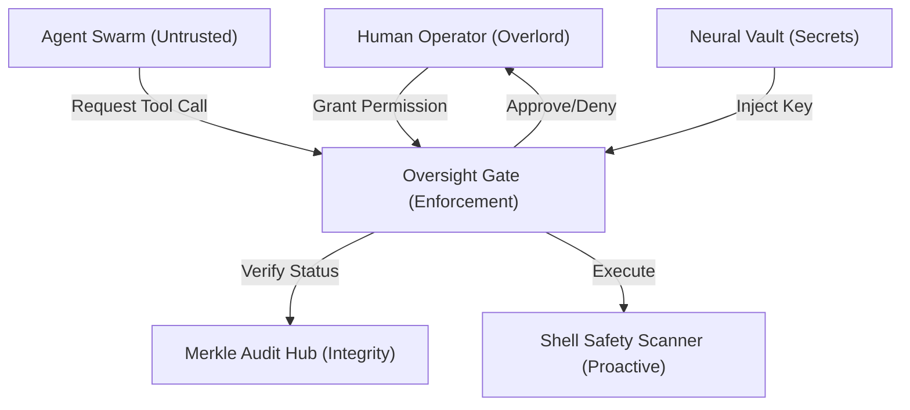

# 🛡️ Tadpole OS: Security Policy & Architecture

> **Intelligence Level**: High-Fidelity (Sovereign Context)  
> **Status**: Verified Production-Ready  
> **Version**: 1.2.0  
> **Last Hardened**: 2026-04-17 (Alignment Patch)  
> **Classification**: Sovereign  

---

> [!IMPORTANT]
> **AI Assist Note (Security Logic)**:
> This document defines the "Zero Trust" boundary of the Tadpole Engine.
> - **Mandatory Gate**: The **Oversight Gate** intercepts all high-risk tool calls (`ShellExecute`, `WriteFile`, `DeleteFile`).
> - **Proactive Detection**: The **Shell Safety Scanner** [DEFINE: Shell Safety Scanner] inspects commands for injection (`&&`, `|`) and secrets.
> - **Audit Trail**: Every action is SHA-256 linked in the **Merkle Audit Trail** [DEFINE: Merkle Audit Trail] (`audit.rs`).
> - **Privacy Shield**: When `PRIVACY_MODE=true`, block all outbound cloud traffic and route only to the **Local Swarm**.

---

## 🏗️ 2026-04-17 Technical Hardening (v1.1.13)
Modernized the security foundation for "Sovereign Traceability":
- **Neural Shield (v1.1.5)**: Unified dual-mode redaction (ENV exact-match + Regex pattern-match) into a single high-performance engine. Added coverage for Anthropic, Groq, AWS, and DB connection strings.
- **Sovereign Trace Synchronization**: Automated injection of `X-Request-Id` and W3C `traceparent` from headers into the internal `tracing` spans, ensuring 100% request-to-log correlation.
- **Redacted Error Surface**: All `ProblemDetails` (RFC 9457) responses now pass through the Neural Shield before serialization to prevent PII leakage.
- **Path Integrity**: Canonicalized absolute root locking remains the primary defense against traversal.

---

## 🛡️ Zero Trust Security Layers

---

## Overview
Tadpole OS implements a multi-layered, zero-trust security architecture designed to prevent autonomous agent rogue behavior, secret leakage, and unauthorized financial expenditure.

---

## 1. Governance & Oversight

### 1.1 The Oversight Gate
Tadpole OS utilizes a "Human-in-the-loop" governance model for high-risk operations. The system automatically intercepts and blocks tool execution for:
- **File System Modification**: Deleting or overwriting non-workspace files.
- **Budgetary Impact**: High-token-usage calls or manual budget adjustments.
- **Subprocess Spawning**: Executing shell scripts or external binaries.
- **Mission Completion**: Finalized delivery of mission-critical reports.
- **External Web Access**: All `fetch_url` calls trigger a mandatory Oversight Gate to prevent data exfiltration.
- **Privacy Shield (Hard Gate)**: When enabled, blocks all outbound calls to external cloud providers (Gemini, OpenAI, Groq), forcing local-only reasoning.

### 1.2 Skill-Based Security (CBS)
Skills (Skills) are defined via structured JSON manifests. 
- **Permissions-First**: Every skill must explicitly declare required permissions (e.g., `shell:execute`).
- **Standardization**: All tool calls are routed through the kernel's `McpHost`, ensuring consistent policy enforcement regardless of tool source.

### 1.3 Capability Ingestion Security
The **Import Engine** implements a restricted parsing model for `.md` files.
- **Preview Safety**: Imported content is never executed during the parsing phase. The **Import Preview Modal** provides a mandatory human-in-the-loop "Air-Gap" to verify the structured data before it is registered to the engine.
- **Category Isolation**: All manually imported capabilities are strictly assigned to the **User Services** category, preventing collision with protected system-level tools.
- **Validation**: The engine validates the structured JSON definition against strict schema requirements (`SkillDefinition` or `WorkflowDefinition`) before persistence.

### 1.4 Sapphire Shield Protocol
Enforces zero-trust execution for downloaded swarm templates.
- **Binary Restriction**: Templates are strictly forbidden from containing compiled binaries or executables.
- **Risk Assessment**: Any dynamic skill containing high-risk permissions (e.g., `shell:execute`) is automatically flagged for mandatory manual approval during the swarm initialization phase.

### 1.5 Auto-Registration Integrity
Autonomous capability capture is monitored for behavioral drift.
- **Attribution**: Every auto-registered capability is tagged with the **Agent ID** and **Mission ID** that generated it.
- **Namespace Isolation**: Discovered capabilities are assigned to the **AI Services** category, allowing operators to easily audit and filter autonomous additions.
- **Oversight of Usage**: Even after auto-registration, high-risk tools (e.g., shell access) within a discovered skill still trigger the standard **Oversight Gate** when called by any agent.

---

## 2. Proactive Defenses

### 2.1 Shell Safety Scanner (`scanner.rs`) [DEFINE: Shell Safety Scanner]
The engine includes a proactive regex-based scanner that inspects agent-generated code (Python/Bash) before execution.
- **Multi-Phase Mitigation**:
    - **Secret Detection**: Checks against known environment secrets (via `SecretRedactor`) and matches patterns for **OpenAI**, **Google**, **GitHub**, **Slack**, and more.
    - **Injection Protection**: Detects command concatenation (`;`, `&&`, `||`), piping (`|`), and output/input redirection (`>`, `<`).
    - **Substitution Defense**: Blocks command substitution (`$()`, `` ` ``) to prevent secondary payload execution.
    - **Export Enforcement**: Identifies and blocks raw secret exports (e.g., `export KEY=...`).
- **Enforcement Modes**:
    - **AUDIT**: Logs detections without blocking (Informational).
    - **ENFORCE**: Terminates the tool call and notifies the agent of the safety violation (Block). Defaults to `ENFORCE` in production.
- **Compliance Link**: `server-rs/src/security/scanner.rs` (`scan` method).

### 2.2 Budget Guard & Persistent Metering
Financial security is enforced at the kernel level using SQLite persistence.
- **Persistent Quotas**: Budgets survive server restarts and are enforced across multiple sessions.
- **Downtime protection**: If the `BudgetGuard` cannot verify remaining quota (e.g., DB lock), it defaults to a **Fail-Closed** state, blocking execution.
- **Self-Healing Throttle**: The `AgentHealth` module monitors for "fail-looping" agents. If an agent wastes budget on consecutive errors, it is automatically throttled or suspended.

---

## 3. Cryptographic Accountability

### 3.1 Merkle Audit Trail (`audit.rs`)
Tadpole OS records all critical actions (ToolCalls, Decisions, PolicyChanges) in a tamper-evident cryptographic ledger.
- **Hash Chaining**: Each record is SHA-256 linked to the previous entry, creating a linear chain of custody.
- **ED25519 Signatures**: Every audit entry is cryptographically signed using the ED25519 algorithm. This provides **Non-repudiation**, ensuring that an agent's actions can be definitively traced back to a specific session and verified by the human operator.
- **Granular Verification**: The system supports both full-chain verification (`verify_chain()`) and per-record validation (`verify_record()`). Individual audit logs can be verified independently to detect granular tampering.
- **Identity Context (IBM Research Alignment)**: Every audit entry now records the **User ID** and **Mission Instance ID**. These fields are included in the SHA-256 hash chaining, making the entire identity context (Human -> App -> Agent -> Data) tamper-evident.
- **Integrity Verification**: The system provides a `/v1/oversight/security/integrity` endpoint to cryptographically prove that the log has not been manually altered.
- **Production Requirement**: A valid hex-encoded Ed25519 key must be provided via `AUDIT_PRIVATE_KEY` for production deployments. If missing, the Merkle Hub will fail-closed to prevent unsigned (and therefore repudiable) actions.

---

## 4. Secret Management (Neural Vault)

### 4.1 Client-Side Encryption (Web Worker Isolated)
API keys are protected via the **NeuralVault** infrastructure.
- **AES-256-GCM**: Keys are encrypted client-side using a user-provided Master Passphrase.
- **SubtleCrypto Protocol**: Encryption relies on the browser's hardware-accelerated SubtleCrypto API.
- **Secure Context Barrier**: Cryptographic functions are automatically disabled if the application is not served over a secure channel (HTTPS) or local host alias (`localhost`/`127.0.0.1`).
- **Worker Isolation**: Decryption occurs inside a dedicated **Web Worker** thread, isolating key material from the main UI thread during sensitive operations.
- **Volatile Execution**: Keys are injected into the agent's environment only at the moment of execution and are never persisted to disk or indexedDB.
- **Auto-Locking**: Inactivity timers (default 30m) wipe the Master Key from memory, deep-freezing the engine until re-authorization.
- **Emergency Purge**: An **Emergency Vault Reset** protocol allows users to clear all encrypted configurations from local storage if a passphrase is lost, ensuring no stale encrypted data remains.

---

## 5. Resource Guard & Sandbox Awareness

Tadpole OS proactively monitors its execution environment to prevent platform-level attacks and resource starvation.

### 5.1 Resource Exhaustion Defense
The engine tracks critical system metrics to maintain stability and security:
- **RAM Pressure Monitoring**: Real-time tracking of memory usage. The interface alerts the operator if the engine or host system approaches memory limits, preventing OOM (Out Of Memory) conditions that could lead to denial of service.
- **CPU Load Verification**: Monitors processing intensity to detect recursive agent loops or malformed tool execution that could saturate host resources.

### 5.2 Sandbox Detection
The system automatically identifies its runtime environment to assess available security primitives:
- **Environment Awareness**: Detects if running within **Docker**, **Kubernetes**, or a **Virtual Machine**.
- **Skill Mapping**: Adjusts security assumptions based on the sandbox type (e.g., restricted filesystem access in containerized environments).

---

## 6. Network & Infrastructure Safety

### 6.1 Sandboxed Workspaces
Agents are restricted to physical directories under `workspaces/<cluster-id>/`.
- **Absolute Paths**: All file tools enforce absolute, canonicalized paths to prevent symlink-escape attacks.
- **Process Guard**: External subprocesses are wrapped in an asynchronous watchdog with a 60s timeout to prevent resource exhaustion (Fork Bombs / Deadlocks).

---

## 7. Local Path Integrity (`security.rs`)

Tadpole OS implements a centralized path validation primitive (`validate_path`) that is applied to ALL file-system interactions involving user-controlled data.

- **Component Normalization**: Paths are broken down into components and verified for illegal traversal tokens (`..`, root prefixes).
- **Absolute Root Locking**: Every validated path is checked to ensure it remains a strict descendant of the authorized base directory (Workspace, Execution Dir, or Codebase Root).
- **ID Sanitization**: User-provided identifiers (Mission IDs, Agent IDs, Hook Types) are automatically stripped of non-alphanumeric characters before being used as filenames, providing a secondary layer of defense against injection.

---

## 8. Reporting Vulnerabilities
If you discover a security vulnerability in Tadpole OS, please do not open a public issue. Instead, report it to the core security team via the designated sovereign channel.
