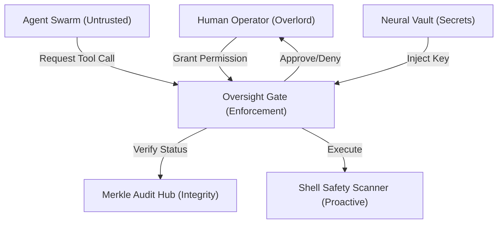

> [!IMPORTANT]
> **AI Assist Note (Knowledge Heritage)**:
> This document is part of the "Sovereign Reality" documentation.
> - **@docs ARCHITECTURE:Core**
> - **Failure Path**: Information drift, legacy terminology, or documentation mismatch.
> - **Telemetry Link**: Search `[SECURITY]` in audit logs.
>
> ### AI Assist Note
> 🛡️ Tadpole OS: Security Policy & Architecture
>
> ### 🔍 Debugging & Observability
> Traceability via `execution/parity_guard.py`.

# 🛡️ Tadpole OS: Security Policy & Architecture

> **Intelligence Level**: High-Fidelity (Sovereign Context)  
> **Status**: Verified Production-Ready  
> **Version**: 1.2.1  
> **Last Hardened**: 2026-06-23 (Audit Ledger v3 + Scanner Hardening)  
> **Classification**: Sovereign  

---

---

---

## 🏗️ 2026-06-23 Technical Hardening (v1.2.1)
Audit Ledger promoted to **v3** (`AUDIT-V2` domain separator retained for chain continuity); Shell Safety Scanner hardened for test isolation.

### `server-rs/src/security/audit.rs` — Merkle Audit Ledger v3
- **X-001 TOCTOU Elimination**: Hash computation, Ed25519 signing, and DB insertion now serialized on a single writer task. The v2 cache+DB race condition is architecturally closed.
- **X-002 Field-Omission Hardening**: Canonical hash uses explicit presence bytes (`0x00`/`0x01`) for `mission_id` and `user_id` Optional fields, preventing hash collisions from `Some(x)` ↔ `None` substitutions.
- **V2-002/V2-003/AV3-001 Secret Hygiene**: Ed25519 `SigningKey` wrapped in `secrecy::SecretBox<SecretSigningKey>`; hex-decode staging buffer and env-var source string wrapped in `zeroize::Zeroizing`. All sensitive buffers zeroized on drop.
- **V2-004 Error Surface Reduction**: `AuditError` is a discriminant-only enum. The underlying `sqlx::Error` message is never propagated to callers, closing the log-injection vector.
- **V2-006 Bounded Startup**: Worker startup DB read is bounded by a 5-second timeout; returns `Err` on timeout instead of hanging indefinitely.
- **AV3-004 Panic Recovery**: Writer task wraps `process_one` in `AssertUnwindSafe + catch_unwind`. A panic in one write no longer kills the entire worker loop.
- **Public API**: `AuditWriteRequest` and `resp_tx` are now fully private. `get_last_hash` removed (dead code that embodied the v2 TOCTOU). `MerkleAuditTrail::record` returns `anyhow::Result<AuditEntry>`.
- **Test gate**: `cargo test` must pass in CI as a merge gate (rand v0.10.1 `use rand::RngExt` import fixed).

### `server-rs/src/security/scanner.rs` — Shell Safety Scanner
- **Test Isolation**: Added `ShellScanner::mock()` constructor backed by `SecretRedactor::noop()`. Prevents test-time panics when no env secrets are loaded.
- **Compliance Link**: `server-rs/src/security/scanner.rs` (`scan` method) — no behavioral changes to production scanning logic.

---

## 🏗️ 2026-04-17 Technical Hardening (v1.1.13)
Modernized the security foundation for "Sovereign Traceability":
- **Neural Shield (v1.1.5)**: Unified dual-mode redaction (ENV exact-match + Regex pattern-match) into a single high-performance engine. Added coverage for Anthropic, Groq, AWS, and DB connection strings.
- **Sovereign Trace Synchronization**: Automated injection of `X-Request-Id` and W3C `traceparent` from headers into the internal `tracing` spans, ensuring 100% request-to-log correlation.
- **Redacted Error Surface**: All `ProblemDetails` (RFC 9457) responses now pass through the Neural Shield before serialization to prevent PII leakage.
- **Path Integrity**: Canonicalized absolute root locking remains the primary defense against traversal.

---

## 🛡️ Zero Trust Security Layers

```mermaid
graph TD
    User["Human Operator (Overlord)"]
    Gate["Oversight Gate (Enforcement)"]
    Merkle["Merkle Audit Hub (Integrity)"]
    Shell["Shell Safety Scanner (Proactive)"]
    Vault["Neural Vault (Secrets)"]
    Agents["Agent Swarm (Untrusted)"]

    Agents -- "Request Tool Call" --> Gate
    Gate -- "Verify Status" --> Merkle
    Gate -- "Approve/Deny" --> User
    User -- "Grant Permission" --> Gate
    Gate -- "Execute" --> Shell
    Vault -- "Inject Key" --> Gate
```

---

## Overview
Tadpole OS implements a multi-layered, zero-trust security architecture designed to prevent autonomous agent rogue behavior, secret leakage, and unauthorized financial expenditure.

---

## 1. Governance & Oversight

### 1.1 The Oversight Gate
Tadpole OS utilizes a "Human-in-the-loop" governance model for high-risk operations. The system automatically intercepts and blocks tool execution for:
- **File System Modification**: Deleting or overwriting non-workspace files.
- **Budgetary Impact**: High-token-usage calls or manual budget adjustments.
- **Subprocess Spawning**: Executing shell scripts or external binaries.
- **Mission Completion**: Finalized delivery of mission-critical reports.
- **External Web Access**: All `fetch_url` calls trigger a mandatory Oversight Gate to prevent data exfiltration.
- **Privacy Shield (Hard Gate)**: When enabled, blocks all outbound calls to external cloud providers (Gemini, OpenAI, Groq), forcing local-only reasoning.

### 1.2 Skill-Based Security (CBS)
Skills (Skills) are defined via structured JSON manifests. 
- **Permissions-First**: Every skill must explicitly declare required permissions (e.g., `shell:execute`).
- **Standardization**: All tool calls are routed through the kernel's `McpHost`, ensuring consistent policy enforcement regardless of tool source.

### 1.3 Capability Ingestion Security
The **Import Engine** implements a restricted parsing model for `.md` files.
- **Preview Safety**: Imported content is never executed during the parsing phase. The **Import Preview Modal** provides a mandatory human-in-the-loop "Air-Gap" to verify the structured data before it is registered to the engine.
- **Category Isolation**: All manually imported capabilities are strictly assigned to the **User Services** category, preventing collision with protected system-level tools.
- **Validation**: The engine validates the structured JSON definition against strict schema requirements (`SkillDefinition` or `WorkflowDefinition`) before persistence.

### 1.4 Sapphire Shield Protocol
Enforces zero-trust execution for downloaded swarm templates.
- **Binary Restriction**: Templates are strictly forbidden from containing compiled binaries or executables.
- **Risk Assessment**: Any dynamic skill containing high-risk permissions (e.g., `shell:execute`) is automatically flagged for mandatory manual approval during the swarm initialization phase.

### 1.5 Auto-Registration Integrity
Autonomous capability capture is monitored for behavioral drift.
- **Attribution**: Every auto-registered capability is tagged with the **Agent ID** and **Mission ID** that generated it.
- **Namespace Isolation**: Discovered capabilities are assigned to the **AI Services** category, allowing operators to easily audit and filter autonomous additions.
- **Oversight of Usage**: Even after auto-registration, high-risk tools (e.g., shell access) within a discovered skill still trigger the standard **Oversight Gate** when called by any agent.

---

## 2. Proactive Defenses

### 2.1 Shell Safety Scanner (`scanner.rs`) [DEFINE: Shell Safety Scanner]
The engine includes a proactive regex-based scanner that inspects agent-generated code (Python/Bash) before execution.
- **Multi-Phase Mitigation**:
    - **Secret Detection**: Checks against known environment secrets (via `SecretRedactor`) and matches patterns for **OpenAI**, **Google**, **GitHub**, **Slack**, and more.
    - **Injection Protection**: Detects command concatenation (`;`, `&&`, `||`), piping (`|`), and output/input redirection (`>`, `<`).
    - **Substitution Defense**: Blocks command substitution (`$()`, `` ` ``) to prevent secondary payload execution.
    - **Export Enforcement**: Identifies and blocks raw secret exports (e.g., `export KEY=...`).
- **Enforcement Modes**:
    - **AUDIT**: Logs detections without blocking (Informational).
    - **ENFORCE**: Terminates the tool call and notifies the agent of the safety violation (Block). Defaults to `ENFORCE` in production.
- **Compliance Link**: `server-rs/src/security/scanner.rs` (`scan` method).

### 2.2 Budget Guard & Persistent Metering
Financial security is enforced at the kernel level using SQLite persistence.
- **Persistent Quotas**: Budgets survive server restarts and are enforced across multiple sessions.
- **Downtime protection**: If the `BudgetGuard` cannot verify remaining quota (e.g., DB lock), it defaults to a **Fail-Closed** state, blocking execution.
- **Self-Healing Throttle**: The `AgentHealth` module monitors for "fail-looping" agents. If an agent wastes budget on consecutive errors, it is automatically throttled or suspended.

---

## 3. Cryptographic Accountability

### 3.1 Merkle Audit Trail (`audit.rs`) — v3
Tadpole OS records all critical actions (ToolCalls, Decisions, PolicyChanges) in a tamper-evident cryptographic ledger (`server-rs/src/security/audit.rs`).
- **Single-Writer Serialization**: Hash computation, signing, and DB insertion are serialized on exactly one Tokio writer task. No other code path computes or updates the chain head (closes v1 X-001 TOCTOU race).
- **Canonical Hash — Domain Separation + Length Prefixes**: Every entry's hash is `SHA-256("AUDIT-V2" ‖ len(prev_hash) ‖ prev_hash ‖ len(agent_id) ‖ agent_id ‖ mission_presence_byte ‖ … ‖ len(timestamp))`. Domain separator and presence bytes prevent the length-extension and field-omission attack class (closes v1 X-002).
- **Ed25519 Signatures**: Every audit entry is optionally signed using Ed25519. The signing key is wrapped in `secrecy::SecretBox` and zeroized on drop (V2-002, AV3-001).
- **Bounded Liveness**: Channel send and worker ACK are bounded by 5-second timeouts (v1 X-005). Worker startup DB read is also bounded (V2-006).
- **Panic Recovery**: The writer loop catches panics from `process_one` via `catch_unwind` and continues processing (AV3-004).
- **Error Surface Reduction**: `AuditError` surfaces only a kind discriminant to callers. Underlying SQL error messages are never propagated (V2-004).
- **Granular Verification**: Full-chain (`verify_chain()`), last-N (`verify_last_n()`), and per-record (`verify_record()`) verification supported.
- **Production Requirement**: `AUDIT_PRIVATE_KEY` (hex-encoded 32-byte Ed25519 secret) required for signed mode. Set `AUDIT_REQUIRE_SIGNED=1` to fail closed if the key is absent.

---

## 4. Secret Management (Neural Vault)

### 4.1 Client-Side Encryption (Web Worker Isolated)
API keys are protected via the **`use_vault_store`** (Neural Vault) infrastructure.
- **AES-256-GCM**: Keys are encrypted client-side using a user-provided Master Passphrase.
- **SubtleCrypto Protocol**: Encryption relies on the browser's hardware-accelerated SubtleCrypto API.
- **Secure Context Barrier**: Cryptographic functions are automatically disabled if the application is not served over a secure channel (HTTPS) or local host alias (`localhost`/`127.0.0.1`).
- **Worker Isolation**: Decryption occurs inside a dedicated **Web Worker** thread, isolating key material from the main UI thread during sensitive operations.
- **Selective Persistence**: The **encrypted** API key blobs are persisted to `localStorage` (key: `tadpole-vault-secrets`) via Zustand. The **plaintext Master Key/passphrase** is never written to disk, indexedDB, or sessionStorage — it lives only in memory and is cleared on lock.
- **Auto-Locking**: Inactivity timers (default 30m) wipe the Master Key from memory, deep-freezing the engine until re-authorization.
- **Emergency Purge**: An **Emergency Vault Reset** (`reset_vault()`) clears all encrypted configs from localStorage and broadcasts a LOCK signal to all open tabs, ensuring no stale encrypted data remains.

---

## 5. Resource Guard & Sandbox Awareness

Tadpole OS proactively monitors its execution environment to prevent platform-level attacks and resource starvation.

### 5.1 Resource Exhaustion Defense
The engine tracks critical system metrics to maintain stability and security:
- **RAM Pressure Monitoring**: Real-time tracking of memory usage. The interface alerts the operator if the engine or host system approaches memory limits, preventing OOM (Out Of Memory) conditions that could lead to denial of service.
- **CPU Load Verification**: Monitors processing intensity to detect recursive agent loops or malformed tool execution that could saturate host resources.

### 5.2 Sandbox Detection
The system automatically identifies its runtime environment to assess available security primitives:
- **Environment Awareness**: Detects if running within **Docker**, **Kubernetes**, or a **Virtual Machine**.
- **Skill Mapping**: Adjusts security assumptions based on the sandbox type (e.g., restricted filesystem access in containerized environments).

---

## 6. Network & Infrastructure Safety

### 6.1 Sandboxed Workspaces
Agents are restricted to physical directories under `workspaces/<cluster-id>/`.
- **Absolute Paths**: All file tools enforce absolute, canonicalized paths to prevent symlink-escape attacks.
- **Process Guard**: External subprocesses are wrapped in an asynchronous watchdog with a 60s timeout to prevent resource exhaustion (Fork Bombs / Deadlocks).

---

## 7. Local Path Integrity (`utils/security.rs`)

Tadpole OS implements a centralized path validation primitive (`validate_path`) that is applied to ALL file-system interactions involving user-controlled data.

- **Component Normalization**: Paths are broken down into components and verified for illegal traversal tokens (`..`, root prefixes).
- **Absolute Root Locking**: Every validated path is checked to ensure it remains a strict descendant of the authorized base directory (Workspace, Execution Dir, or Codebase Root).
- **ID Sanitization**: User-provided identifiers (Mission IDs, Agent IDs, Hook Types) are filtered to only alphanumeric characters, underscores (`_`), and hyphens (`-`) via `sanitize_id()` before being used as filenames, providing a secondary layer of defense against injection.

---

## 8. Reporting Vulnerabilities
If you discover a security vulnerability in Tadpole OS, please do not open a public issue. Instead, report it to the core security team via the designated sovereign channel.

[//]: # (Metadata: [SECURITY])
