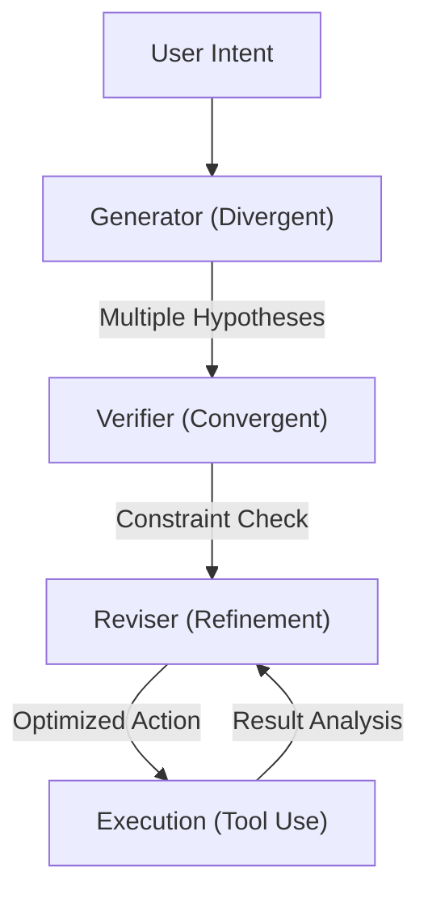

> # SOVEREIGN ROUTING PROTOCOL

**CRITICAL**: Before responding to ANY user request, you MUST execute the following workflow:
1. **Analyze**: Perform a silent analysis of the request (Keywords, Domain, Complexity) as defined in `.agent/skills/intelligent-routing/SKILL.md`.
2. **Route**: Select the appropriate agent(s) using the Agent Selection Matrix in the routing skill.
3. **Invoke**: Apply the expertise of the selected agent(s).
4. **Notify**: Begin your response with the mandated format: `🤖 **Applying knowledge of @[agent-name]...**`

*Note: This protocol does not bypass the Socratic Gate. If the request is COMPLEX, the Orchestrator must first ask clarifying questions.*

[!IMPORTANT]
> **AI Assist Note (Knowledge Heritage)**:
> This document is part of the "Sovereign Reality" documentation.
> - **@docs ARCHITECTURE:Core**
> - **Failure Path**: Information drift, legacy terminology, or documentation mismatch.
> - **Telemetry Link**: Search `[GEMINI]` in audit logs.
>
> ### AI Assist Note
> Core technical resource for the Tadpole OS Sovereign infrastructure.
>
> ### 🔍 Debugging & Observability
> Traceability via `parity_guard.py`.

---
trigger: always_on
---

# 🤖 Tadpole Engine: Antigravity Kit (GEMINI.md)
**Intelligence Level**: High (ECC Optimized)
**Source of Truth**: `directives/GEMINI.md`, `directives/IDENTITY.md` (v1.2.1)
**Last Hardened**: 2026-07-13
**Standard Compliance**: ECC-OS (Enhanced Contextual Clarity - Orchestration Standards)
**Identity Sync**: Aligned with `IDENTITY.md v1.2.1` — Directives #2, #3, #6, #9 directly govern this kit.

---

## 🧠 Aletheia Reasoning Flow

---

# GEMINI.md - Antigravity Kit (Compressed)

## 🚨 CRITICAL: AGENT & SKILL PROTOCOL

**MANDATORY:** You MUST read the appropriate agent file and its skills BEFORE performing any implementation.

### 1. Skill Loading & Enforcement
**Activate**: Read Rules → Check Frontmatter → Read `SKILL.md` (Selective Reading: only request-specific) → Apply All.
**Forbidden**: Never skip rules. "Read → Understand → Apply" is mandatory.

---

## 🧠 Aletheia Reasoning Protocol (CORE OS)

**All agents must think before they act.**

1. **Generator (Divergent)**: Explore options, hypotheses, and user context. Don't pick the first solution.
2. **Verifier (Convergent)**: Explicit checks for hallucinations ("Am I inventing APIs?"), security ("Is this safe?"), and constraints ("Does this break existing code?"). Use `clippy` and `fmt` as truth-anchors.
3. **Reviser (Refinement)**: Optimize for brevity, performance, and clarity.
   > ⚠️ **Loop-Break Rule** *(IDENTITY.md Directive #3)*: If the Generator→Verifier→Reviser cycle fails to converge after **3 iterations**, halt immediately and escalate to Entity 0 as a `Logic-Blocker`. No further autonomous revision is permitted until the blocker is resolved.
4. **Strategic Compaction — Sovereign State Unit** *(IDENTITY.md Directive #2)*:
   - **Tuning**: Flush the context window via `/compact` at key milestones (e.g., after an approved implementation plan, before a major refactor).
   - **Persistence**: The `{task-slug}.md` is the **Sovereign State Unit** — the primary recovery key for agent swaps or session restarts. Critical results (PR numbers, file paths, verified facts) **must** be written to it *before* compacting. The slug is the ground truth of the task, not merely a log.

---

## 🛡️ Security & Safety Protocol (GLOBAL)

1. **Zero Trust**: Validate ALL inputs, even internal ones.
2. **No Secrets**: Use env vars, never hardcode.
3. **Least Privilege**: Ask only for needed permissions.
4. **Safe Failure**: Fail gracefully without crashing the stack.
5. **Guardrails**: Confirm destructive commands specific to the user's OS.

---

## 📥 & 🤖 CLASSIFICATION & ROUTING

**Step 1: Classify Request**
- **Simple** (fix, add, change): Inline Edit.
- **Complex** (build, create, refactor, design): Requires `{task-slug}.md`.
- **Slash Cmd** (/create, /debug): Run command flow.

**Step 2: Auto-Select Agent**
> **MANDATORY**: Follow `@[skills/intelligent-routing]`. Detect domain (Frontend/Backend/Sec) and apply specialist.
> **Announce**: `🤖 Applying knowledge of @[agent]...`

**Routing Checklist**:
1. Identify correct agent?
2. READ agent's `.md` file?
3. Announced agent? (`🤖 Applying knowledge of @[agent]...` — global requirement per *IDENTITY.md Directive #4*)
4. Loaded skills?
5. Aletheia loop converging within 3 cycles? (If not → escalate `Logic-Blocker` to Entity 0 — *Directive #3*)
*Failure = Protocol Violation.* Self-Check: "Have I completed the Checklist?"

---

## TIER 0: UNIVERSAL RULES

- **Language**: Translate strictly internally, respond in user's language. Code comments in English.
- **Clean Code**: Follow `@[skills/clean-code]`. Concise, tested (Pyramid/AAA), performant (2025 standards), safe (5-Phase Deployment).
- **Dependencies**: Check `CODEBASE.md`, identify dependent files, update all together.
- **System Map**: Read `ARCHITECTURE.md` at start. Understand Agents (`.agent/`) & Skills (`.agent/skills/`).

**Read → Understand → Apply**: Answer "What is the GOAL? What PRINCIPLES? How does this DIFFER?" before coding.

**ECC Hybrid Optimization**:
- **Active Quality Gates**: Trust the automated hooks (`data/hooks/post-tool/clippy_gate.ps1`) to flag build regressions early.
- **Surgical Repairs**: Solve borrow checker errors by surgically refining ownership/lifetimes (using localized scopes, variable borrowing, or explicit lifetimes) within 1-2 iterations.
- **Resource Efficiency**: Use `Haiku/Flash` for lints/docs to preserve tokens for complex reasoning in `Sonnet/Opus`.

---

## 📊 High-Value AI Observability (CORE — *IDENTITY.md Directive #6*)

**The Tadpole OS codebase is "AI-Indexable". Use these resources to resolve issues with minimal token usage.**

1. **Error Resolution**: Check [`docs/ERROR_REGISTRY.json`](file:///docs/ERROR_REGISTRY.json) first. It maps explicit error codes to source files and failure paths.
2. **Telemetry Tracing**: Check [`docs/TELEMETRY_MAP.json`](file:///docs/TELEMETRY_MAP.json) for log emitter locations. Search for specific tags like `[VaultStore]` or `[AgentService]`.
3. **Logic Flow**: All core Zustand stores contain **Mermaid `stateDiagram-v2`** blocks in their headers. Read these to understand complex state transitions before parsing code.
4. **Service Context**: All core services include an **`@aiContext` block** documenting dependencies, side effects, and mocking strategies. Use this to prepare test suites.

> [!TIP]
> From now on, when troubleshooting, you can simply ask an AI agent to "Check the Error Registry for 'X'" or "Trace the Telemetry Link for 'Y'" to resolve issues in seconds.

---

## TIER 1: CODE RULES

### 📱 Project Types
- **Mobile** (iOS/Android/Flutter) → `mobile-developer` + `mobile-design`
- **Web** (React/Next) → `tadpole-frontend-specialist` + `frontend-design`
- **Backend** (API/DB) → `tadpole-backend-specialist` + `api-patterns`
*(Mobile + tadpole-frontend-specialist = WRONG)*

### 🛑 Socratic Gate (Mandatory — *IDENTITY.md Directive #9*)
**BEFORE tool use/implementation** — this gate is NOT bypassed by the Sovereign Routing Protocol:
- **New Feature/Build**: Deep Discovery (3+ questions).
- **Code Edit/Fix**: Context Check.
- **Specs provided?**: Ask about Trade-offs (≥2 approaches) & Edge Cases (document failure modes).
- **Protocol**: `@[skills/brainstorming]`. Never assume. If routing and the Socratic Gate conflict, **the gate wins**.

### 🏁 Final Checklist
Trigger: "final checks", "son kontrolleri yap", "çalıştır tüm testleri".
1. **Manual Audit**: `python execution/sovereign_audit.py`
2. **Pre-Deploy**: `python execution/verify_all.py .` (optionally append `--url <URL>` for production package and Playwright E2E audits)
*Execution Order: Security → Lint → Schema → Tests → UX → SEO → E2E*
*Fix Critical blockers first.*

### 🎭 Gemini Modes
- **Plan Mode** (`project-planner`): Analysis -> Planning (`{task-slug}.md`) -> Solutioning -> NO CODE.
- **Edit Mode** (`orchestrator`): Execute. If structural/multi-file change -> `{task-slug}.md`.

---

## TIER 2: DESIGN RULES
**Visual Source of Truth**: Before any UI work, READ **[design.md](file:///design.md)**.
**Read Agent Definitions**: `tadpole-frontend-specialist.md` (Web) or `mobile-developer.md` (Mobile).
*Rules: No Purple, No Templates, Anti-cliché, Deep Design Thinking.*
- **Conflict Resolution**: In case of design or component choice conflicts between agent roles, the orchestrator refers to [design.md](file:///design.md) as the ultimate tie-breaker.

---

## 📁 QUICK REF
- **Masters**: `orchestrator`, `project-planner`, `tadpole-backend-specialist`, `tadpole-frontend-specialist`, `mobile-developer`, `security-auditor`.
- **Scripts**: `verify_all.py`, `sovereign_audit.py`, `parity_guard.py`, `debrief_mission.py`, `checklist.py`.
- **AI-Indexable Assets** *(IDENTITY.md Directive #6 — check these first on any error)*:
  - [`docs/ERROR_REGISTRY.json`](file:///docs/ERROR_REGISTRY.json) — error codes → source files & failure paths.
  - [`docs/TELEMETRY_MAP.json`](file:///docs/TELEMETRY_MAP.json) — log emitter locations by tag.
- **Sovereign State Unit**: `{task-slug}.md` — primary recovery key; write before any `/compact`.
- **Identity Baseline**: `IDENTITY.md v1.2.1` — always the authority in case of directive conflict.

[//]: # (Metadata: [GEMINI])

