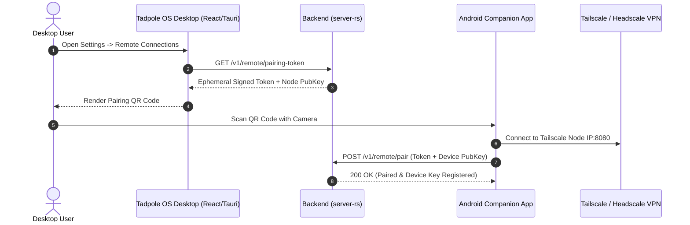

> [!IMPORTANT]
> **AI Context & Knowledge Heritage**
> - **Subsystem**: Core Directives / remote-oversight-mobile-system
> - **Architecture**: `@docs ARCHITECTURE:Documentation`
> - **Failure Path**: Information drift, legacy terminology, or documentation mismatch.
> - **Observability**: Traceability via `execution/parity_guard.py` (`[remote_oversight_mobile]`)

# Feature: Sovereign Remote Oversight & Mobile Companion Ecosystem (RMS-01 – RMS-06)

**Status:** `IN_PROGRESS` (Desktop UI, Android Foundation & Test Suites Completed)  
**Priority:** P1 — Sovereign Expansion  
**Pillar:** Zero-Trust Remote Control & Human-in-the-Loop Governance  
**Roadmap Phase:** Phase 7  

---

## 🎯 Problem Statement & Vision

High-autonomy agent swarms in Tadpole OS execute long-running background tasks. When an agent reaches a sensitive boundary (shell commands, budget cap increases, database mutations), it halts execution at the **Unified Oversight Gate** (`OVR-01`) waiting for human sign-off. If the human supervisor is away from their workstation, work stalls indefinitely.

### Core Goals:
1. **Remote Connectivity**: Allow users to monitor and sign off on agent work both on the local company network (LAN) and remotely over the internet via Zero-Trust mesh tunnels (Tailscale, Headscale, WireGuard mTLS).
2. **Ultra-Focused Remote Interface**: Limit the mobile UI strictly to 3 core control panels to maximize speed and clarity:
   - **Oversight Screen / Approval Ledger**: Pending approval requests, context diffs, and signed approvals.
   - **Agent Health Panel**: Swarm telemetry pulse, active state, error logs, and one-tap emergency panic freeze switch.
   - **Remote Connections & Setup Panel**: Pairing QR code scanner, Tailscale node status, and WebPush/FCM settings inside Settings.
3. **Mobile Target Strategy**:
   - **Android Smartphone App First**: Native Kotlin app built via Android Studio using Jetpack Compose, Ktor WebSocket, and BiometricPrompt hardware security.
   - **iOS Companion App Second**: SwiftUI companion app using Apple Secure Enclave FaceID/TouchID.

---

## 📂 Repository & Codebase Architecture

### Recommendation: Monorepo Subdirectory (`apps/mobile-android/` or `clients/android/`)

**Why a Monorepo Subdirectory?**
- **Schema & Parity Synchronization**: Keeps WebSocket telemetry schemas (`KindCode` integer codes `KND-01`), REST request models, and RFC 9457 error contracts perfectly synchronized between `server-rs` and the mobile client in a single git commit.
- **Unified Validation & Parity Guard**: `execution/parity_guard.py` and `ADG-01` can validate both desktop backend and companion client contracts simultaneously.
- **Developer Experience**: Cloning the main repository gives developers the complete Tadpole OS ecosystem (Backend, Web Dashboard, and Companion Mobile Client).

---

## 🏗️ Technical Architecture & Component Breakdown

### 1. `RMS-01`: Zero-Trust Remote Bridge & Dynamic QR Pairing (`server-rs`)

Add remote mTLS / Mesh proxy listener capabilities to `server-rs`.

- **Dynamic QR Code**: Desktop Settings panel renders a dynamic QR code containing the backend node address, node public key, and a short-lived pairing challenge token.
- **Device Pairing Registry**: `server-rs` stores registered mobile device public keys in `data/remote_devices.json` or SQLite.

---

### 2. `RMS-02`: Android Native Companion App (Jetpack Compose)

Built in **Android Studio** using native Kotlin and modern Android Jetpack libraries.

- **Stack Details**:
  - **UI Layer**: Jetpack Compose with Material 3 design system.
  - **Networking Layer**: Ktor Client with WebSocket engine for low-latency live telemetry streams (`KindCode` pulse events).
  - **State Management**: Android ViewModel + Kotlin Flow.
  - **Local Persistence**: Room DB to queue pending approval history for offline viewing.

#### Screen Structure:
1. **Screen 1: Approval Ledger (`OversightScreen`)**
   - Displays real-time list of pending HITL requests from `OVR-01`.
   - Displays agent ID, proposed tool action, target resource, and context rationale snippet.
   - Action Buttons: `Approve` (triggers Biometric Prompt) and `Reject` (with optional user reason note).
2. **Screen 2: Agent Health Panel (`AgentHealthScreen`)**
   - Live grid of active agents, current step count, token consumption rate, and status badge (Idle, Running, Halted, Error).
   - Prominent **Emergency Panic Switch**: Triggers `POST /v1/engine/swarm/halt` to freeze execution instantly.
3. **Screen 3: Remote Connections (`SettingsScreen`)**
   - Integrated QR Code Scanner (using CameraX + ML Kit).
   - Connection indicator (LAN vs Tailscale Mesh active).
   - Firebase Push Notification token registration toggle.

---

### 3. `RMS-03`: Push-to-Approve Biometric Gateway & FCM WebPush

- **Biometric Security**: Approvals invoke Android `BiometricPrompt` (Fingerprint/Face Unlock) linked to `AndroidKeyStore`.
- **Signed Approval Payload**:
  $$\text{Signature} = \text{Ed25519\_Sign}\left(\text{DevicePrivateKey}, \text{ApprovalID} + \text{Timestamp} + \text{ActionHash}\right)$$
  The backend verifies the signature against the paired device public key before unlocking the agent runtime gate.
- **Firebase Cloud Messaging (FCM)**: When `OVR-01` creates a pending request, `server-rs` sends a lightweight FCM alert so the mobile app alerts the user immediately, even when closed.

---

### 4. `RMS-04`: iOS Native Companion App (SwiftUI)

- Built using Xcode and SwiftUI.
- Integrates with Apple **Secure Enclave** for TouchID/FaceID biometric sign-off.
- Communicates with the same `server-rs` Zero-Trust Remote Bridge endpoints (`RMS-01`).

---

## 📋 File & Module Mapping

| Module / Path | Language / Tech | Role |
|---|---|---|
| `server-rs/src/routes/remote.rs` | Rust (Axum) | Zero-trust pairing endpoints & remote session management |
| `server-rs/src/remote/auth.rs` | Rust | Ed25519 device key verification for signed approvals |
| `apps/mobile-android/` | Kotlin / Gradle | Android Companion App project root |
| `apps/mobile-android/app/src/main/java/.../ui/oversight/` | Kotlin (Compose) | Approval Ledger UI components |
| `apps/mobile-android/app/src/main/java/.../ui/health/` | Kotlin (Compose) | Agent Health Panel & Emergency Panic Button |
| `apps/mobile-android/app/src/main/java/.../ui/settings/` | Kotlin (Compose) | QR Pairing Scanner & Tailscale Node Settings |
| `src/pages/Settings.tsx` | TSX / React | Desktop UI QR code pairing generator |

---

## 🧪 Verification & Acceptance Criteria

1. **Pairing**: Scanning the desktop QR code in the Android app pairs the device in under 3 seconds over LAN or Tailscale.
2. **Oversight Gate**: Triggering a HITL tool action on desktop creates a push notification on Android; approving via fingerprint sends a verified signature to `server-rs` within 500ms, resuming agent execution.
3. **Health & Panic**: Tapping the Emergency Panic Switch on Android instantly halts all running agents on the desktop node.
4. **Security**: Replayed or altered approval payloads are rejected by `server-rs` signature verification.