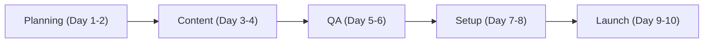

# 🚀 Tadpole Engine: Strategic Launch Plan
**Intelligence Level**: High (ECC Optimized)
**Source of Truth**: `directives/launch_plan.md`
**Last Hardened**: 2026-04-01
**Standard Compliance**: ECC-PLAN (Enhanced Contextual Clarity - Planning Standards)

> [!IMPORTANT]
> **AI Assist Note (Planning Logic)**:
> This document defines a 10-day aggressive launch sequence.
> - **Critical Path**: Content Creation (Days 3-4) -> QA (Days 5-6) -> Setup (Days 7-8).
> - **Dependency**: QA (Day 5-6) MUST be completed before Tools Setup (Day 7-8).
> - **Execution**: All launch-related materials must be cross-verified against `SECURITY.md` for secret leakage.

---

## 🚀 Launch Sequence Flow

---

## Day 1-2: Planning and Preparation

* Define launch objectives and key performance indicators (KPIs)
* Identify target audience and create buyer personas
* Develop a content calendar and social media strategy
## Day 3-4: Content Creation
* Create and publish launch-related content (blog posts, videos, social media posts)
* Develop email marketing campaigns and automate workflows
* Design and publish landing pages and sales pages
## Day 5-6: Testing and Quality Assurance
* Test and debug landing pages, sales pages, and email marketing campaigns
* Conduct quality assurance checks on all launch-related materials
* Identify and fix any technical issues
## Day 7-8: Launch Preparations
* Set up and configure launch tools (e.g., webinar software, payment gateways)
* Coordinate with team members and stakeholders
* Finalize launch timeline and deadlines
## Day 9-10: Launch and Post-Launch Activities
* Launch product or service and execute marketing campaigns
* Monitor and analyze launch results and KPIs
* Plan and execute post-launch activities (e.g., webinars, email follow-ups)