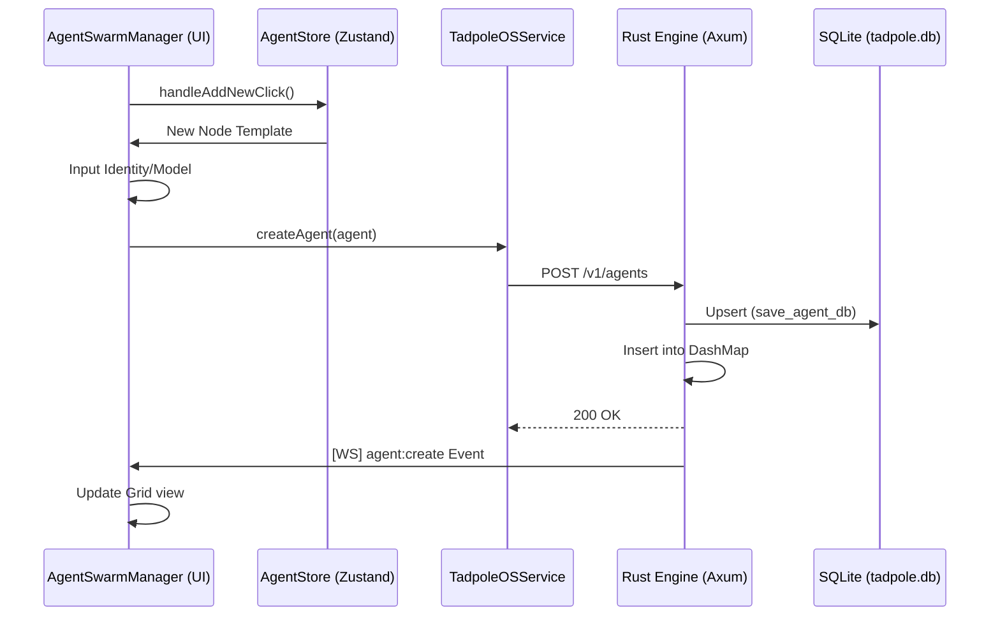

# 🧠 Tadpole Engine Architecture

<!-- @docs-ref ARCHITECTURE:BootSequence (main.rs) -->
<!-- @docs-ref ARCHITECTURE:StatePersistence (state.rs) -->

> **Status**: In-Progress / Parity Guard Enabled
> **Version**: 1.1.4
> **Last Updated**: 2026-03-20 (Verified 100% Quality Pass - Neural Health Update)
> **Documentation Level**: Professional (Antigravity Std)

## Table of Contents

- [🏗️ Core Components](#core-components)
  - [1. Gateway Server](#1-gateway-server-server-rssrcmainrs)
  - [2. Agent Registry](#2-agent-registry-server-rssrcagentregistryrs)
  - [3. Agent Runner](#3-agent-runner-server-rssrcagentrunnermodrs)
  - [4. Financial Control (Budget Guard)](#4-financial-control-budget-guard-server-rssrcsecuritymeteringrs)
  - [5. Oversight & Security (Audit, Monitoring, & Scanner)](#5-oversight--security-audit-monitoring--scanner-server-rssrcsecurityauditrs-monitoringrs-scannerrs)
  - [5.1 Merkle Audit Trail](#51-merkle-audit-trail-auditrs)
  - [5.2 Shell Safety Scanner](#52-shell-safety-scanner-scannerrs)
  - [5.3 Automated Security Gate](#53-automated-security-gate)
  - [5.4 Resource Guard (System Monitoring)](#54-resource-guard-system-monitoring-monitoringrs)
- [6. Neural Memory](#6-vector-neural-memory-server-rssrcagentmemoryrs)
- [14. Neural Oversight Engine](#14-neural-oversight-engine)
- [📊 Performance Architecture](#performance-architecture)
- [🛡️ Security Model](#security-model)

---

## Overview

The Tadpole Engine is a local-first, multi-provider AI agent runtime designed for security, observability, and human oversight. It follows a **Gateway-Runner-Registry** pattern, implemented in **Rust** for high-performance async processing and memory safety.

## Core Components

### 1. Gateway Server (`server-rs/src/main.rs`)
The entry point for the backend, built using the **Axum** framework. Refactored for **High Maintainability** through structural decoupling.
- **Bootstrapping (`main.rs`)**: Highly simplified entry point that delegates to specialized modules for initialization and routing.
- **System Initialization (`startup.rs`)**: Centralized logic for tracing, environment loading, and background task orchestration (Heartbeat, Continuity Scheduler, Memory Cleanup).
- **Router Configuration (`router.rs`)**: Encapsulates the entire Axum routing table, CORS policy, and middleware stacks (Auth, Rate Limiting, Request-ID).
- **REST API**: Handles high-performance routing for agent tasks, health checks, and deployment triggers.
- **API Versioning**: All business endpoints are nested under `/v1/` (e.g., `/v1/agents`) with backwards-compatible root-level mounts.
- **WebSocket Hub (`routes/ws.rs`)**: Multiplexes system logs and engine events over a single connection using `tokio::select!`.
- **Application State Hubs (`state.rs`)**: The engine's state is decomposed into five specialized hubs to ensure modularity and thread-safe access:
    - **`comms`**: Handles real-time broadcast channels and oversight decision orchestration.
    - **`governance`**: Enforces operational limits, budget policies, and recruitment depth safety.
    - **`registry`**: Manages the identities and configurations of agents, providers, and models.
    - **`security`**: Orchestrates Merkle auditing, shell scanning, and resource monitoring.
    - **`resources`**: Centralizes shared infrastructure like DB pools, HTTP clients, and the Neural Audio Engine.
- **CORS & Security**: Configurable middleware for safe browser communication. Refactored to explicitly support credentialed requests from `localhost:5173` for internal discovery.
- **REST Level 3 Awareness**: Resource endpoints utilize **HATEOAS-aware envelopes**, providing navigability via `_links` in response envelopes for core resources (Agents, Missions).
- **Problem Details (RFC 9457)**: Standardized machine-readable error responses for all API failures.
- **Protocol-Aware Resolution**: Automatically detects `http` vs `https` environments (e.g., Tailscale) to prevent mixed-content blocks.

### 2. Agent Persistence & Swarm Ecosystem (`server-rs/src/agent/persistence.rs`)
The "source of truth" for the agent swarm, architected around a unified persistence model.
- **Unified SQLite State**: Discards declarative JSON file-sync in favor of a robust SQLite schema via `tadpole.db`. This eliminates data drift and ensures transactional consistency at the DB layer.
- **GitHub Native Hub**: The in-app Template Store connects natively to a designated public GitHub repository (e.g., `tadpole-os-templates`), functioning as an app store for industry-specific swarms (Legal, Healthcare, etc.).
- **Sapphire Shield Protocol**: Enforces zero-trust execution for downloaded templates. Templates are restricted from containing compiled executables. Any dangerous skills (e.g., shell execution, real-world bug bounty) require mandatory, manual "Overlord" approval before the swarm can initialize.
- **Metadata Support**: Flexible metadata structures allow the frontend to render premium designs, including hierarchical **Resource Monitoring** (real-time cost/token tracking).

### 3. Agent Runner (`server-rs/src/agent/runner/mod.rs`)
The "brain" of an individual agent execution loop. Refactored from a monolithic 770-line `run()` method into **15+ focused helper methods** with a `RunContext` struct for clean data flow.
- **Mission Analysis Engine (Agent 99)**: Implements LanceDB-powered post-mission debriefing. The default analysis node for all missions. Features **Cross-Mission Pattern Recognition** (meta-learning from past missions), **Semantic Pruning** (embedding logs into a temporary `scope.lance` to extract key blockers and reduce token bloat), **Swarm Memory Deduplication** (avoiding storing redundant insights), and **Behavioral Drift** detection (comparing execution vectors against the agent's core `IDENTITY.md`).
- **Tokio-Native**: Spawns asynchronous tasks for every mission to ensure non-blocking operation.
- **Neural Handoff (SEC-04)**: Implements "Strategic Intent Injection." When spawning a sub-agent, the parent agent's current strategic thoughts are injected into the sub-agent's prompt, providing immediate alignment without redundant context cycles.
- **Swarm Governance**: Enforces a recursive depth limit of **5** (see `AppState`) and implements **Lineage Awareness** (using `swarm_lineage`) to detect and block circular recruitment loops (e.g., A -> B -> A).
- **Context Pruning (PERF-07)**: Implements precise tokenization and pruning in `synthesis.rs`. Repository maps and shared mission findings are automatically truncated using `tiktoken-rs` (cl100k_base) if they exceed the model's configured TPM limit, preventing "Request too large" errors.
- **Parallel Swarming (PERF-06)**: Uses `FuturesUnordered` to execute multiple tool calls in parallel. This enables an agent to recruit an entire department simultaneously, reducing swarm latency by up to 80%.
- **Inheritance Logic**: Sub-agents automatically inherit the parent's model configuration and provider credentials.
- **Provider Adapters (`agent/gemini.rs`, `agent/groq.rs`, `agent/openai.rs`)**: Accept a shared `reqwest::Client` from `AppState` — connection pool is reused across **all** LLM and tool calls (including `fetch_url`) for zero TLS handshake overhead.
  - **Unified Provider Dispatch (PERF-09)**: Both `call_provider` and `call_provider_for_synthesis` delegate to a shared `dispatch_to_provider()` method, eliminating 90+ lines of duplicated match arms and making new provider integrations a single-edit operation.
  - **Provider-Agnostic Embeddings**: The `LlmProvider` trait now includes an `embed()` method, abstracting away specific embedding APIs and allowing the Memory engine to remain provider-indifferent.
  - **Broadcast Correction**: Automatically broadcasts agent state updates to the WebSocket EventBus during provider failures to ensure UI metrics (TPM, budget) remain accurate even during network fault.
- **Raw Tool Output (PERF-10)**: Tool handlers (`read_file`, `list_files`, `fetch_url`, dynamic skills) return raw results directly instead of making redundant synthesis LLM calls per tool. This eliminates the token cost doubling and 2-4s latency previously incurred per tool invocation.
- **Mandatory Web Oversight**: All `fetch_url` calls are subject to mandatory human approval via the Oversight Gate to prevent unauthorized external exfiltration.
- **Shared Rate Limiting (`agent/rate_limiter.rs`)**: Enforces RPM and TPM limits via shared state limiters. Unlike per-request limiters, these are keyed by `(provider, model)`, ensuring that multiple parallel missions for the same model correctly share the global API quota.
- **Telemetry (`main.rs` & `state.rs`)**: Real-time broadcast of thinking/idle states, token usage, and swarm health metrics (TPM, Density, Depth, Velocity) to the global EventBus via a 5s heartbeat.
- **Type-Unified `ModelConfig`**: 14-field struct aligned 1:1 between TypeScript and Rust (including slot-specific `skills` and `workflows`). Serde renames ensure camelCase compatibility across the WebSocket boundary.
- **MCP Tool Execution**: Delegates all tool discovery and execution to the `McpHost`. This decouples the reasoning loop from the specific implementation of a tool (Native, Legacy, or External MCP).
- **Graceful Degradation & Self-Healing (Phase 3)**: Unified `LlmProvider` trait architecture.
    - **Null Failover**: A `NullProvider` fallback automatically activates during API failure or when `TADPOLE_NULL_PROVIDERS=true`, preventing hard crashes and flagging the mission as degraded.
    - **Health Watchdog**: The runner increments a persistent `failure_count` in the registry upon mission failure. This state is broadcasted over the `agent:update` WebSocket pulse for real-time UI reactive health monitoring.
    - **Throttling Mechanism**: Agents hitting a failure threshold (default: 3) are automatically prevented from starting new missions.
    - **State Recovery**: Implements a dedicated `reset_agent` route that transitions an agent back to `Idle` and clears failure metrics.

### 4. Financial Control (Budget Guard) (`server-rs/src/security/metering.rs`)
The fiscal governance layer of the engine, ensuring autonomous agents operate within strict monetary bounds.
- **Persistent Quota Management**: Unlike in-memory counters, the `BudgetGuard` utilizes SQLite for persistent quota tracking. This ensures that agent budgets survive server restarts and are enforced across multiple independent mission clusters.
- **Neural Cost Registry**: A centralized registry of USD rates per 1k tokens for all supported providers (Gemini, OpenAI, Groq, etc.).
- **Real-time Cost Engine**: Calculates the monetary impact of every agent turn (input + output) based on actual token usage reported by the provider.
- **Budget Propagation**: Missions carry financial payloads from the frontend to the engine. The `BudgetGuard` intercepts LLM calls and blocks execution if the remaining quota for a cluster or agent is insufficient.
- **Auto-Replenishment**: Supports policy-based replenishment (daily/weekly) to ensure continuous operation for verified background tasks.

- **Sovereign Telemetry Engine**: Tracks real-time performance metrics (Latency, Success Rate, Throughput) for every execution. Enforces "Protocol Pulses" via WebSockets for live monitoring.
- **Interactive Tool Laboratory**: Exposes a manual execution interface for developers to test and debug MCP capabilities with dynamic JSON validation.
- **RESTful Orchestration**: Exposes `/v1/capabilities/mcp-tools` for discovery and `/v1/capabilities/mcp-tools/:name/execute` for direct, standardized invocation.
- **In-Memory Caching**: Loads capabilities into a memory cache upon server start, ensuring zero disk I/O bottlenecks during hot execution.

### 5. Oversight & Security (Audit, Monitoring, & Scanner) (`server-rs/src/security/audit.rs`, `monitoring.rs`, `scanner.rs`)
The human-in-the-loop governance layer and proactive capability defense.

#### 5.1 Merkle Audit Trail (`audit.rs`)
A tamper-evident cryptographic ledger of all critical agent actions.
- **Hash Chaining**: Each entry is SHA-256 linked to the previous entry, creating a linear chain of custody. Any manual modification to the database will break the chain integrity, immediately detectable via `verify_chain()`.
- **ED25519 Non-repudiation**: Every entry is cryptographically signed. This ensures that every tool call or oversight decision is immutable and attributable to the engine instance, preventing unauthorized retrospective tampering even by a database administrator.
- **Granular Verification**: The system supports both full-chain verification (`verify_chain()`) and per-record validation (`verify_record()`). This allows the UI to display real-time "Verified" badges for individual audit logs.
- **Action Recording**: Automatically logs `ToolCall`, `ConfigChange`, and `MissionLifecycle` events with high-fidelity parameters and agent attribution.
- **Identity Propagation**: Records are enriched with `user_id` and `mission_id`, ensuring a complete, verifiable audit trail from the originating human user through the entire agentic swarm.

#### 5.2 Shell Safety Scanner (`scanner.rs`)
A proactive defense layer that blocks secret leakage in agent-generated code.
- **Regex-Driven Redaction**: Scans all Python/Bash scripts generated by the agent for environment variable references (e.g., `$NEURAL_TOKEN`, `os.environ`).
- **Policy Enforcement**: Configurable levels (Informational vs. Block) allow the operator to balance autonomy with security.

#### 5.3 Automated Security Gate
- **Skill Manifests**: Capabilities are defined via highly-structured JSON schemas validating tool I/O, constraints, and dependencies.
- **CBS (Capability-Based Security)**: If a dynamic skill requests `budget:spend` or `shell:execute` permissions, the engine automatically flags it with `requires_oversight = true` regardless of developer configuration.
- **Async Interruption**: Uses `tokio::sync::oneshot` channels to pause agent execution during sensitive tool calls.
- **Persistent Audit Log**: All oversight entries (pending, approved, rejected) are recorded in the SQLite `oversight_log` table, providing a permanent record for behavioral auditing.
- **Approval Queue**: Managed via `DashMap` for real-time interaction, synced with DB for durability.
- **Protected Operations**: `archive_to_vault`, `notify_discord`, `complete_mission`, and `delete_file` all require explicit human approval before execution.

#### 5.4 Resource Guard (System Monitoring) (`monitoring.rs`)
A real-time telemetry service for hardware-level security and performance observability.
- **Memory Pressure Monitoring**: Synchronous tracking of system and process RAM usage. Triggers alerts in the UI when the engine approaches host memory limits to prevent OOM (Out Of Memory) failures.
- **CPU Load Tracking**: Live monitoring of aggregate CPU usage, providing insights into the computational intensity of agent reasoning cycles.
- **Sandbox Awareness**: Proactive detection of the engine's runtime environment. Identifies if the OS is running within **Docker**, **Kubernetes (K8s)**, or a generic container.
- **Sovereign Dashboard Integration**: Metrics are broadcasted via the `SystemDefense` DTO, powering the "Capabilities Defense Matrix" on the Security Dashboard.

### 5b. Vector Neural Memory (`server-rs/src/agent/memory.rs`)

> [!TIP]
> **Split-Brain Efficiency**: Traditional SQLite handles deterministic data (logs/budgets), while **LanceDB** manages high-dimensional embeddings. This hybrid model avoids the performance bottlenecks inherent in using a single relational DB for vector search.

Top-tier "Split-Brain" architecture managing cross-session context.
- **LanceDB + Arrow**: High-performance local vector database utilizing Apache Arrow memory layouts for zero-copy semantic search.
- **Deduplication Thresholding**: Utilizes vector cosine distance to prevent writing duplicate memories via the `LANCEDB_DEDUPE_THRESHOLD` environment variable.
- **Embedding Generation**: Dedicated module utilizing Gemini's `text-embedding-004` API to generate 768-dimensional vectors seamlessly.
- **Mission RAG Scopes**: Agents inject historical, highly relevant insights extracted from their master `memory.lance` directly into a temporary `scope.lance` per mission, establishing a focused Retrieval-Augmented Generation context.
- **Orphan Sweeper**: A continuous background daemon sweeps `workspaces/` and purges `scope.lance` directories for completed or failed missions via SQLite state cross-referencing, proactively averting unbounded disk bloat over time.
- **Native Semantic Tools**: Registers `search_mission_knowledge` seamlessly to the LLM context, permitting agents to independently query localized data streams without polluting prompts.

### 6. FilesystemAdapter (`server-rs/src/adapter/filesystem.rs`)
The sandboxed workspace I/O layer.
- **Workspace Anchoring**: Each agent's `RunContext` contains a `workspace_root: PathBuf` derived from the mission's `cluster_id`. All file operations are strictly confined to this directory.
- **Symlink-Safe Canonicalization (SEC-03)**: Both the workspace root and candidate file paths are resolved via `std::fs::canonicalize` before comparison — defeating symlink-based sandox escape attempts.
- **Operations**: `read_file`, `write_file`, `list_files` (sorted), `delete_file` (oversight-gated).

### 7. Shared Rate Limiter (`server-rs/src/agent/rate_limiter.rs`)
Enforces LLM provider API quotas at the engine level using a dual-constraint, shared-state strategy.

- **Shared Context**: Limiters are persisted in `AppState` and keyed by `(provider, model)`. This ensures that across multiple concurrent missions, the aggregate throughput stays within API bounds.
- **RPM (Requests Per Minute)**: Uses a **Sliding Window** strategy implemented via `tokio::sync::Semaphore`.
    - **Mechanism**: Every request acquires a permit that is held by a background task for exactly 60 seconds.
    - **Effect**: Guarantees that at any point in time, the number of requests started in the *last* 60 seconds never exceeds the limit.
- **TPM (Tokens Per Minute)**: Uses a **Fixed Window** strategy with an `AtomicU32` counter.
    - **Mechanism**: Tracks actual usage updated via `record_usage()`. When a request is triggered, it checks the current minute window; if the limit would be exceeded, the agent task is asynchronously "parked" (`tokio::time::sleep`) until the next window reset.
    - **Post-hoc Correction**: Since exact token counts aren't known until the provider responds, the limiter uses the provider's own usage metadata to calibrate the counter after every call.
- **Opt-In Architecture**: Zero-overhead no-op when `rpm`/`tpm` are not configured for a model. High-concurrency safe via atomic operations (no global mutexes required for counters).

### 8. Reactive Infrastructure (Zustand)

The frontend utilizes a collection of decentralized **Zustand** stores to maintain a reactive, unitary source of truth.

| Store | Purpose | Key Reactive Elements |
| :--- | :--- | :--- |
| `agentStore` | **Neural Registry** | `agents`, `activeAgentId`, `updateAgent()` |
| `tabStore` | **Multi-Tab Orchestration** | `tabs`, `activeTabId`, `addTab()`, `removeTab()` |
| `headerStore`| **Unified Header State** | `activeHeaderConfig`, `setHeaderConfig()` |
| `settingsStore`| **Engine Connectivity** | `tadpoleOsUrl`, `neuralEngineAccessToken` (formerly Neural Token) |
| `providerStore`| **Infrastructure Vault** | `providers`, `models`, `vaultLocked` |
| `roleStore` | **Agent Schematics** | `roles`, `activeRoleId` |
| `workspaceStore`| **Cluster Management** | `clusters`, `activeClusterId` |

#### 8.1 Tab Architecture
The `tabStore` enables the **Multi-Tab Sovereign Interface**. It manages an array of `Tab` objects, each representing a distinct operational context (Ops, Missions, Hierarchy, etc.). The interface features a persistent `TabBar` (located at the top of the viewport) that coordinates with the `tabStore` to switch views without reloading the application state.

Each tab now supports **State-Preserved Detachment**. When a tab is marked as `isDetached`, the `DashboardLayout` preserves the component instance's state but renders it into a native browser portal instead of the main viewport grid.

#### 8.2 Neural Portal Window Architecture
To support multi-monitor real-time visualization, Tadpole OS implements a **Single-Instance Portal** pattern.

- **ReactDOM.createPortal**: Utilized to render React components into the DOM of a newly opened `about:blank` browser window. 
- **Unified Memory Space**: Unlike standard multiple-window setups that create separate JS heaps, detached tabs remain part of the *same* React tree and share the *same* memory, context providers, and WebSocket connection.
- **Dynamic Style Sync**: A `MutationObserver` monitors the `<head>` of the parent window and automatically synchronizes all `<style>` and `<link>` tags (including Tailwind's dynamic styles and theme variables) to the detached portals in real-time.
- **State Bridging**: Implements window lifecycle hooks to gracefully re-attach tabs if the native browser window is closed manually by the operator.

#### 8.3 Dynamic Header System
The `PageHeader` is a global, context-aware component driven by the `headerStore`. It dynamically renders page-specific tactical metrics and action buttons based on the active tab, ensuring a consistent high-end aesthetic while providing necessary operational controls.

### 9. Component Taxonomy
Infrastructure & State Layer (`src/services/`)
The frontend is architected for low-latency observability and reactive parity with the engine.
- **Decoupled API Architecture**: Refactored from a monolithic service into specialized domain-driven providers:
    - **`AgentApiService.ts`**: Handles agent identity and basic lifecycle.
    - **`MissionApiService.ts`**: Orchestrates missions, workflows, and skills.
    - **`SystemApiService.ts`**: Manages infrastructure, engine health, and node discovery.
    - **`BaseApiService.ts`**: Encapsulates core fetch logic, timeout handling, and header injection.
- **TadpoleOSService (Proxy)**: Acts as a unified entry point, proxying calls to specialized API services to maintain backward compatibility while ensuring clean separation of concerns.
- **settingsStore**: A reactive **Zustand** store with persistence. Implements **Auto-Fixing** logic that dynamically resolves `localhost` aliases to the correct remote host during external access (e.g. Tailscale/VPN).
- **agentStore**: The single source of truth for the agent swarm. Multiplexes WebSocket telemetry from the `TadpoleOSSocket` with manual configuration changes, ensuring O(1) state resolution for UI components.
- **providerStore**: Manages LLM provider configurations and secrets. Implements the **NeuralVault** protocol, utilizing a dedicated **Web Worker** (`crypto.worker.ts`) and the **SubtleCrypto API** for hardware-accelerated, hardware-isolated encryption. Persists the `baseUrl` (Network Endpoint) reliably across sessions and coordinates the **Test Trace** handshake. Provides the **AI Provider Manager** UI state.
- **Dynamic Role System**: Allows manual agent configurations to be "promoted" to system-level role blueprints.

### 10. Audio Subsystem (Hybrid/Experimental) (`routes/audio.rs` & `agent/runner.rs`)
The voice-command intelligence layer (Local Neural Engine is currently in Roadmap/Experimental phase).
- **Neural Transcription (Hybrid)**: Supports high-fidelity **Whisper-large-v3** via Groq. Local **Whisper-tiny/base** support via ONNX is in placeholder status.
- **Neural Synthesis (Hybrid)**: The `/engine/speak` endpoint leverages OpenAI's `tts-1` for cloud quality. **Piper (Local)** support via ONNX is in placeholder status.
- **Neural VAD (Silero)**: Implements local Voice Activity Detection to intelligently segment speech and reduce background noise processing.
- **Bunker Cache (Audio Caching)**: A SQLite-backed semantic cache (`audio_cache.db`) providing zero-latency replay for previously synthesized phrases.
- **Real-time Streaming**: Utilizes binary WebSocket broadcasting for O(audio_chunk) latency delivery.
- **Hybrid Interaction Logic**:
    - **Trigger**: Activating the Microphone automatically enables the Speech Output toggle.
    - **Feedback**: A real-time CSS/SVG waveform animates during agent speech synthesis.
    - **Fallback**: Automatically reverts to Browser Speech Synthesis (Web Speech API) if server-side TTS fails or keys are missing.
- **Strategic-to-Tactical Bridge**: Implements a multi-layer delegation model where a sovereign orchestrator (ID 1) directs autonomous tactical nodes through neural handoffs.

### 11. Persistence Layer (`server-rs/src/agent/persistence.rs`)
The "State-to-Disk" synchronization engine.
- **SQLite Backend (`tadpole.db`)**: Uses **sqlx** for asynchronous persistence of agents, missions, and logs.
- **Async I/O (PERF-08)**: All registry loaders (`load_registry`, `load_providers`, `load_models`) use `tokio::fs` to avoid blocking the Tokio runtime during startup.
- **Absolute Path Resolution**: Enforces absolute paths for `DATABASE_URL` to ensure environment stability on Windows.
- **JSON Fallback**: Opt-in via `LEGACY_JSON_BACKUP=true` env var.
- **Cached Context Files (PERF-11)**: `IDENTITY.md` and `LONG_TERM_MEMORY.md` are loaded once into `AppState` at startup from the root `directives/` folder, ensuring zero disk I/O bottlenecks during hot execution.
- **Bounded In-Memory Ledger**: The oversight ledger uses a `VecDeque` capped at 500 entries with O(1) `push_front` insertion, preventing unbounded memory growth on long-running sessions.
- **`parking_lot::Mutex`**: All synchronous mutexes (`oversight_ledger`, `default_budget_usd`, `code_graph`) use the non-poisoning, faster `parking_lot::Mutex` instead of `std::sync::Mutex`.
- **Bounded Tool Cache**: The `TOOL_CACHE` static cache is bounded to 64 entries and auto-evicts when exceeded, preventing memory leaks from dynamic skill creation.

### 12. Benchmark & Performance Analytics (`agent/benchmarks.rs`)
The performance tracking and regression analysis hub.
- **Persistent Metrics**: Records fine-grained latency (mean, p95, p99), category-specific test IDs, and technical targets to the `benchmarks` table.
- **Delta Analysis**: Backend supports retrieving historical runs for a specific test ID, enabling the frontend to calculate performance deltas and identify regressions.
- **Interactive Triggering**: Implements the `POST /v1/benchmarks/run/:test_id` endpoint which allows the Performance Analytics UI to execute specific technical tests (defined in `docs/Benchmark_Spec.md`) on demand.
- **Compliance Monitoring**: Visualizes "PASS/FAIL" status based on technical requirements.

### 13. Continuity Scheduler & Workflow Engine (`agent/continuity/mod.rs`)
The autonomous execution engine for scheduled AI jobs and multi-step pipelines.
- **Standard-Compliant Cron**: Utilizes the `cron` crate for robust, industry-standard temporal triggers.
- **Workflow Engine (`workflow.rs`)**: Manages deterministic multi-step agent pipelines, allowing for complex "If-This-Then-That" logic across multiple agents.
- **Persistence & Run Tracking**: Integrated directly with SQLite (`scheduled_jobs`, `scheduled_job_runs`, `workflows`) to survive server restarts. Tracks history and execution output for every autonomous turn.
- **Self-Healing Loop**: The `AgentHealth` module tracks failure rates per job. If a job hits the `max_failures` threshold (e.g., consecutive LLM errors), the scheduler immediately suspends it to protect the budget.

### 11. Reliability Layer (Hardening)
Architected for heavy MISSION-CRITICAL stability.
- **Lazy Singleton Socket**: `TadpoleOSSocket` is implemented as a **Lazy Proxy Singleton**. This prevents initialization-order race conditions during store hydration and ensures the socket remains side-effect free until explicitly invoked.
- **Infrastructure Reactivity**: The socket subscribes directly to `useSettingsStore`. Any change to the Engine URL or API Key triggers an immediate, intelligent reconnection without requiring a page refresh.
- **Atomic Registry Sync**: Registry reloads (Skills/Workflows) use a "Load-then-Swap" strategy in `capabilities.rs`. Disk I/O occurs on a background buffer, and the active `DashMap` is only hot-swapped after successful validation, ensuring zero "Registry Empty" race conditions.
- **Process Guard (Execution Timeouts)**: Every dynamic skill subprocess is wrapped in an asynchronous timeout (default 60s) in `runner.rs`. This prevents orphan processes or engine stalls caused by malfunctioning scripts.
- **Problem Details (RFC 9457)**: A dedicated `ProblemDetails` utility in `routes/error.rs` ensures that every engine failure is broadcast as a machine-readable specification, aligning with high-end cloud standards.
- **Lifecycle Hooks**: Implements `pre-tool` and `post-tool` hooks.
- **Sanitization Hook (PROACTIVE)**: A dedicated `Sanitizer` utility (regex-driven) that scans all incoming user messages and outgoing tool results for:
    - **Prompt Injection**: "Ignore all previous instructions", "system override".
    - **Role Assumption**: "You are now...", "Act as...".
    - **Data Exfiltration**: Detecting accidental leakage of sensitive `NEURAL_TOKEN` components.
- **OS Identity & Memory**: Injects `IDENTITY.md` and `LONG_TERM_MEMORY.md` (from root `directives/`) into every agent's system prompt. This provides a persistent "Core Directive" and cross-session learning capability, ensuring the swarm adheres to the bunker's architectural standards.

### 11b. Industry Standards & Compliance
Tadpole OS is engineered to meet and exceed modern software standards:
- **RFC 9457 (Problem Details)**: Full alignment with machine-readable error specifications.
- **HATEOAS Awareness**: Discoverable API surfaces for core agentic resources.
- **Zero-Trust Security**: Sandboxed filesystem access with canonicalization checks.
- **Memory Safety**: 100% Rust-native backend ensuring no buffer overflows or data races.
- **ISO 8601 Compliance**: Standardized temporal data across all mission logs and benchmarks.
- **W3C Web Interface Guidelines**: 100% audit-passed UI with adherence to accessibility and responsive design principles.

## Data Flow

1.  **Dashboard** sends a task to `POST /v1/agents/:id/tasks`.
2.  **Axum** routes the request and fetches the agent configuration from the **Registry**.
3.  **AgentRunner** spawns a background mission, resolves the `workspace_root`, and acquires a rate-limit permit.
4.  **McpHost** is consulted to find the appropriate tool. If it's a legacy skill, a subprocess is spawned. If it's a recruitment tool, it delegates back to the runner's sub-agent logic.
5.  **Provider** is called via the **shared `reqwest::Client`** (connection pool reused).
6.  **Oversight Gate** intercepts tool calls (if required), broadcasting `oversight:new` via WebSockets.
6.  **User** clicks "Approve/Reject" on the dashboard, hitting `POST /oversight/:id/decide`.
7.  **Gate** resolves the oneshot channel, allowing the **Runner** to proceed or abort.
8.  **Telemetry** streams all events back to the dashboard log in real-time.

### WebSocket Protocol & Multiplexing

The engine uses a single, high-concurrency WebSocket endpoint (`/ws`) for all real-time communication.
- **Token-Based Handshake**: Requires authentication via `Sec-WebSocket-Protocol` header (`bearer.<TOKEN>`) to prevent token leakage in URL query params (SEC-01).
- **Channel Multiplexing**: Uses `tokio::select!` to listen to three distinct `broadcast` channels simultaneously:
    - `AppState.tx`: Streams `LogEntry` structs (formatted system logs).
    - `AppState.event_tx`: Streams `serde_json::Value` (raw engine events like `oversight:new`).
    - `AppState.telemetry_tx`: Streams high-speed telemetry data (agent metrics, swarm health).
- **Reactive Batching**: The frontend buffers these events and flushes to the UI on `requestAnimationFrame` to maintain 60fps even during high-traffic swarming.

### Agent Lifecycle & Registration



## Performance Architecture

| Optimization | Where | Detail |
|---|---|---|
| WebSocket Multiplexing | `ws.rs` | Uses `tokio::select!` to multiplex `LogEntry` (system logs) and `EngineEvent` (JSON) over a single connection, reducing socket overhead. |
| Oversight Ledger | `state.rs` | Combines `DashMap` for pending state and `oneshot` channels to suspend agent tasks during human-in-the-loop approvals. |
| Shared `reqwest::Client` | `AppState` | Single TCP connection pool, `pool_max_idle_per_host=20`. No TLS handshake per call. |
| Concurrent Agent Saves | `state.rs` | `join_all()` — all DB writes run in parallel, O(1) wall time |
| Zero-alloc Lineage Check | `runner.rs` | `iter().any()` instead of `to_string()` allocation |
| RPM/TPM Rate Limiter | `rate_limiter.rs` | `Semaphore`-based window; blocks task, not thread |
| Parallel Swarming | `runner.rs` | `FuturesUnordered` loop for concurrent tool execution |
| Single-Instance Portals | `PortalWindow.tsx` | Shared JS heap across windows via `ReactDOM.createPortal`, enabling multi-monitor data sync with zero latency. |
| Shared HTTP Client | `state.rs` | Connection reuse across all providers |
| Test Trace (Handshake) | `model_manager.rs` | Real-time connectivity diagnostics via backend-to-provider handshakes. |
| Bunker Discovery | `nodes.rs` | Dynamic registration of secondary nodes with system-wide broadcast. |
| Broadcast Channel | `state.rs` | `tokio::sync::broadcast` avoids per-subscriber copies |

### Frontend
- **Terminal RAF Batching**: `Terminal.tsx` buffers EventBus events and flushes on `requestAnimationFrame`, reducing re-renders.
- **Circular EventBus**: `eventBus.ts` uses a true circular buffer (fixed 1000-slot ring) with O(1) writes.
- **O(1) Agent Resolution**: `commandProcessor.ts` builds Map indexes at function entry.
- **Vendor Chunk Splitting**: `vite.config.ts` separates `react`, `framer-motion`, `reactflow`, `lucide-react`, and `zustand` into dedicated vendor bundles.

### 14. Neural Oversight Engine
The **Neural Oversight Engine** is the governance layer responsible for cluster-wide strategic optimization. It bridges the gap between autonomous agent reasoning and human-in-the-loop (HITL) strategic command.

- **Neural Proposals**: The engine proactively analyzes mission contexts (using keywords like `security`, `audit`, `scale`) and generates `SwarmProposal` objects. These proposals contain specific recommendations for changing agent roles, models, or skillsets.
- **Reactive State Management**: Proposals are synchronized in real-time via the `workspaceStore` (Zustand). The state is split between the logical registry (`activeProposals`) and the UI visibility state (`isOversightOpen`).
- **Floating Hierarchy UI**: Implemented via the `SwarmOversightNode` component. It uses an absolute-positioned "floating" layout within the `HierarchyNode` to provide strategic context without disrupting the core organizational chart.
- **Actionable Governance**:
    - **Authorization**: Persists the recommended changes to the cluster configuration.
    - **Dismissal**: Permanently removes the proposal from the `activeProposals` registry.
    - **Hiding**: Briefly closes the UI view while maintaining the proposal for future review.

### 12. Frontend Infrastructure (`src/hooks/` & `src/services/`)
The frontend is architected for low-latency observability even during high-throughput agent swarms.

- **Interactive Info Dots**: Fields in the `ProviderConfigPanel` and `AgentConfigPanel` are enhanced with `Info` icons providing real-time neural governance definitions.
- **Reactive State Management (Zustand)**: Uses atomic selectors to ensure that a single agent's state update (e.g., token count) doesn't trigger a full dashboard re-render. Stores like `useSettingsStore` and `useAgentStore` provide the reactive backbone for the UI.
- **Reactive Event Bus (`useEventBus.ts`)**: Implements a `requestAnimationFrame` (RAF) batching strategy. High-frequency telemetry from the engine is buffered in a `ref` and only flushed to React state on the next draw call, preventing UI jank.
- **Neural Map Visualization**: Uses SVG-based connection traces and `framer-motion` to visualize cluster relationships in real-time. Employs a unitless `viewBox` (0-100) for resolution-independent path rendering.
- **Unified API Layer (`useApiRequest.ts`)**: A centralized hook that injects `NEURAL_TOKEN` authorization headers and handles standardized error parsing. This ensures consistency across 20+ different management panels.

## Directory Structure

```
├── directives/         # OS Identity, Rules, and Workflows (Layer 1)
├── execution/          # Python tools and Skill manifests (Layer 3)
├── server-rs/          # Rust Backend (Orchestration - Layer 2)
│   ├── src/
│   │   ├── main.rs              # Minimal entry point
│   │   ├── startup.rs           # Bootstrap & Background loops
│   │   ├── router.rs            # Decoupled Routing Table
│   │   ├── state.rs             # Modular AppState (registry/resources/comms/governance/security hubs)
│   │   ├── db.rs                # Database initialization
│   │   ├── env_schema.rs        # Runtime env var validation
│   │   ├── secret_redactor.rs   # API key redaction for log broadcasts
│   │   ├── telemetry.rs         # OpenTelemetry tracing pipeline
│   │   ├── agent/               # Core agent module
│   │   │   ├── runner/          # Modular execution (mod, tools, synthesis, swarm, provider, fs_tools, external_tools, mission_tools)
│   │   │   ├── memory.rs        # LanceDB vector memory
│   │   │   ├── persistence.rs   # SQLite + JSON persistence
│   │   │   └── audio.rs         # Neural voice (Piper/Whisper/VAD)
│   │   ├── security/            # Security module
│   │   │   ├── audit.rs         # ED25519 Merkle audit trail
│   │   │   ├── metering.rs      # Budget quotas & spend tracking
│   │   │   └── scanner.rs       # Shell safety scanner
│   │   ├── adapter/             # External integrations
│   │   └── routes/              # HTTP and WebSocket handlers
├── docs/                # Project Documentation
├── scripts/             # Utility and Deployment Scripts
├── logs/                # System and Lint Logs
├── data/                # Persistent State (SQLite, Vector DB)
│   ├── workspaces/      # Agent physical sandboxes (one dir per cluster)
├── src/                # Frontend (React/Vite)
│   ├── hooks/           # useEngineStatus (flat telemetry), useThrottledStatus (60fps throttle)
│   ├── services/        # API services, socket, stores
│   └── components/      # UI components
├── Dockerfile          # Multi-stage production container
├── docker-compose.yml  # Volume mapping for workspaces + DB
└── README.md           # Entry Point Documentation
```

## Security Model

| Control | Mechanism |
|---|---|
| **Memory Safety** | Rust ownership — no buffer overflows, no data races |
| **Auth Token** | `NEURAL_TOKEN` — **panics at startup in release builds if not set** |
| **Sandbox Isolation** | `FilesystemAdapter` with `canonicalize`-based containment check |
| **Symlink Escape Prevention** | Both paths canonicalized before `starts_with` comparison |
| **Oversight Gate** | All destructive tool calls require oneshot approval |
| **Thread Isolation** | Each agent runner operates in an isolated Tokio task |
| **Client-Side Encryption** | **NeuralVault** pattern using AES-256-GCM. Keys exist only in volatile memory and are decrypted via a dedicated **Web Worker** thread for execution isolation. |
| **Secure Context Barrier** | Cryptographic operations (SubtleCrypto) are automatically disabled unless served over **HTTPS** or `localhost`. |
| **Recovery Protocol** | **Emergency Vault Reset** allows for deterministic purging of encrypted data if the Master Passphrase is lost. |

### TLS Strategy

- **LAN/VPN (Current)**: All inter-node traffic is encrypted via **Tailscale** (WireGuard-based mesh VPN). This provides full end-to-end encryption without requiring TLS termination at the application layer.
- **Public Internet**: If the engine is ever exposed beyond the Tailscale network, deploy behind **Caddy** (automatic HTTPS via Let's Encrypt) or **nginx** with certbot. Alternatively, enable `rustls` directly in Axum.

---

## Workspace & Cluster Management

Tadpole OS distinguishes between **Logical Clusters** (UI-facing missions) and **Physical Workspaces** (Backend file sandboxes).

### 1. Logical Clusters (Mission Clusters)
- **Source of Truth**: The frontend `workspaceStore.ts` and the user's browser `localStorage`.
- **Persistence**: Stored in the browser's persistent state (`tadpole-workspaces-v3`).

### 2. Physical Workspaces (Sandboxes)
- **Source of Truth**: The `workspaces/` directory on the backend filesystem.
- **Mapping**: `cluster_id` is sanitized and appended to `./workspaces/` to create the agent's `workspace_root`.
- **Security**: The `FilesystemAdapter` uses `std::fs::canonicalize` to resolve all paths before allowing access.

---

## 🤖 Context for AI Assistants

1. **State Ownership**: The Rust engine is the primary source of truth for **agent configurations**. Mission Clusters are owned by the frontend in LocalStorage.
2. **Tool Protocol**: All agent tools must return an `anyhow::Result<String>`.
3. **Workspace Paths**: Never hardcode workspace paths. Always use `ctx.workspace_root` from `RunContext`.
4. **Lineage Safety**: Never remove the lineage check in `validate_input`. It is the core guard against token-burn loops.
5. **WebSocket Protocol**: System logs use a JSON-wrapped event bus. If a log isn't appearing, check the `BroadcastHandler` in `ws.rs`.
6. **CEO Sovereignty**: ID 1 (Agent of Nine) is the ONLY node that should use `issue_alpha_directive`.
7. **Rate Limiter**: Never bypass `RateLimiter.acquire()`. It is the only enforcement point for API quotas.
8. **HTTP Client**: Never create a `reqwest::Client` directly in handlers. Always use `state.http_client`.


## 9. Observability and Tracing

Tadpole OS utilizes OpenTelemetry (OTel) for distributed tracing, specifically to capture the 'Chain of Thought' across agent swarms. The Rust backend explicitly extracts and propagates W3C `traceparent` headers down through recursive agent executions via the `TaskPayload`. The React frontend acts as the root span initiator, maintaining a local Zustand `traceStore` buffers to render recursive LineageStream tree views and Gantt-style NeuralWaterfall visualizations.

