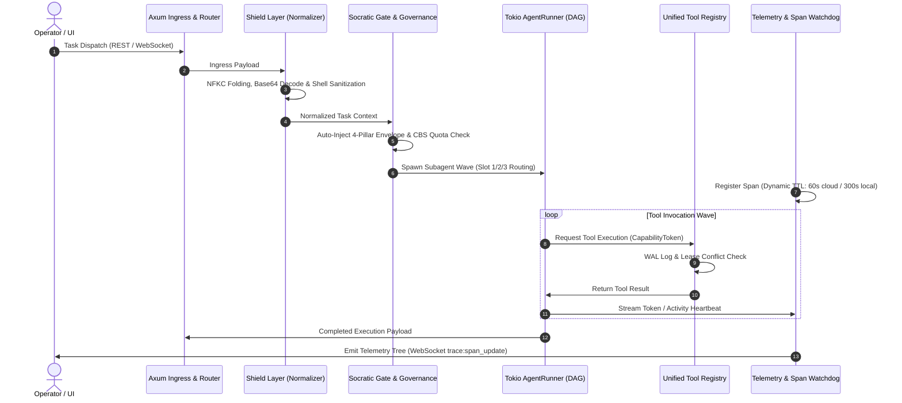

> [!IMPORTANT]
> **AI Context & Knowledge Heritage**
> - **Subsystem**: Architecture & Documentation / Core Docs / ARCHITECTURE
> - **Architecture**: `@docs ARCHITECTURE:Documentation`
> - **Failure Path**: Information drift, legacy terminology, or documentation mismatch.
> - **Observability**: Traceability via `execution/parity_guard.py`

# 🏗️ Tadpole OS Architecture: Technical Hub

**Intelligence Level**: High (ECC Optimized)  
**Version**: 1.3.4
**Last Hardened**: 2026-09-10 (Ollama loopback resolution, schemeless OLLAMA_HOST normalization, and protocol-aware endpoint stripping)
**Standard Compliance**: ECC-ARA (Enhanced Contextual Clarity)  
**Last Code/Docs Parity Check**: 2026-09-10 (Ollama handshake parity, ProtocolRouter unit tests, and parity guard synchronization)

---

## 🎯 Executive Summary

Tadpole OS serves as the sovereign, local-first runtime layer within the broader **Sovereign Reality** ecosystem. It provides a deterministic, high-performance execution environment for autonomous multi-agent swarms. Utilizing a **Gateway-Runner-Registry** architecture implemented in Rust (`server-rs`), the system guarantees 100% data sovereignty, Capability-Based Security (CBS), and cryptographically verified human oversight. The runtime features a **Unified Tool Registry**, **Adaptive Span Lifecycle Watchdogs**, and a **Socratic Gate Context Auto-Injection** engine to enable low-latency, zero-stall swarm orchestration.

> [!TIP]
> **New to the codebase?** Start with the [Architecture Overview](./Architecture_Overview.md) for an executive brief and core system topology.

---

## 🛰️ Documentation Suite

To maintain technical clarity and prevent cognitive overload, the architecture is decomposed into specialized modules:

| Module | Description | Key Technologies |
|:--- |:--- |:--- |
| **[🏗️ Overview](./Architecture_Overview.md)** | Core topology and system philosophy. | Axum, Mermaid, Sovereign Layer |
| **[🛡️ Security Model](./Security_Model.md)** | Zero-Trust, CBS, WAL, and Oversight. | Ed25519, CBS, WAL, Audit |
| **[🤖 Agent Runner](./Agent_Runner_Workflow.md)** | Execution lifecycle and Swarm protocols. | Tokio, LLM Dispatch, Recruitment |
| **[🧠 Memory & RAG](./Knowledge_Memory.md)** | Hybrid memory strategy and ingestion. | LanceDB, SQLite, BM25 Reranking |
| **[⚛️ Client Architecture](./Frontend_State_Management.md)** | Frontend state and multi-window sync. | React 19, Zustand, Portals |
| **[📜 Contracts & Bindings](#contracts)** | Cross-language TypeScript/Rust contract generation. | Specta, TypeScript, IPC |

### Contracts
The system enforces end-to-end type safety between the Rust engine (`server-rs`) and the TypeScript frontend (`src/contracts/generated.ts`) via automated Specta code generation in `server-rs/src/bridge.rs`. Generated models mirror the canonical Rust state machines and CBS policies.

---

## 🔄 Life of a Request: Swarm Execution Pipeline

The diagram below illustrates the end-to-end deterministic lifecycle of an execution request through the Tadpole OS runtime:


```mermaid
sequenceDiagram
    autonumber
    actor User as Operator / UI
    participant Gateway as Axum Ingress & Router
    participant Shield as Shield Layer (Normalizer)
    participant Socratic as Socratic Gate & Governance
    participant Runner as Tokio AgentRunner (DAG)
    participant Registry as Unified Tool Registry
    participant Telemetry as Telemetry & Span Watchdog

    User->>Gateway: Task Dispatch (REST / WebSocket)
    Gateway->>Shield: Ingress Payload
    Shield->>Shield: NFKC Folding, Base64 Decode & Shell Sanitization
    Shield->>Socratic: Normalized Task Context
    Socratic->>Socratic: Auto-Inject 4-Pillar Envelope & CBS Quota Check
    Socratic->>Runner: Spawn Subagent Wave (Slot 1/2/3 Routing)
    Telemetry->>Telemetry: Register Span (Dynamic TTL: 60s cloud / 300s local)
    loop Tool Invocation Wave
        Runner->>Registry: Request Tool Execution (CapabilityToken)
        Registry->>Registry: WAL Log & Lease Conflict Check
        Registry->>Runner: Return Tool Result
        Runner->>Telemetry: Stream Token / Activity Heartbeat
    end
    Runner->>Gateway: Completed Execution Payload
    Telemetry->>User: Emit Telemetry Tree (WebSocket trace:span_update)
```

---

## ⚙️ Core Engine Subsystems (server-rs)

The Rust engine implements high-fidelity subsystems to ensure sovereign stability, intelligence, and safety.

### 1. Unified Tool Registry
- **@docs ARCHITECTURE:Registry** (`tools/registry.rs`, `tools/manifest.rs`)
- **Centralized Manifest**: All tools (builtin, categorical, and dynamic) are defined in a unified `ToolManifest` (v1.3.0), providing a single source of truth for names, descriptions, parameter schemas, and security classification metadata (`is_mutating`, `is_dangerous`, `is_cacheable`).
- **Discovery Parity**: The `Synthesis` layer dynamically pulls from the registry, ensuring that the model's understanding of its toolbelt matches execution reality.
- **Hot-Reload Ready**: Swarms can autonomously register and refine micro-scripts (Skills) without engine restarts.
- **Shared Idempotent Tool Caching**: Caches read-only tool outputs (`read_file`, `grep_search`, `list_file_symbols`) keyed by arguments and workspace root, invalidating on mutating file writes.

### 2. Zero-Trust Tool Pipeline (SEC-04)
- **@docs ARCHITECTURE:Security** (`tools/mod.rs`, `tools/context.rs`)
- **Capability-Based Security (CBS)**: Replaces ambient authority with explicit, cryptographically signed permission tokens.
- **CBS Key Rotation**: Supports zero-downtime rotation via `CAPABILITY_KEY_CURR` and `CAPABILITY_KEY_PREV`.
- **Write-Ahead Logging (WAL)**: Persists tool intents to the audit trail *before* execution begins.
- **Cryptographic Oversight Gate**: Enforces operator decision signing via client-side Ed25519 key generation and server-side signature verification.
- **Concurrent Conflict Locks**: Leases active file paths to writing agents; leases automatically expire after 30 seconds to prevent deadlocks.

### 3. Intelligent Model Registry & Slot Routing (IMR-01)
- **@docs ARCHITECTURE:Intelligence** (`capability_matrix.rs`, `model_manager.rs`)
- **@docs ARCHITECTURE:Agent** (`model_manager.rs`)
- **@docs ARCHITECTURE:ModelRouting** (`routing.rs`)
- **Tri-Tier Slot Architecture**:
  - **Slot 1 (Primary)**: General conversational steering and task ingestion.
  - **Slot 2 (Execution)**: Fast, low-latency code generation and deterministic tool invocation.
  - **Slot 3 (Planning)**: Deep recurrent reasoning and long-horizon architecture synthesis.
- **Dynamic Handshake Validation**: Automated provider capability inference (Vision, Tools, Reasoning) with secret redaction.

### 4. Swarm Persistence & Governance
- **@docs ARCHITECTURE:Persistence** (`persistence.rs`, `agent_db.rs`, `sync_manifests.rs`)
- **Concurrent Active Clusters**: Supports up to `MAX_CLUSTERS = 10` parallel swarm mission clusters running independently.
- **Transactional Persistence Guard**: Atomic manifest synchronization with agent state via transactional SQLite commits.
- **Strict JSON Error Propagation**: Fails fast on corrupted records during state loading to prevent silent capability wipes.
- **Hierarchical RBAC**: Policy cascade: `Agent-Specific` $\rightarrow$ `Role-Based` $\rightarrow$ `Global Policy` $\rightarrow$ `Sovereign Safety Prompt`.

### 5. Swarm Intelligence & Autonomous Evolution
- **@docs ARCHITECTURE:Persistence** (`swarm_persistence.rs`)
- **@docs ARCHITECTURE:Agent** (`mission_tools.rs`)
- **Hierarchical Coordination**: Peer-to-peer directive delegation and multi-stage audit loops (Critic-Refiner).
- **Dynamic Tool Synthesis**: Autonomous generation and registration of Python/Node micro-scripts (Skills).
- **Turn Preservation Compaction**: Keeps the latest 4 reasoning turns raw, truncating older embedded code logs exceeding 2,000 chars in $O(N)$ linear time.

### 6. CodeBase Intelligence & Semantic Graph (MOD-03)
- **@docs ARCHITECTURE:CodeBaseIntelligence** (`utils/parser.rs`, `intelligence/graph/mod.rs`)
- **@docs ARCHITECTURE:Intelligence** (`routes/intelligence.rs`)
- **Modular Intelligence Subsystem**: Decomposed graph architecture (`intelligence/graph/`) cleanly separating data models (`models.rs`), path normalization and Git status lookup (`path_utils.rs`), workspace filesystem scanning (`discovery.rs`), in-memory AST cache serialization (`cache.rs`), multi-language tree-sitter AST extraction (`parsing.rs`), and graph assembly / blast radius calculation (`synthesis.rs`).
- **Tree-sitter Symbol Extraction**: High-fidelity AST parsing for Rust and TypeScript, extracting functions, structs, traits, and signatures into `SymbolNode` graphs.
- **Incremental AST Caching**: Scans file sizes and `mtime` to parse only modified files, rebuilding in-memory `petgraph` in microseconds.
- **Active Documentation Guard (ADG & ADG v2)**: Dual-engine documentation integrity (@docs `docs/ADG_V2.md`). Layer 1 (`graph_query validate`) enforces backtick symbol-to-code parity in Rustdoc and JSDoc comments with Jaro-Winkler auto-fixes. Layer 2 (`tools/adg/adg.mjs`) enforces ADG v2 3-layer claim governance (P-class prose, M-class `adg.manifest.json` witness map, and E-class `tests/invariants/` test harness).

### 7. API Gateways, Router & State Management
- **@docs ARCHITECTURE:Gateways** (`routes/mod.rs`, `router.rs`, `routes/agent/mod.rs`)
- **@docs ARCHITECTURE:Networking** (`router.rs`, `startup/mod.rs`, `routes/templates/mod.rs`)
- **@docs ARCHITECTURE:State** (`state/mod.rs`, `state/persistence.rs`, `services/mod.rs`)
- **Axum 0.8 Engine**: High-speed routing enforcing Bearer token authentication via `NEURAL_TOKEN`.
- **Path Traversal Hardening**: Validates all resource paths strictly within `WORKSPACE_ROOT`.
- **System State Hub & Initialization**: Global shared references in `AppState` with modular subsystem initialization (`state/init/`) isolating channel allocation (`channels.rs`), database pools (`databases.rs`), security parameters (`security.rs`), background runtime services (`services.rs`), and atomic state snapshot persistence (`state/persistence.rs`).
- **Modular Agent Gateway**: Decomposed router subsystem (`routes/agent/`) cleanly separating request models (`models.rs`), CRUD and introspection (`crud.rs`), asynchronous task dispatch (`tasks.rs`), conversational turn generation (`chat.rs`), long-running mission lifecycles (`missions.rs`), and failure count recovery (`recovery.rs`).
- **Modular Startup Pipeline**: Refactored application lifecycle orchestration (`startup/`) isolating CLI arguments parsing (`cli.rs`), async runtime configuration (`runtime.rs`), supervisor loops (`supervisor.rs`), and OpenTelemetry tracing initialization (`tracing.rs`).
- **Decomposed Template Store**: Modular multi-file subsystem (`routes/templates/`) isolating catalog fetching, git source management, naming sanitization, asset validation, synchronized MCP configuration storage, and installed lifecycle ledger.

### 8. Test Suite Isolation & Settings Store Verification
- **@docs ARCHITECTURE:TestSuites** (`stores/settings_store.test.ts`)
- **Test Sandbox Isolation**: Strict test isolation using `vi.hoisted` to mock `localStorage` and `atob`/`btoa` globally, preventing cross-test state leakage.

### 9. System Core & Configuration
- **@docs ARCHITECTURE:Core** (`config.rs`, `utils/deduplicator.rs`)
- **@docs ARCHITECTURE:Configuration** (`config.rs`)
- **Centralized Configuration**: Validates environment parameters, database URLs, and hardware limits on startup.
- **Deduplication Engine**: SHA-256 content hashing to prevent duplicate knowledge ingestion.

### 10. Institutional Knowledge Store (IKS) & Open Knowledge Format (OKF)
- **@docs ARCHITECTURE:IKS** (`routes/knowledge.rs`, `agent/knowledge_store.rs`)
- **OKF-Aligned Schema**: SQLite-backed storage mapping swarm insights using standard OKF metadata parameters (`concept_type`, `title`, `description`, `resource_uri`, `tags`).
- **Visual OKF Force-Graph**: Monochromatic Zinc-scaled design tokens with semantic accent highlights for live node health.

### 11. Agent-to-Agent (A2A) Economic Layer
- **@docs ARCHITECTURE:Economics** (`agent/runner/a2a_ledger.rs`, `agent/runner/a2a_router.rs`)
- **Two-Phase Commit (2PC) Transactions**: Deterministic `prepare_transaction` $\rightarrow$ `commit_transaction` protocol preventing double-spending.
- **Mailbox Protocol & Routing**: Standardized message mailboxes enabling paid inter-agent service delegation.
- **Economic Limit Guards**: Global `PaymentRouter` enforcing daily spend limit caps across Economic Zones (Dev, Staging, Prod).

### 12. AI-Tadpole-OS Swarm Orchestration Engine
- **@docs ARCHITECTURE:Orchestration** (`agent/runner/swarm.rs`, `agent/runner/conductor.rs`, `agent/runner/context.rs`, `Dual_Trace_Playback.tsx`)
- **@docs ARCHITECTURE:Orchestrator** (`agent/runner/service_traits/orchestrator.rs`)
- **Conductor Plan (DAG)**: Decomposes complex objectives into validated dependency graphs executed in bounded parallel waves.
- **Socratic Gate Context Auto-Injection**: Automatic compilation of the 4-Pillar Envelope (`[SCOPE_CONTRACT]`, `[PERFORMANCE_THRESHOLD]`, `[ARCHITECTURE_MODE]`, `[FAILURE_MODES]`) for 0-turn sub-agent evaluation.
- **Heuristic Fast-Path (System 1)**: Bypasses heavy planning loops for simple single-step queries.
- **Context Sandboxing**: Isolates sub-agent context using `visible_transcript` to prevent telemetry noise leaks.
- **Builder-Debugger Pair Swapping**: Dynamically swaps model slots to dedicated debugging configurations upon tool or compilation errors.
- **Dual-Trace Telemetry Inspector**: Side-by-side execution trace visualizer comparing baseline directives against certified state machines.

### 13. Outward A2A Gateway & Customer Knowledge Catalog
- **@docs ARCHITECTURE:OutwardGateway** (`agent/outward/outward_gateway.rs`, `agent/outward/customer_catalog.rs`, `routes/outward_routes.rs`)
- **Zero-Trust Silo Isolation**: Completely isolates public-facing agent interactions from internal developer AST trees to prevent IP exposure.
- **Outward Local Model Runner**: Binds customer agents to low-footprint local inference profiles (`gemma4:e4b`) to preserve VRAM on SMB nodes.
- **Real-Time PII Sanitizer & Luhn Mod-10 Verification**: Strips credit card numbers, SSNs, and secret keys before agent card publishing.
- **Public A2A Metadata Endpoint**: Publishes standard `a2a-protocol.org` agent profiles protected by a 60 req/min fixed-window IP rate limiter.

### 14. Shield Layer & Adaptive Span Lifecycle Watchdog
- **@docs ARCHITECTURE:ShieldLayer** (`security/normalizer.rs`, `security/path_guard.rs`, `security/ssrf_guard.rs`, `security/command_guard.rs`, `security/remote_protocol.rs`)
- **@docs ARCHITECTURE:Security:PathGuard** (`security/path_guard.rs`)
- **@docs ARCHITECTURE:Security:SSRFGuard** (`security/ssrf_guard.rs`)
- **@docs ARCHITECTURE:Security:CommandGuard** (`security/command_guard.rs`)
- **@docs ARCHITECTURE:Security:RemoteProtocol** (`security/remote_protocol.rs`)
- **@docs ARCHITECTURE:TelemetryBridge** (`telemetry/span_watchdog.rs`)
- **Multi-Pass Normalization**: Unicode NFKC folding, confusable Cyrillic/Greek homoglyph resolution, and recursive base64 decoding.
- **Modular Security & Sandbox Guards**: Specialized defense submodules isolating workspace boundary enforcement (`security/path_guard.rs`), server-side request forgery mitigation (`security/ssrf_guard.rs`), command injection scanning & binary allowlisting (`security/command_guard.rs`), and Ed25519 proof-of-possession verification (`security/remote_protocol.rs`).
- **Adaptive Span Lifecycle Watchdog**: Monotonic (`std::time::Instant`) background reaper cleaning orphaned trace spans with per-chunk streaming heartbeat protection and provider-aware dynamic TTLs (`60s` cloud vs `300s` local).

### 15. Vulnerability Scanning & Skillspector Governance
- **@docs ARCHITECTURE:VulnerabilityScanning** (`security/skillspector.rs`)
- **Fail-Closed Gate**: Automated static analysis of capabilities, template skills, workflows, and knowledge files against prompt injection and command exploits before registration.
- **Universal Rejection Threshold**: Enforces `RISK_REJECT_THRESHOLD = 50` across all capability ingestion routes, recording explicit bypassed indicators if disabled.

### 16. Utility Foundation & Transactional Filesystem Staging
- **@docs ARCHITECTURE:UtilityFoundation** (`utils/mod.rs`, `utils/fs_transaction.rs`)
- **InstallTransaction Staging Engine**: Infallible transactional staging (`copy_new`, `write_new`, `replace_atomically`) with automatic LIFO rollback on uncommitted drop.
- **Kernel-Guaranteed Atomic Creation**: Direct `OpenOptions::create_new(true)` preventing TOCTOU races during file installs.

### 17. Model Context Protocol (MCP) Subsystem & 2026-07-28 Hybrid Transport
- **@docs ARCHITECTURE:Registry:Mcp** (`agent/mcp/`)
- **Single-Responsibility Decomposition**: Decomposed monolithic modules into focused leaf modules: `types.rs` (data models), `authz.rs` (security codec & wildcard authorization), `config.rs` (configuration schema, CRLF/NUL injection validation, separate env/headers placeholder resolution), `native.rs` (`#[agent_tool]` native handlers), `host.rs` (orchestrator with execution-path scoping & bounded eviction), and `client/` facade (`stdio.rs`, `adaptive.rs`, `jsonrpc.rs`, decomposed `http/` transport, and decomposed `port3000_conformance/` witness suite).
- **Decomposed HTTP Transport Submodule (`client/http/`)**:
  - `limits.rs`: Strict specification bounds (`MAX_REQUEST_BODY_BYTES = 1 MiB`, `MAX_RESPONSE_BODY_BYTES = 4 MiB`, `MAX_SSE_LINE_BYTES = 64 KiB`, `MAX_OPERATION_BINDINGS = 1024`).
  - `headers.rs`: Pure schema parameter header extraction (`extract_and_validate_tool_headers`), RFC 9110 token validation, whole finite float integer projection, MCP Base64 sentinel encoding (`=?base64?...?=`), and deterministic binding hashing (`hash_operation_binding`). Zero `reqwest` dependencies.
  - `classify.rs`: Exact error classification allowlist (`ConnectionRefused`, `HostUnreachable`).
  - `body.rs`: Bounded response body consumer (`read_bounded_body`) with source error context preservation.
  - `sse.rs`: Unified line processor (`process_sse_line`) and request-scoped stream parser (`parse_sse_stream`) with EOF trailing buffer draining, preventing dropped final events.
  - `client.rs`: `McpHttpClient` state machine, RFC 9110 bracketed IPv6 `Host` authority, redirect disabling (`Policy::none()`), and priority eviction of non-retryable operations in the 1,024-entry binding cache.
- **Decomposed Port 3000 Conformance Witnesses (`client/port3000_conformance/`)**:
  - `harness.rs`: Dedicated local HTTP/stdio mock transport harness, `ParsedHttpRequest`, and `write_json_rpc` response helper.
  - `gates_config.rs`: Gate 1 config coexistence validation.
  - `gates_schema.rs`: Gates 12 & 15 parameter header schema and sentinel encoding rules.
  - `gates_http.rs`: Gates 2–5, 9, 11, 11b, 14, 16, 17, 19, 20 client wire contract, dual-stack `_meta` discovery assertions, Bearer redaction, and SSE stream lifecycle.
  - `gates_adaptive.rs`: Gates 6–8, 10, 13, 18 adaptive fallback and fail-closed state machine transitions.
- **GEV Port 3000 Dual Transport (`prefer_http`)**: Adaptive state machine (`AdaptiveMcpClient`) managing transitions `Configured` $\rightarrow$ `HttpDiscovering` $\rightarrow$ `HttpReady` $\rightarrow$ `HttpCommitted` or falling back to `StdioDiscovering` $\rightarrow$ `StdioReady`.
- **Fail-Closed Fallback Matrix**: Stdio fallback is permitted strictly during pre-tool discovery for network refusal/unreachable or disjoint protocol version errors (-32022 without 2026-07-28). HTTP 4xx, 5xx, timeouts, protocol inconsistencies, and any errors post-tool-commitment strictly fail closed with no transport switching or request replays.
- **Parameter Header Mapping & Redaction**: Discovers tool schema parameter `x-mcp-header` directives, safely encoding non-ASCII/whitespace values with MCP Base64 sentinel tokens (`=?base64?...?=`), while redacting bearer tokens from telemetry and `Debug` representations.

### 18. Local IPC Bridge for Code Mode (`agent/mcp/ipc_bridge.rs`)
- **@docs ARCHITECTURE:Registry:IPC** (`agent/mcp/ipc_bridge.rs`)
- **Zero-Dependency JSON-RPC 2.0 Bridge**: Named Pipe (Windows) / Unix Domain Socket (Linux/macOS) server exposing `list_tools`, `get_tool_schema`, and `ping` methods over newline-delimited JSON-RPC 2.0 (NDJSON).
- **Deterministic Pipe Path**: `\\.\pipe\tadpoleos-ipc-{workspace_hash}` ensures one bridge instance per workspace, derived from the workspace root path hash.
- **Python Client**: Zero-dependency stdlib-only client (`execution/lib/mcp_client.py`) with in-memory tool cache, auto-connect workspace discovery, and CLI entry point.
- **Purpose**: Enables Python execution scripts to perform bulk tool lookups locally in milliseconds instead of burning 10+ LLM conversational turns for deterministic operations.

### 19. In-Chat Generative UI — OpenUI DSL Renderer
- **@docs ARCHITECTURE:Interface** (`src/components/chat/OpenUI_Renderer.tsx`)
- **Strongly-Typed DSL**: 4 primitives — `kpi_card`, `bar_chart`, `table` (sortable), `layout` (recursive row/column container).
- **Data-Only Rendering**: DSL payloads are pure data, never eval'd — safe from injection. Exhaustive `switch` dispatch ensures compile-time completeness.
- **Integration**: `Message_Part` union extended with `{ type: 'openui', dsl: OpenUI_DSL }` variant, rendered inline in chat via `Chat_Message_List.tsx`.

### 20. Blind-Judge Mission Benchmarking Rig (`tests/mission_bench/`)
- **@docs ARCHITECTURE:Testing** (`tests/mission_bench/`)
- **Scenario-Driven Benchmarks**: YAML scenarios define mission prompts, expected tools, weighted evaluation criteria, max turns, and timeouts.
- **SQLite Run Logging**: Each benchmark run persists telemetry (turns, tool calls, tokens, cost, duration) to `.tmp/mission_bench/results.db`.
- **Blind LLM Judge**: Configurable evaluator (`judge.py`) supporting Ollama/LM Studio local models with heuristic fallback. Per-criterion pass/fail scoring with rationale.
- **5 Seed Scenarios**: File search, error diagnosis, multi-file refactor, delegation efficiency, clarification & recovery.

### 21. Reciprocal Rank Fusion (RRF) RAG Engine (`services/rag_fusion.rs`)
- **@docs ARCHITECTURE:Services:RAG** (`server-rs/src/services/rag_fusion.rs`)
- **Triad Fusion**: Merges lexical BM25, semantic vector embeddings, and TrustGraph graph-retrieval candidates using weighted Reciprocal Rank Fusion ($RRF(d) = \sum_e \frac{w_e}{k + rank_e(d)}$).
- **Consensus & Provenance**: Single-engine duplicate suppression, 3-tier deterministic tie-breaking (RRF score $\to$ consensus engine count $\to$ canonical ID), and unified provenance labeling.

### 22. Frontend Resilience & Utility Cluster Studio
- **@docs ARCHITECTURE:UI-Services:Resilience** (`src/services/resilience/circuit_breaker.ts`, `src/services/resilience/hex_utils.ts`)
- **@docs ARCHITECTURE:Interface:ClusterStudio** (`src/components/missions/Cluster_Manager_Modal.tsx`, `src/components/missions/cluster_manager/`)
- **Resilience Engine**: Decomposed network fault-tolerance isolating stateful CircuitBreaker logic (`circuit_breaker.ts`) with failure threshold trip-guards and exponential cooldown probes, alongside cryptographically secure hex ID generation (`hex_utils.ts`) with telemetry fallback.
- **Modular Cluster Studio**: Decomposed modal subsystem isolating modal types (`types.ts`), Agent Capability Inspector (`Agent_Capability_Inspector.tsx`) with 3-slot model configuration inspection, and preset creation/editing forms (`Preset_Form.tsx`).

---

## 🏗️ 2026 Framework Modernization

- **React 19**: Modern hydration, Actions, and zero-jank telemetry state.
- **Tailwind CSS v4**: CSS-first theme architecture with sub-millisecond HMR.
- **Axum 0.8**: High-performance asynchronous Rust web framework.
- **Mythos Engine**: Deep Recurrent Reasoning (RDT) with Adaptive Computation (ACT) halting.
- **OpenTelemetry (OTel)**: Enterprise-grade distributed tracing and span aggregation.

---

## 📂 Directory Structure

```
├── server-rs/          # Layer 2: Rust Orchestration Engine
│   ├── src/agent/       # Core Runner, Socratic Gate, RAG, and Persistence
│   │   ├── mcp/         # Decomposed MCP Hub (host, authz, config, types, native, ipc_bridge, client/{stdio,http,jsonrpc,port3000_conformance})
│   │   └── runner/tools/# Zero-Trust Pipeline & CBS
│   ├── src/bin/graph_query/    # Modular intelligence CLI (ADG-05)
│   ├── src/db/          # Persistence, Migrations, Contract Tests
│   ├── src/error/       # Modular RFC 9457 Error Engine
│   ├── src/intelligence/# CodeBase Graph & Blast Radius Analysis (graph/{models,path_utils,discovery,cache,parsing,synthesis,mod})
│   ├── src/routes/      # Axum REST & WebSocket Gateways (templates, agent/{chat,crud,missions,models,recovery,tasks}, a2a, oversight)
│   │   └── templates/   # Decomposed Template Store (catalog, source, naming, validate, mcp_store, installed)
│   ├── src/security/    # Merkle Audit, Metering, Scanner, Shield Layer, PathGuard, SSRFGuard, CommandGuard, RemoteProtocol
│   ├── src/startup/     # Modular Startup Pipeline (cli, runtime, supervisor, tracing, services)
│   ├── src/state/       # Modular AppState Hubs & Initialization (init/{channels,databases,security,services}, persistence)
│   ├── src/telemetry/   # Adaptive Span Watchdog & OTel Sinks
│   └── src/utils/       # System Utilities & Transactional Filesystem Staging (fs_transaction, security facade)
├── directives/         # Layer 1: Sovereign SOPs & Behavioral Directives
├── execution/          # Layer 3: Deterministic Python Execution Tools
│   └── lib/            # Shared Python Libraries (mcp_client IPC bridge client)
├── tests/mission_bench/ # Blind-Judge Mission Benchmarking Rig (scenarios, runner, judge)
├── docs/               # Technical Specification Suite
├── data/               # Persistent State (SQLite, Vector DB)
└── src/                # Frontend Web Application (React 19/Zustand)
    ├── components/chat/ # Chat UI (Message List, OpenUI Renderer, Question Pills, Metrics Badge)
    ├── components/missions/cluster_manager/ # Decomposed Cluster Studio (Agent_Capability_Inspector, Preset_Form, types)
    └── services/resilience/ # Decomposed Frontend Resilience (circuit_breaker, hex_utils)
```

---

## 📱 Remote Companion Trust Boundary

The desktop administrator is the only actor permitted to mint a three-minute, single-use pairing challenge. An Android or remote companion consumes this challenge once while registering its Ed25519 public key.

Companion reads and commands use signed `METHOD:PATH:TIMESTAMP:NONCE` headers. The server verifies the registered key, a five-minute freshness window, and a one-time nonce before dispatch. Oversight decisions sign `approval_id:decision:timestamp:nonce` so decision parameters are cryptographically bound.

---

## 🤖 Context for AI Assistants

1.  **State Ownership**: The Rust engine is the authoritative source of truth for **agent configurations**.
2.  **Tool Protocol**: All agent tools must implement the `Tool` trait and use `ToolContext`.
3.  **Zero-Trust**: No tool has ambient authority; always check for `CapabilityToken` in execution flows.
4.  **Sovereignty**: Enforce the **Oversight Gate** for all destructive file or network operations.
5.  **Rate Limiting**: Never bypass `RateLimiter.acquire()`. It is the primary budget enforcement point.
6.  **Identity Governance** *(IDENTITY.md Directive #6)*: All agents are bound by [`directives/IDENTITY.md`](../directives/IDENTITY.md). For error analysis, check [`docs/ERROR_REGISTRY.json`](./ERROR_REGISTRY.json) for error codes (`BUDGET_BREACH`, `STASIS_ACTIVE`, `LOGIC_BLOCKER`, `COMPLIANCE_DRIFT`).
7.  **OpenUI DSL Safety**: The `OpenUI_Renderer` only accepts strongly-typed DSL payloads — never raw HTML/JS. All rendering is data-only via exhaustive `switch` dispatch.
8.  **IPC Bridge**: Python scripts should use `execution/lib/mcp_client.py` for local tool access instead of HTTP API calls.

---

## 🔍 Glossary & References

For complete domain terminology definitions (e.g., *Swarm*, *CBS*, *WAL*, *Oversight Gate*), refer to [GLOSSARY.md](./GLOSSARY.md).

---

## 🔄 Recent Sovereign Milestones

| Date | Version | Key Milestones |
|:---|:---|:---|
| 2026-09-20 | 1.4.1 | **Architectural Decomposition & Subsystem Modularization**: Decomposed monolithic files across frontend and backend for single-responsibility isolation and zero regression. Extracted frontend resilience utilities (`services/resilience/{hex_utils, circuit_breaker}.ts`) and decomposed Cluster Studio modal (`components/missions/cluster_manager/{types, Agent_Capability_Inspector, Preset_Form}.tsx`). Extracted dedicated security modules (`security/{path_guard, ssrf_guard, command_guard, remote_protocol}.rs`). Decomposed CodeBase semantic graph engine (`intelligence/graph/{models, path_utils, discovery, cache, parsing, synthesis, mod}.rs`). Decomposed server startup supervisor (`startup/{cli, runtime, supervisor, tracing, mod}.rs`). Decomposed agent HTTP gateway routes (`routes/agent/{models, tasks, crud, chat, missions, recovery, mod}.rs`). Decomposed application state initialization (`state/init/{channels, databases, security, services, mod}.rs`) and atomic snapshot serialization (`state/persistence.rs`). 100% tests, benchmarks, and active parity passing. |
| 2026-09-17 | 1.4.0 | **AI-Tadpole-OS Architectural Synthesis (Phases 1–3)**: Token-budgeted tool overflow with lossless file offload, 8-section structured compaction with frozen continuation, open tool call closer, 4-rule sub-agent delegation contract, fail-fast tool config validator, XML section-tree prompt builder, per-mission execution metrics with real-time HUD, structured `ask_user_question` with interactive choice pills, deferred MCP discovery with 3 meta-tools, async `PermissionMode::Prompt`, named model tiers for swarm delegation, stream-then-poll WebSocket recovery, local IPC bridge (Named Pipe/UDS) with zero-dependency Python client, in-chat OpenUI generative DSL renderer (KPI cards, bar charts, sortable tables, recursive layouts), blind-judge mission benchmarking rig with 5 seed scenarios, and unified store contract behavioral test suite (DashMap + SQLite). 868 Rust tests, 28 frontend tests. |
| 2026-09-09 | 1.3.5 | **MCP HTTP Submodule & Conformance Decomposition**: Decomposed monolithic `client/http.rs` into focused leaf modules (`limits`, `headers`, `classify`, `body`, `sse`, `client`, `mod`) and decomposed the 21-test witness suite into `client/port3000_conformance/` (`harness`, `gates_config`, `gates_schema`, `gates_http`, `gates_adaptive`). Hardened dual-stack `_meta` discovery assertions, unified request-scoped SSE line processor with trailing EOF buffer flush (Gate 20), memory-bounded operation binding cache (1,024 entries with non-retryable eviction priority), RFC 9110 bracketed IPv6 `Host` authority, and strict redirect disabling (`Policy::none()`). |
| 2026-09-09 | 1.3.4 | **GEV Port 3000 Client Contract**: Added the exact secret-free `prefer_http` profile, typed fail-closed transport selection, strict JSON-RPC/content-type validation, bounded request-scoped SSE, schema-derived parameter headers, last-catalog enforcement, stable logical operation IDs, structured tool outcomes, configurable finite timeouts, and 20 deterministic tests across 19 conformance gates. |
| 2026-09-08 | 1.3.3 | **MCP Subsystem Decomposition & 2026-07-28 Protocol Upgrade**: Decomposed monolithic `mod.rs` and `client.rs` into focused leaf modules (`authz`, `config`, `host`, `native`, `types`, `client/{stdio,http,jsonrpc}`). Implemented official stable MCP `2026-07-28` Streamable HTTP transport with SSE parsing, namespaced `_meta` negotiation, adaptive stdio discovery-probe handshake, and execution-path capability scoping. |
| 2026-08-25 | 1.3.2 | **Template Store Decomposition & Transactional FS**: Decomposed monolithic `routes/templates.rs` into specialized submodules (`catalog`, `source`, `naming`, `validate`, `mcp_store`, `installed`). Extracted crate-level `utils/fs_transaction.rs` with atomic `create_new` refusal and automatic rollback. Serialized MCP config mutations under process-wide lock. |
| 2026-08-20 | 1.3.2 | **Adaptive Telemetry & Socratic Gate**: Production-hardened Span Lifecycle Watchdog with monotonic `Instant` tracking and stream heartbeats. Deterministic Socratic Gate Context Auto-Injection (4-Pillar Envelope) for 0-turn sub-agent evaluation. Tri-tier model slot badging (`SLOT 1 / PRIMARY`, `SLOT 2 / EXECUTION`, `SLOT 3 / PLANNING`). Zero-trust token ledger audit tool. |
| 2026-08-04 | 1.3.1 | **Remote Oversight & Android Companion**: Phase 7 Remote Oversight — desktop QR pairing settings panel, Android companion app with CameraX + ML Kit QR scanning, BiometricPrompt hardware signing, Ktor HTTP client, and live oversight polling. Material3 theme, CSPRNG pairing tokens, and CodeQL matrix hardening. |
| 2026-07-30 | 1.3.0 | **Identity Governance & Knowledge Graph**: Phase 6.5 human-to-agent identity mapping (ISO 42001). Role blueprint backend hydration. Knowledge Graph centering, canvas sizing, PNG export, and anomaly panel. Customer Catalog RFC 4180 CSV parser with quote-aware parsing and live search tester. |

*For complete historical changelog records, see [`CHANGELOG.md`](../CHANGELOG.md).*
