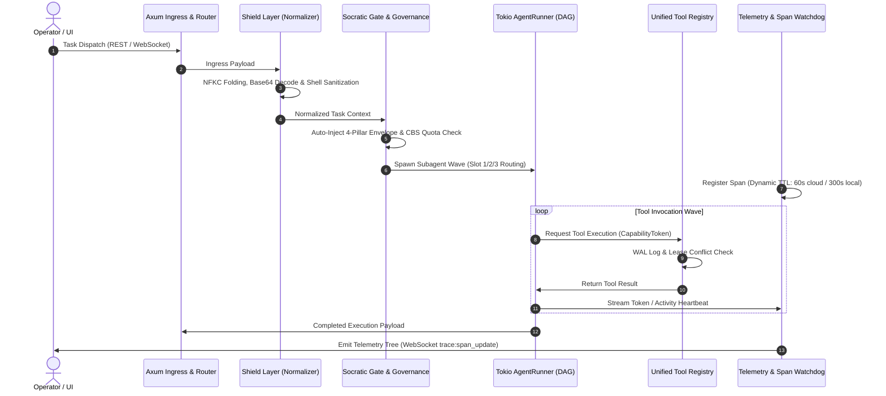

> [!IMPORTANT]
> **AI Context & Knowledge Heritage**
> - **Subsystem**: Architecture & Documentation / Core Docs / ARCHITECTURE
> - **Architecture**: `@docs ARCHITECTURE:Documentation`
> - **Failure Path**: Information drift, legacy terminology, or documentation mismatch.
> - **Observability**: Traceability via `execution/parity_guard.py`

# 🏗️ Tadpole OS Architecture: Technical Hub

**Intelligence Level**: High (ECC Optimized)  
**Version**: 1.3.2  
**Last Hardened**: 2026-08-25 (Template store decomposition, transactional filesystem staging, MCP write serialization lock, traversal sanitization boundary, receipt tracking)  
**Standard Compliance**: ECC-ARA (Enhanced Contextual Clarity)  
**Last Code/Docs Parity Check**: 2026-08-25 (Rust formatting, modular route submodules, transactional file utilities, type safety, and zero-trust verification verified)

---

## 🎯 Executive Summary

Tadpole OS serves as the sovereign, local-first runtime layer within the broader **Sovereign Reality** ecosystem. It provides a deterministic, high-performance execution environment for autonomous multi-agent swarms. Utilizing a **Gateway-Runner-Registry** architecture implemented in Rust (`server-rs`), the system guarantees 100% data sovereignty, Capability-Based Security (CBS), and cryptographically verified human oversight. The runtime features a **Unified Tool Registry**, **Adaptive Span Lifecycle Watchdogs**, and a **Socratic Gate Context Auto-Injection** engine to enable low-latency, zero-stall swarm orchestration.

> [!TIP]
> **New to the codebase?** Start with the [Architecture Overview](./Architecture_Overview.md) for an executive brief and core system topology.

---

## 🛰️ Documentation Suite

To maintain technical clarity and prevent cognitive overload, the architecture is decomposed into specialized modules:

| Module | Description | Key Technologies |
|:--- |:--- |:--- |
| **[🏗️ Overview](./Architecture_Overview.md)** | Core topology and system philosophy. | Axum, Mermaid, Sovereign Layer |
| **[🛡️ Security Model](./Security_Model.md)** | Zero-Trust, CBS, WAL, and Oversight. | Ed25519, CBS, WAL, Audit |
| **[🤖 Agent Runner](./Agent_Runner_Workflow.md)** | Execution lifecycle and Swarm protocols. | Tokio, LLM Dispatch, Recruitment |
| **[🧠 Memory & RAG](./Knowledge_Memory.md)** | Hybrid memory strategy and ingestion. | LanceDB, SQLite, BM25 Reranking |
| **[⚛️ Client Architecture](./Frontend_State_Management.md)** | Frontend state and multi-window sync. | React 19, Zustand, Portals |

---

## 🔄 Life of a Request: Swarm Execution Pipeline

The diagram below illustrates the end-to-end deterministic lifecycle of an execution request through the Tadpole OS runtime:


```mermaid
sequenceDiagram
    autonumber
    actor User as Operator / UI
    participant Gateway as Axum Ingress & Router
    participant Shield as Shield Layer (Normalizer)
    participant Socratic as Socratic Gate & Governance
    participant Runner as Tokio AgentRunner (DAG)
    participant Registry as Unified Tool Registry
    participant Telemetry as Telemetry & Span Watchdog

    User->>Gateway: Task Dispatch (REST / WebSocket)
    Gateway->>Shield: Ingress Payload
    Shield->>Shield: NFKC Folding, Base64 Decode & Shell Sanitization
    Shield->>Socratic: Normalized Task Context
    Socratic->>Socratic: Auto-Inject 4-Pillar Envelope & CBS Quota Check
    Socratic->>Runner: Spawn Subagent Wave (Slot 1/2/3 Routing)
    Telemetry->>Telemetry: Register Span (Dynamic TTL: 60s cloud / 300s local)
    loop Tool Invocation Wave
        Runner->>Registry: Request Tool Execution (CapabilityToken)
        Registry->>Registry: WAL Log & Lease Conflict Check
        Registry->>Runner: Return Tool Result
        Runner->>Telemetry: Stream Token / Activity Heartbeat
    end
    Runner->>Gateway: Completed Execution Payload
    Telemetry->>User: Emit Telemetry Tree (WebSocket trace:span_update)
```

---

## ⚙️ Core Engine Subsystems (server-rs)

The Rust engine implements high-fidelity subsystems to ensure sovereign stability, intelligence, and safety.

### 1. Unified Tool Registry
- **@docs ARCHITECTURE:Registry** (`tools/registry.rs`, `tools/manifest.rs`)
- **Centralized Manifest**: All tools (builtin, categorical, and dynamic) are defined in a unified `ToolManifest` (v1.3.0), providing a single source of truth for names, descriptions, parameter schemas, and security classification metadata (`is_mutating`, `is_dangerous`, `is_cacheable`).
- **Discovery Parity**: The `Synthesis` layer dynamically pulls from the registry, ensuring that the model's understanding of its toolbelt matches execution reality.
- **Hot-Reload Ready**: Swarms can autonomously register and refine micro-scripts (Skills) without engine restarts.
- **Shared Idempotent Tool Caching**: Caches read-only tool outputs (`read_file`, `grep_search`, `list_file_symbols`) keyed by arguments and workspace root, invalidating on mutating file writes.

### 2. Zero-Trust Tool Pipeline (SEC-04)
- **@docs ARCHITECTURE:Security** (`tools/mod.rs`, `tools/context.rs`)
- **Capability-Based Security (CBS)**: Replaces ambient authority with explicit, cryptographically signed permission tokens.
- **CBS Key Rotation**: Supports zero-downtime rotation via `CAPABILITY_KEY_CURR` and `CAPABILITY_KEY_PREV`.
- **Write-Ahead Logging (WAL)**: Persists tool intents to the audit trail *before* execution begins.
- **Cryptographic Oversight Gate**: Enforces operator decision signing via client-side Ed25519 key generation and server-side signature verification.
- **Concurrent Conflict Locks**: Leases active file paths to writing agents; leases automatically expire after 30 seconds to prevent deadlocks.

### 3. Intelligent Model Registry & Slot Routing (IMR-01)
- **@docs ARCHITECTURE:Intelligence** (`capability_matrix.rs`, `model_manager.rs`)
- **@docs ARCHITECTURE:Agent** (`model_manager.rs`)
- **Tri-Tier Slot Architecture**:
  - **Slot 1 (Primary)**: General conversational steering and task ingestion.
  - **Slot 2 (Execution)**: Fast, low-latency code generation and deterministic tool invocation.
  - **Slot 3 (Planning)**: Deep recurrent reasoning and long-horizon architecture synthesis.
- **Dynamic Handshake Validation**: Automated provider capability inference (Vision, Tools, Reasoning) with secret redaction.

### 4. Swarm Persistence & Governance
- **@docs ARCHITECTURE:Persistence** (`persistence.rs`, `agent_db.rs`, `sync_manifests.rs`)
- **Concurrent Active Clusters**: Supports up to `MAX_CLUSTERS = 10` parallel swarm mission clusters running independently.
- **Transactional Persistence Guard**: Atomic manifest synchronization with agent state via transactional SQLite commits.
- **Strict JSON Error Propagation**: Fails fast on corrupted records during state loading to prevent silent capability wipes.
- **Hierarchical RBAC**: Policy cascade: `Agent-Specific` $\rightarrow$ `Role-Based` $\rightarrow$ `Global Policy` $\rightarrow$ `Sovereign Safety Prompt`.

### 5. Swarm Intelligence & Autonomous Evolution
- **@docs ARCHITECTURE:Persistence** (`swarm_persistence.rs`)
- **@docs ARCHITECTURE:Agent** (`mission_tools.rs`)
- **Hierarchical Coordination**: Peer-to-peer directive delegation and multi-stage audit loops (Critic-Refiner).
- **Dynamic Tool Synthesis**: Autonomous generation and registration of Python/Node micro-scripts (Skills).
- **Turn Preservation Compaction**: Keeps the latest 4 reasoning turns raw, truncating older embedded code logs exceeding 2,000 chars in $O(N)$ linear time.

### 6. CodeBase Intelligence & Semantic Graph (MOD-03)
- **@docs ARCHITECTURE:CodeBaseIntelligence** (`utils/parser.rs`, `intelligence/graph.rs`)
- **@docs ARCHITECTURE:Intelligence** (`routes/intelligence.rs`)
- **Tree-sitter Symbol Extraction**: High-fidelity AST parsing for Rust and TypeScript, extracting functions, structs, traits, and signatures into `SymbolNode` graphs.
- **Incremental AST Caching**: Scans file sizes and `mtime` to parse only modified files, rebuilding in-memory `petgraph` in microseconds.
- **Blast Radius Analysis**: Calculates downstream dependents of any symbol, enabling safe refactoring and change-impact visualization.
- **Active Documentation Guard (ADG)**: Enforces backtick symbol-to-code parity in Rustdoc and JSDoc comments with Jaro-Winkler auto-fixes.

### 7. API Gateways, Router & State Management
- **@docs ARCHITECTURE:Gateways** (`routes/mod.rs`, `router.rs`)
- **@docs ARCHITECTURE:Networking** (`router.rs`, `startup/mod.rs`, `routes/templates/mod.rs`)
- **@docs ARCHITECTURE:State** (`state/mod.rs`, `services/mod.rs`)
- **Axum 0.8 Engine**: High-speed routing enforcing Bearer token authentication via `NEURAL_TOKEN`.
- **Path Traversal Hardening**: Validates all resource paths strictly within `WORKSPACE_ROOT`.
- **System State Hub**: Global shared references to registries, connection pools, and agent lifecycles in `AppState`.
- **Decomposed Template Store**: Modular multi-file subsystem (`routes/templates/`) isolating catalog fetching, git source management, naming sanitization, asset validation, synchronized MCP configuration storage, and installed lifecycle ledger.

### 8. Test Suite Isolation & Settings Store Verification
- **@docs ARCHITECTURE:TestSuites** (`stores/settings_store.test.ts`)
- **Test Sandbox Isolation**: Strict test isolation using `vi.hoisted` to mock `localStorage` and `atob`/`btoa` globally, preventing cross-test state leakage.

### 9. System Core & Configuration
- **@docs ARCHITECTURE:Core** (`config.rs`, `utils/deduplicator.rs`)
- **@docs ARCHITECTURE:Configuration** (`config.rs`)
- **Centralized Configuration**: Validates environment parameters, database URLs, and hardware limits on startup.
- **Deduplication Engine**: SHA-256 content hashing to prevent duplicate knowledge ingestion.

### 10. Institutional Knowledge Store (IKS) & Open Knowledge Format (OKF)
- **@docs ARCHITECTURE:IKS** (`routes/knowledge.rs`, `agent/knowledge_store.rs`)
- **OKF-Aligned Schema**: SQLite-backed storage mapping swarm insights using standard OKF metadata parameters (`concept_type`, `title`, `description`, `resource_uri`, `tags`).
- **Visual OKF Force-Graph**: Monochromatic Zinc-scaled design tokens with semantic accent highlights for live node health.

### 11. Agent-to-Agent (A2A) Economic Layer
- **@docs ARCHITECTURE:Economics** (`agent/runner/a2a_ledger.rs`, `agent/runner/a2a_router.rs`)
- **Two-Phase Commit (2PC) Transactions**: Deterministic `prepare_transaction` $\rightarrow$ `commit_transaction` protocol preventing double-spending.
- **Mailbox Protocol & Routing**: Standardized message mailboxes enabling paid inter-agent service delegation.
- **Economic Limit Guards**: Global `PaymentRouter` enforcing daily spend limit caps across Economic Zones (Dev, Staging, Prod).

### 12. AI-Tadpole-OS Swarm Orchestration Engine
- **@docs ARCHITECTURE:Orchestration** (`agent/runner/swarm.rs`, `agent/runner/conductor.rs`, `agent/runner/context.rs`, `Dual_Trace_Playback.tsx`)
- **Conductor Plan (DAG)**: Decomposes complex objectives into validated dependency graphs executed in bounded parallel waves.
- **Socratic Gate Context Auto-Injection**: Automatic compilation of the 4-Pillar Envelope (`[SCOPE_CONTRACT]`, `[PERFORMANCE_THRESHOLD]`, `[ARCHITECTURE_MODE]`, `[FAILURE_MODES]`) for 0-turn sub-agent evaluation.
- **Heuristic Fast-Path (System 1)**: Bypasses heavy planning loops for simple single-step queries.
- **Context Sandboxing**: Isolates sub-agent context using `visible_transcript` to prevent telemetry noise leaks.
- **Builder-Debugger Pair Swapping**: Dynamically swaps model slots to dedicated debugging configurations upon tool or compilation errors.
- **Dual-Trace Telemetry Inspector**: Side-by-side execution trace visualizer comparing baseline directives against certified state machines.

### 13. Outward A2A Gateway & Customer Knowledge Catalog
- **@docs ARCHITECTURE:OutwardGateway** (`agent/outward/outward_gateway.rs`, `agent/outward/customer_catalog.rs`, `routes/outward_routes.rs`)
- **Zero-Trust Silo Isolation**: Completely isolates public-facing agent interactions from internal developer AST trees to prevent IP exposure.
- **Outward Local Model Runner**: Binds customer agents to low-footprint local inference profiles (`gemma4:e4b`) to preserve VRAM on SMB nodes.
- **Real-Time PII Sanitizer & Luhn Mod-10 Verification**: Strips credit card numbers, SSNs, and secret keys before agent card publishing.
- **Public A2A Metadata Endpoint**: Publishes standard `a2a-protocol.org` agent profiles protected by a 60 req/min fixed-window IP rate limiter.

### 14. Shield Layer & Adaptive Span Lifecycle Watchdog
- **@docs ARCHITECTURE:ShieldLayer** (`security/normalizer.rs`)
- **@docs ARCHITECTURE:TelemetryBridge** (`telemetry/span_watchdog.rs`)
- **Multi-Pass Normalization**: Unicode NFKC folding, confusable Cyrillic/Greek homoglyph resolution, and recursive base64 decoding.
- **Adaptive Span Lifecycle Watchdog**: Monotonic (`std::time::Instant`) background reaper cleaning orphaned trace spans with per-chunk streaming heartbeat protection and provider-aware dynamic TTLs (`60s` cloud vs `300s` local).

### 15. Vulnerability Scanning & Skillspector Governance
- **@docs ARCHITECTURE:VulnerabilityScanning** (`security/skillspector.rs`)
- **Fail-Closed Gate**: Automated static analysis of capabilities, template skills, workflows, and knowledge files against prompt injection and command exploits before registration.
- **Universal Rejection Threshold**: Enforces `RISK_REJECT_THRESHOLD = 50` across all capability ingestion routes, recording explicit bypassed indicators if disabled.

### 16. Utility Foundation & Transactional Filesystem Staging
- **@docs ARCHITECTURE:UtilityFoundation** (`utils/mod.rs`, `utils/fs_transaction.rs`)
- **InstallTransaction Staging Engine**: Infallible transactional staging (`copy_new`, `write_new`, `replace_atomically`) with automatic LIFO rollback on uncommitted drop.
- **Kernel-Guaranteed Atomic Creation**: Direct `OpenOptions::create_new(true)` preventing TOCTOU races during file installs.

---

## 🏗️ 2026 Framework Modernization

- **React 19**: Modern hydration, Actions, and zero-jank telemetry state.
- **Tailwind CSS v4**: CSS-first theme architecture with sub-millisecond HMR.
- **Axum 0.8**: High-performance asynchronous Rust web framework.
- **Mythos Engine**: Deep Recurrent Reasoning (RDT) with Adaptive Computation (ACT) halting.
- **OpenTelemetry (OTel)**: Enterprise-grade distributed tracing and span aggregation.

---

## 📂 Directory Structure

```
├── server-rs/          # Layer 2: Rust Orchestration Engine
│   ├── src/agent/       # Core Runner, Socratic Gate, RAG, and Persistence
│   ├── src/agent/runner/tools/ # Zero-Trust Pipeline & CBS
│   ├── src/bin/graph_query/    # Modular intelligence CLI (ADG-05)
│   ├── src/error/       # Modular RFC 9457 Error Engine
│   ├── src/intelligence/# CodeBase Graph & Blast Radius Analysis
│   ├── src/routes/      # Axum REST & WebSocket Gateways (templates, agent, a2a, oversight)
│   │   └── templates/   # Decomposed Template Store (catalog, source, naming, validate, mcp_store, installed)
│   ├── src/security/    # Merkle Audit, Metering, Scanner, Shield Layer
│   ├── src/telemetry/   # Adaptive Span Watchdog & OTel Sinks
│   ├── src/utils/       # System Utilities & Transactional Filesystem Staging (fs_transaction)
│   └── src/state/       # Modular AppState Hubs
├── directives/         # Layer 1: Sovereign SOPs & Behavioral Directives
├── execution/          # Layer 3: Deterministic Python Execution Tools
├── docs/               # Technical Specification Suite
├── data/               # Persistent State (SQLite, Vector DB)
└── src/                # Frontend Web Application (React 19/Zustand)
```

---

## 📱 Remote Companion Trust Boundary

The desktop administrator is the only actor permitted to mint a three-minute, single-use pairing challenge. An Android or remote companion consumes this challenge once while registering its Ed25519 public key.

Companion reads and commands use signed `METHOD:PATH:TIMESTAMP:NONCE` headers. The server verifies the registered key, a five-minute freshness window, and a one-time nonce before dispatch. Oversight decisions sign `approval_id:decision:timestamp:nonce` so decision parameters are cryptographically bound.

---

## 🤖 Context for AI Assistants

1.  **State Ownership**: The Rust engine is the authoritative source of truth for **agent configurations**.
2.  **Tool Protocol**: All agent tools must implement the `Tool` trait and use `ToolContext`.
3.  **Zero-Trust**: No tool has ambient authority; always check for `CapabilityToken` in execution flows.
4.  **Sovereignty**: Enforce the **Oversight Gate** for all destructive file or network operations.
5.  **Rate Limiting**: Never bypass `RateLimiter.acquire()`. It is the primary budget enforcement point.
6.  **Identity Governance** *(IDENTITY.md Directive #6)*: All agents are bound by [`directives/IDENTITY.md`](../directives/IDENTITY.md). For error analysis, check [`docs/ERROR_REGISTRY.json`](./ERROR_REGISTRY.json) for error codes (`BUDGET_BREACH`, `STASIS_ACTIVE`, `LOGIC_BLOCKER`, `COMPLIANCE_DRIFT`).

---

## 🔍 Glossary & References

For complete domain terminology definitions (e.g., *Swarm*, *CBS*, *WAL*, *Oversight Gate*), refer to [GLOSSARY.md](./GLOSSARY.md).

---

## 🔄 Recent Sovereign Milestones

| Date | Version | Key Milestones |
|:---|:---|:---|
| 2026-08-25 | 1.3.2 | **Template Store Decomposition & Transactional FS**: Decomposed monolithic `routes/templates.rs` into specialized submodules (`catalog`, `source`, `naming`, `validate`, `mcp_store`, `installed`). Extracted crate-level `utils/fs_transaction.rs` with atomic `create_new` refusal and automatic rollback. Serialized MCP config mutations under process-wide lock. |
| 2026-08-20 | 1.3.2 | **Adaptive Telemetry & Socratic Gate**: Production-hardened Span Lifecycle Watchdog with monotonic `Instant` tracking and stream heartbeats. Deterministic Socratic Gate Context Auto-Injection (4-Pillar Envelope) for 0-turn sub-agent evaluation. Tri-tier model slot badging (`SLOT 1 / PRIMARY`, `SLOT 2 / EXECUTION`, `SLOT 3 / PLANNING`). Zero-trust token ledger audit tool. |
| 2026-08-04 | 1.3.1 | **Remote Oversight & Android Companion**: Phase 7 Remote Oversight — desktop QR pairing settings panel, Android companion app with CameraX + ML Kit QR scanning, BiometricPrompt hardware signing, Ktor HTTP client, and live oversight polling. Material3 theme, CSPRNG pairing tokens, and CodeQL matrix hardening. |
| 2026-07-30 | 1.3.0 | **Identity Governance & Knowledge Graph**: Phase 6.5 human-to-agent identity mapping (ISO 42001). Role blueprint backend hydration. Knowledge Graph centering, canvas sizing, PNG export, and anomaly panel. Customer Catalog RFC 4180 CSV parser with quote-aware parsing and live search tester. |

*For complete historical changelog records, see [`CHANGELOG.md`](../CHANGELOG.md).*
