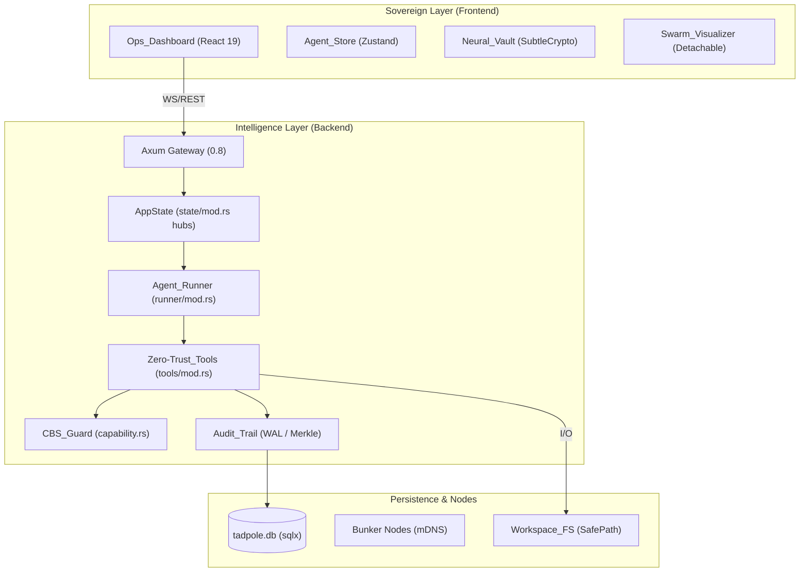

> [!IMPORTANT]
> **AI Assist Note (Knowledge Heritage)**:
> This document is part of the "Sovereign Reality" documentation.
> - **@docs ARCHITECTURE:Documentation**
> - **Failure Path**: Information drift, legacy terminology, or documentation mismatch.
> - **Telemetry Link**: Cross-reference with `execution/parity_guard.py` results.
>
> ### AI Assist Note
> Automated governance and architectural tracking.
>
> ### 🔍 Debugging & Observability
> Traceability via `parity_guard.py`.

# 🪐 Architecture Overview: Tadpole OS

> **Intelligence Level**: High (Sovereign Context)  
> **Status**: Verified Production-Ready  
> **Version**: 1.2.0  
> **Last Hardened**: 2026-05-01 (Zero-Trust Tooling & CBS)  
> **Classification**: Sovereign  

---

## 🎯 Executive Summary

**What is Tadpole OS?**  
Tadpole OS is a high-performance, local-first runtime for sovereign multi-agent swarms. It enables the orchestration of complex, recursive AI workflows where high-level "strategic" nodes delegate tactical missions to specialists, all while maintaining strict privacy, cost controls, and human-in-the-loop oversight.

**Why was it built this way?**  
The architecture is rooted in the philosophy of **Sovereign Intelligence**. Unlike cloud-locked agent frameworks, Tadpole OS prioritizes resilience and observability. By utilizing a "Gateway-Runner-Registry" pattern in Rust, the system ensures memory safety, sub-millisecond telemetry, and verifiable auditability using cryptographic Merkle trails and Write-Ahead Logging (WAL).

**What is new in the current iteration?**  
- **Zero-Trust Tooling**: Transitioned from monolithic execution to a trait-based, decoupled tool architecture.
- **Capability-Based Security (CBS)**: Replaced ambient authority with non-forgeable permission tokens.
- **Mandatory WAL**: Integrated Write-Ahead Logging to persist tool intent before execution (SEC-04).
- **Safe Command Lexer**: Whitelist-based shell validation to prevent injection and substitution attacks.

---

## 🛰️ Core System Topology

The following diagram illustrates the macro-structure of the Tadpole OS lifecycle, from the frontend dashboard to the sandboxed execution environment.

---

## 🏗️ The "Gateway-Runner-Registry" Pattern

Tadpole OS operates as a distributed state machine:
1.  **Registry**: Manages the persistent identities and capabilities of agents and providers.
2.  **Gateway**: Provides the high-concurrency Axum-based interface for the dashboard and external adapters.
3.  **Runner**: A stateful execution loop that manages the mission lifecycle, recruitment of specialists, and integration of findings.
4.  **Security Hub**: Enforces CBS and WAL policies across all tool interactions.

---

## 📄 Documentation Suite

To maintain high navigability, the architecture is decomposed into focused modules:

- [🛡️ Security Model](./Security_Model.md): Policies, CBS, WAL, and Encryption.
- [🤖 Agent Runner Workflow](./Agent_Runner_Workflow.md): Execution lifecycles and Swarm Protocols.
- [🧠 Knowledge & Memory](./Knowledge_Memory.md): Hybrid RAG, LanceDB, and Ingestion.
- [⚛️ State Management](./Frontend_State_Management.md): Zustand stores, Portals, and React 19.

---

## 🤖 Context for AI Assistants

1.  **State Ownership**: The Rust engine is the primary source of truth for **agent configurations**.
2.  **Tool Protocol**: All agent tools must implement the `Tool` trait and return a `ToolExecutionError` on failure.
3.  **Sovereignty**: Enforce the **Zero-Trust** pipeline for all tool interactions.

[//]: # (Metadata: [Architecture_Overview])
