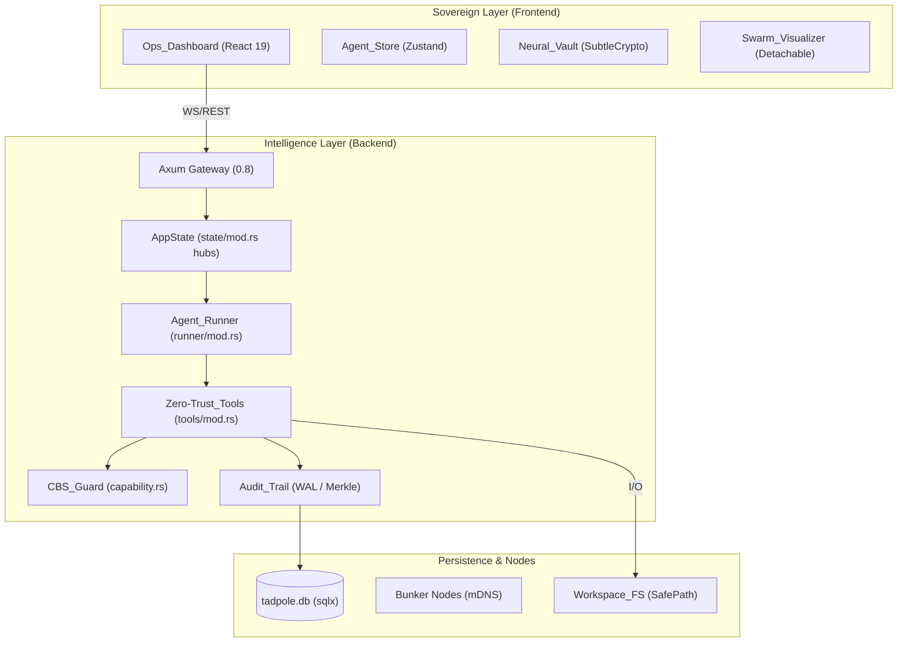

> [!IMPORTANT]
> **AI Context & Knowledge Heritage**
> - **Subsystem**: Architecture & Documentation / Core Docs / Architecture_Overview
> - **Architecture**: `@docs ARCHITECTURE:Documentation`
> - **Failure Path**: Information drift, legacy terminology, or documentation mismatch.
> - **Observability**: Traceability via `execution/parity_guard.py`

# 🪐 Architecture Overview: Tadpole OS

> **Intelligence Level**: High (Sovereign Context)  
> **Status**: Verified Production-Ready  
> **Version**: 1.2.5  
> **Last Hardened**: 2026-07-11 (Symbol Graph & Doc Guard Hardening + graph_query Modularization)  
> **Classification**: Sovereign  

---

## 🎯 Executive Summary

**What is AI-Tadpole-OS?**  
AI-Tadpole-OS is a high-performance, local-first runtime for sovereign multi-agent swarms. It enables the orchestration of complex, recursive AI workflows where high-level "strategic" nodes delegate tactical missions to specialists, all while maintaining strict privacy, cost controls, and human-in-the-loop oversight.

**Why was it built this way?**  
The architecture is rooted in the philosophy of **Sovereign Intelligence**. Unlike cloud-locked agent frameworks, AI-Tadpole-OS prioritizes resilience and observability. By utilizing a "Gateway-Runner-Registry" pattern in Rust, the system ensures memory safety, sub-millisecond telemetry, and verifiable auditability using cryptographic Merkle trails and Write-Ahead Logging (WAL).

**What is new in the current iteration?**  
- **Hierarchical Role-Based Access Control (RBAC)**: Fine-grained agent-specific and role-based policies resolved hierarchically.
- **Cryptographic Human-in-the-Loop (HITL) Oversight**: Digital Ed25519 signatures validating human actions on REST and WS channels.
- **Dynamic Provider Failover & Hot-Swapping**: Smart model hot-swapping to cloud/local backups when primary LLMs rate limit or go offline.
- **Distributed Tracing (OTel)**: Request correlation via `X-Request-Id` trace ID propagation across asynchronous boundaries.
- **RFC 9457 UI Remediation**: Unified `application/problem+json` error mapping coupled with interactive self-healing dashboard guidance.
- **Zero-Trust Tooling**: Transitioned from monolithic execution to a trait-based, decoupled tool architecture.
- **Capability-Based Security (CBS)**: Replaced ambient authority with non-forgeable permission tokens.
- **Mandatory WAL**: Integrated Write-Ahead Logging to persist tool intent before execution (SEC-04).
- **Safe Command Lexer**: Whitelist-based shell validation to prevent injection and substitution attacks.
- **Active Documentation Guard (ADG)**: Symbol graph validates Rustdoc/JSDoc backtick references against live code. `graph_query validate --fix` auto-corrects drift via Jaro-Winkler similarity. `--diff` mode restricts scanning to git-modified files for fast pre-commit enforcement.
- **Tauri IPC Boundary Validation**: Parser emits `tauri_ipc:` synthetic symbols for `#[tauri::command]` functions and matching `invoke()` calls, enabling cross-language drift detection via the symbol graph.
- **graph_query Modular CLI**: The intelligence CLI was decomposed from a monolithic file into 5 single-responsibility modules (`main.rs`, `path_utils.rs`, `visualizer.rs`, `query_manager.rs`, `doc_guard.rs`). Blast radius exports now support `--format mermaid|html`.

---

## 🛰️ Core System Topology

The following diagram illustrates the macro-structure of the Tadpole OS lifecycle, from the frontend dashboard to the sandboxed execution environment.

```mermaid
graph TD
    subgraph "Sovereign Layer (Frontend)"
        Dashboard["Ops_Dashboard (React 19)"]
        Registry["Agent_Store (Zustand)"]
        Vault["Neural_Vault (SubtleCrypto)"]
        Visualizer["Swarm_Visualizer (Detachable)"]
    end

    subgraph "Intelligence Layer (Backend)"
        Axum["Axum Gateway (0.8)"]
        State["AppState (state/mod.rs hubs)"]
        Runner["Agent_Runner (runner/mod.rs)"]
        Tools["Zero-Trust_Tools (tools/mod.rs)"]
        CBS["CBS_Guard (capability.rs)"]
        Audit["Audit_Trail (WAL / Merkle)"]
    end

    subgraph "Persistence & Nodes"
        SQLite[("tadpole.db (sqlx)")]
        Bunker["Bunker Nodes (mDNS)"]
        Files["Workspace_FS (SafePath)"]
    end

    Dashboard -- "WS/REST" --> Axum
    Axum --> State
    State --> Runner
    Runner --> Tools
    Tools --> CBS
    Tools --> Audit
    Audit --> SQLite
    Tools -- "I/O" --> Files
```

---

## 🏗️ The "Gateway-Runner-Registry" Pattern

Tadpole OS operates as a distributed state machine:
1.  **Registry**: Manages the persistent identities and capabilities of agents and providers.
2.  **Gateway**: Provides the high-concurrency Axum-based interface for the dashboard and external adapters.
3.  **Runner**: A stateful execution loop that manages the mission lifecycle, recruitment of specialists, and integration of findings.
4.  **Security Hub**: Enforces CBS and WAL policies across all tool interactions.

---

## 📄 Documentation Suite

To maintain high navigability, the architecture is decomposed into focused modules:

- [🛡️ Security Model](./Security_Model.md): Policies, CBS, WAL, and Encryption.
- [🤖 Agent Runner Workflow](./Agent_Runner_Workflow.md): Execution lifecycles and Swarm Protocols.
- [🧠 Knowledge & Memory](./Knowledge_Memory.md): Hybrid RAG, LanceDB, and Ingestion.
- [⚛️ State Management](./Frontend_State_Management.md): Zustand stores, Portals, and React 19.

---

## 🤖 Context for AI Assistants

1.  **State Ownership**: The Rust engine is the primary source of truth for **agent configurations**.
2.  **Tool Protocol**: All agent tools must implement the `Tool` trait and return a `ToolExecutionError` on failure.
3.  **Sovereignty**: Enforce the **Zero-Trust** pipeline for all tool interactions.