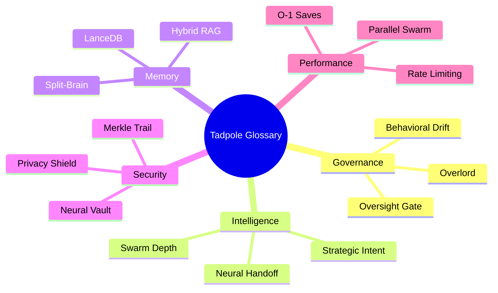

# 📖 Tadpole OS: Glossary
**Intelligence Level**: High (ECC Optimized)
**Source of Truth**: All `docs/` files, `directives/`, and Rust source.
**Last Hardened**: 2026-04-01
**Standard Compliance**: ECC-GLOS (Enhanced Contextual Clarity - Semantic Standards)

> [!IMPORTANT]
> **AI Assist Note (Semantic Logic)**:
> This document is the canonical dictionary for the Tadpole OS Ecosystem.
> - **Intent Mapping**: When an agent encountered an unknown term (e.g., "Bunker", "Alpha Node"), it MUST refer to this document for the technical definition.
> - **Synonym Resolution**: Maps operational terms (e.g., "Manual Reset") to their API implementation (`POST /v1/agents/:id/reset`).
> - **Hierarchy**: All terms are categorized by domain (Governance, Memory, Security, etc.) for O(1) semantic lookups.

---

## 📖 Terminology Domains

---

# 📖 Tadpole OS: Glossary

> **Status**: Stable  
> **Version**: 1.3.0  
> **Last Updated**: 2026-04-04  
> **Classification**: Sovereign  

---

This document defines the core concepts and terminology used throughout the Tadpole OS ecosystem. It is organized by domain to allow both human operators and developers to quickly locate relevant definitions. Entries within each section are ordered alphabetically.

---

## Table of Contents

- [🤖 Agent Governance & Lifecycle](#-agent-governance--lifecycle)
- [🧠 Memory, RAG & Knowledge](#-memory-rag--knowledge)
- [🔒 Security & Compliance](#-security--compliance)
- [⚡ Performance & Runtime](#-performance--runtime)
- [🔌 Skills, Tools & Workflows](#-skills-tools--workflows)
- [🌐 API & Infrastructure](#-api--infrastructure)
- [🖥️ UI & Dashboard](#️-ui--dashboard)
- [🎙️ Voice & Audio](#️-voice--audio)
- [🏗️ Swarm Architecture](#️-swarm-architecture)

---

## 🤖 Agent Governance & Lifecycle

### Agent Health Monitoring
A real-time telemetry system that tracks each agent's failure count and operational status. Nodes transition through three states:
- **Healthy** — `failureCount` is 0.
- **Degraded** — `failureCount` is above 0 but below the suspension threshold.
- **Throttled** — `failureCount` >= 3. The agent is automatically suspended to protect system integrity.

### Behavioral Drift
A semantic auditing mechanism within Mission Analysis that calculates the vector distance between an agent's final output and its core `IDENTITY.md` parameters. If the distance exceeds a configured threshold, the system flags the deviation for operator review.

### Deep Hierarchical Synthesis
The convergence phase where an Alpha Node merges findings from depth-2 and deeper sub-agents. Missions involving deep hierarchical synthesis typically have a swarm depth greater than 2 and require the Alpha to reconcile findings from multiple specialist domains.

### Manual Reset
An administrative action (`POST /v1/agents/:id/reset`) that clears an agent's `failureCount`, resets its `lastFailureAt` timestamp, and returns it to an `idle` state.

### Mission Analysis
The automated post-mission evaluation process. When enabled, the engine triggers a specialized auditing agent (the Success Auditor) to review execution logs and provide performance insights and optimization recommendations.

### Neural Oversight
The governance layer responsible for cluster-wide strategic optimization. It proactively identifies organizational inefficiencies and surfaces configuration recommendations to the human operator for review.

### Optimization Proposal
A structured recommendation (`SwarmProposal`) generated by the engine to improve a mission cluster's efficiency. Proposals may include model upgrades, role reassignments, or skill extensions.

### Overlord (Entity 0)
The human operator at the top of the command hierarchy. The Overlord is the final authority for approving sensitive actions, reviewing Neural Oversight proposals, and maintaining strategic direction over the swarm.

### Oversight Gate (Human-in-the-Loop)
The security interception layer that pauses agent execution during sensitive tool calls — such as writing files or completing missions — until a human operator approves the action via the dashboard. Also enforces the **Requires Oversight** flag on individual agents.

### Requires Oversight
An agent-level governance flag. When enabled, every tool call initiated by that agent is automatically intercepted by the Oversight Gate, regardless of the tool's individual safety classification. Recommended for junior agents or high-risk autonomous nodes.

### Self-Healing Retry
A resilience mechanism in the Groq provider that automatically detects and recovers from `tool_use_failed` errors (HTTP 400) caused by malformed JSON. It performs an immediate corrective retry to maintain mission continuity without manual intervention.

### Strategic Command
The interactive interface within the Hierarchy Layer where operators review, authorize, or dismiss Neural Oversight proposals.

### Success Auditor
The persona of the Mission Analysis agent (ID 99). It is responsible for goal validation, tool efficiency auditing, and generating optimization prescriptions for future missions.

### Swarm Depth
The recursive level of sub-agent spawning within a mission. Tadpole OS enforces a strict maximum depth of 5 (configured in `AppState`) to prevent infinite recursion.
- **Depth 0** — Direct user-to-agent task.
- **Depth 1** — Overlord spawned an Alpha Node.
- **Depth 2–5** — Secondary and tertiary specialists.

### Swarm Lineage (Recruitment Chain)
The deterministic tracking of agent ancestry within a mission. The engine uses lineage records to prevent any agent from recruiting an ancestor, blocking circular dependency loops (e.g., Agent A → B → A).

---

## 🧠 Memory, RAG & Knowledge

### Connector Config
An agent-level configuration array (`connectorConfigs`) that specifies external data sources for background ingestion. Each entry defines a `type` (e.g., `fs`) and a `uri` (e.g., `/data/business-docs/`).

### Debounced Persistence
An architectural pattern where high-frequency database writes — such as token usage updates — are buffered in memory and flushed to disk at regular intervals (every 10 seconds by default) to reduce I/O contention and improve runtime performance.

### Deduplication Thresholding
A vector-based safety check using cosine distance (controlled by `LANCEDB_DEDUPE_THRESHOLD`) that prevents redundant insights from being written to an agent's long-term memory.

### Heuristic Reranker
A lightweight scoring function in `memory.rs` that re-sorts RAG results by combining vector similarity distance with keyword overlap into a unified relevance score before injecting context into the agent's prompt.

### Hybrid RAG (Retrieval-Augmented Generation)
An advanced retrieval strategy in the Neural Memory engine that combines vector similarity (cosine distance) with keyword proximity scoring (BM25-inspired) to produce higher-fidelity context retrieval. The dual-signal approach reduces hallucination on domain-specific terminology.

### Ingestion Worker
A background Tokio daemon (`connectors.rs`) that periodically crawls configured data sources — such as file directories — and embeds new content into an agent's vector memory. Controlled by the `SME_SYNC_INTERVAL_MINS` environment variable.

### Layout-Aware Parsing
A document extraction strategy (`parser.rs`) that preserves structural metadata — headers, CSV row context, and PDF page boundaries — when chunking files for embedding. This produces higher-quality semantic vectors compared to naive full-text splitting.

### Orphan Sweeper
A background maintenance task that purges stale mission vector store directories (`scope.lance`) from the `workspaces/` folder to prevent unbounded disk growth.

### RAG Scope
A temporary, sandboxed LanceDB directory (`scope.lance`) spun up when a mission cluster activates. Agents query this focused semantic space before making external API requests, reducing hallucination on domain-specific tasks.

### Semantic Pruning
A token-reduction strategy used during mission debriefs. Instead of analyzing raw logs in full, the engine embeds them into a LanceDB vector space and extracts only the most critical pivot points — errors, decisions, blockers — to minimize LLM context window usage.

### Split-Brain Architecture
Tadpole OS's dual-database design. SQLite handles deterministic relational data (mission logs, financial budgets, UI hierarchy), while LanceDB exclusively manages high-dimensional vector embeddings for associative agent recall.

### Structured Working Memory
A persistent JSON-based scratchpad assigned to each agent. It allows agents to maintain chain-of-thought reasoning and mission milestones across multiple execution turns.

### SyncManifest
A SQLite-backed record in the `sync_manifest` table that tracks the synchronization state of each data source. Fields include `last_sync_at`, `status` (idle/syncing/error), and `checksum`, enabling incremental-only updates that avoid re-embedding unchanged files.

### Vector Neural Memory
The persistent integration of LanceDB and Apache Arrow into the engine's data layer. It provides agents with long-term semantic recall of previous findings without consuming active context window capacity.

---

## 🔒 Security & Compliance

### Budget Guard (Persistent Metering)
The financial enforcement module. It tracks USD expenditure in SQLite, ensuring that mission budgets persist across restarts and are enforced at the network and LLM gateway layer.

### Emergency Vault Reset
A terminal recovery protocol that purges all encrypted configurations from local browser storage. Used to regain access if a Master Passphrase is lost or if vault data becomes corrupted.

### Lifecycle Hooks
Security-first governance scripts (`pre-tool` and `post-tool`) executed by the engine immediately before and after any tool call. They provide an auditing layer for sensitive operations and are configurable per agent.

### Master Passphrase
The user-defined key used to encrypt and unlock the Neural Vault. This passphrase is never transmitted to the backend and exists only in volatile memory during an active session.

### Merkle Audit Trail
A tamper-evident cryptographic ledger where every critical action — tool calls, configuration changes — is SHA-256 linked to its predecessor entry. Tampering with any entry breaks the hash chain and triggers a security fault.

### Merkle Hub
The central backend service responsible for managing the tamper-evident audit trail, cryptographic signatures, and non-repudiation verification.

### Merkle Integrity Score
A 0–100% security rating derived from a cryptographic audit of the Merkle chain. A score of 100% confirms that every recorded action is authentic and untampered.

### Neural Vault
A secure, client-side encrypted storage for LLM API keys. It uses the browser's SubtleCrypto API over a secure context (HTTPS or localhost). Decryption is isolated within a dedicated Web Worker, ensuring keys are never exposed to the main thread.

### Non-Repudiation
A security property ensuring that an agent action or system decision cannot be denied after the fact. In Tadpole OS, this is achieved through Ed25519-signed Merkle audit entries linked to specific operator and mission identities.

### Privacy Mode (Shield)
A hard gate that, when enabled, explicitly blocks all outbound traffic to external cloud providers (OpenAI, Gemini, etc.) and routes all missions exclusively to the local swarm. Designed for environments with strict data sovereignty requirements.

### Sandbox Detection
An infrastructure primitive that identifies whether the engine is running within a containerized environment (Docker, Kubernetes) and adjusts security primitives and filesystem sandboxing accordingly.

### Sandbox Isolation
Path traversal and symlink-based escape vectors are mitigated by canonicalizing both the workspace root and all candidate paths before access checks, using `std::fs::canonicalize`. This closes a class of directory escape vulnerabilities common in agent runtime environments.

### Sapphire Shield
A zero-trust security protocol applied to the Template Ecosystem. It scans downloaded swarm configurations and refuses to initialize any template that requests dangerous capabilities — such as `shell:execute` or `budget:spend` — until a human operator provides explicit authorization.

### Shell Safety Scanner
A pre-execution defense layer that scans agent-generated scripts for environment variable leaks, exposed API credentials, and unsafe shell constructs before the script is dispatched for execution.

---

## ⚡ Performance & Runtime

### Atomic Synchronization (Load-then-Swap)
A fail-safe mechanism for the skills registry. The engine loads and validates new skills and workflows into a background buffer before hot-swapping the active memory registry, preventing configuration corruption or service interruption during updates.

### Benchmark Analytics Hub
The centralized system for recording and analyzing engine performance. It tracks latency (mean, p95, p99) across all mission-critical operations and supports historical comparisons for regression detection.

### Budget USD (Fiscal Gate)
A hard limit on the monetary cost of a mission. The engine calculates token costs in real-time and will automatically pause the mission if the configured limit is reached.

### Continuity Scheduler
A dedicated asynchronous daemon (`agent/continuity`) that evaluates scheduled cron expressions every 60 seconds to trigger autonomous background missions.

### Fiscal Burn (TPM)
The real-time tracking of aggregate token usage (Tokens Per Minute) across all active providers in the swarm, used to prevent exceeding budget allocations or provider API quotas.

### Memory Pressure
A critical resource metric representing the percentage of host and process RAM in use. High memory pressure triggers defensive alerts in the dashboard to prevent out-of-memory failures.

### Mission-Level Quotas
Granular fiscal limits applied to a specific mission cluster. These complement global and per-agent budgets, allowing precise expenditure control over individual research or engineering threads.

### Parallel Swarming
The engine's ability to execute multiple tool calls — such as spawning three researchers — concurrently. Implemented using Rust's `FuturesUnordered`, this reduces swarm completion latency by approximately 80% compared to sequential execution.

### Performance Delta
The calculated variance between two benchmark runs, expressed as a percentage (e.g., −15% latency). It provides immediate feedback on whether a system update or model change has improved or degraded performance.

### Process Guard (Execution Timeout)
An asynchronous watchdog that monitors dynamic skill execution. It enforces a default 60-second limit and automatically terminates any script that hangs or exceeds its resource window to maintain engine responsiveness.

### Swarm Pulse (Binary Protocol)
The high-speed binary telemetry stream used for real-time swarm visualization. Packets are prefixed with a `0x02` header and broadcast at 10Hz (100ms) over the primary WebSocket. This protocol provides sub-millisecond parity between the backend agent state and the frontend visualizer.

### MessagePack (`rmp-serde`)
The binary serialization format used for the Swarm Pulse. It is chosen for its extreme density and zero-allocation parsing capabilities, enabling 60fps graph updates in the UI even with large swarms.

### Swarm Visualizer (2D Force-Graph)
The high-performance UI component that replaces legacy Gantt-style charts with a real-time topology map of the swarm. It uses D3-force dynamics to arrange agents (nodes) and their active mission relationships (edges).

---

## 🔌 Skills, Tools & Workflows

### AI Services Category
A specialized registry namespace for capabilities discovered or generated by AI agents during a mission. This distinguishes autonomously registered skills from those manually created by operators.

### Auto-Registration
A recursive discovery mechanism where the engine automatically captures and registers sub-agent capabilities into the AI Services registry. Ensures that intelligence generated during a mission is retained for future cross-swarm reuse.

### Bulk Assignment (Skills Hub)
An operational feature in the Skills & Workflows view that allows an operator to select a specific capability and sync it to multiple agent nodes simultaneously, bypassing individual configuration steps.

### Capability Import
The process of ingesting external `.md` or script-based skill and workflow definitions into the Tadpole OS registry. A high-fidelity parser converts the documentation into structured agentic capabilities.

### Deterministic Workflows
Structured multi-step missions defined in the `workflows` table. Unlike passive workflows, these are active execution pipelines managed by the Workflow Engine with guaranteed step ordering and result propagation.

### Dynamic Skills
Custom, user-defined tools created via the Operative interface. Each consists of a JSON schema defining input parameters and an execution script (Bash, PowerShell, Python, etc.) that the engine runs as a sandboxed subprocess.

### Import Preview
A safety-first UI component that allows an operator to inspect the interpreted structure and raw source of a capability before committing it to the system registry.

### MCP (Model Context Protocol)
A standardized open protocol used by Tadpole OS to unify tool discovery and execution. It allows the engine to treat internal functions, local scripts, and remote services as first-class, interchangeable citizens in the agent reasoning loop.

### Passive Workflows
Markdown-based directives stored in the skills registry. They function as persistent knowledge references or standard operating procedures (SOPs) injected directly into an agent's system prompt at execution time.

### Skill Synchronization
The process of ensuring an agent's assigned skills and workflows are loaded into their `RunContext`. Skills are resolved dynamically from the file-system registry on every execution turn, allowing rapid iteration without engine restarts.

### SOP Engine (Standard Operating Procedure)
A deterministic workflow executor (`workflows.rs`) that parses markdown files from `data/workflows/` and executes each step sequentially. Unlike natural language swarming, the SOP Engine guarantees fixed execution order and step-by-step result propagation.

### System Delegate
A specialized MCP tool that, when invoked, triggers internal engine logic rather than an external process. The `recruit_specialist` tool is an example — it delegates sub-agent recruitment directly to the `AgentRunner`, enabling parent-to-child strategic context injection.

### User Services Category
The default registry namespace for skills and workflows manually created or imported by a human operator, as distinct from those autonomously generated by agents.

### Workflow Engine
A deterministic pipeline manager (`agent/continuity/workflow.rs`) that orchestrates multi-step mission sequences across different agents, with strict ordering and state propagation between steps.

---

## 🌐 API & Infrastructure

### File-System Swarm Vaults
The `/data/swarm_config/` directory where downloaded swarm templates are extracted and hot-loaded by the Rust engine. This file-system-first approach enables declarative, version-controllable swarm installations without static database configurations.

### Forward-Only Parity Gate
A development constraint where features are considered incomplete — and builds are blocked — if they lack synchronous documentation. This ensures documentation parity is maintained by design rather than as an afterthought.

### GitHub Native Hub
The native integration that allows the Tadpole OS Template Store to browse, search, and install swarm templates directly from a public GitHub repository without requiring a custom API backend.

### HATEOAS (Hypermedia as the Engine of Application State)
A REST Level 3 architectural constraint used in the Tadpole OS API. Responses include `_links` objects that allow clients to discover and navigate available actions and resources without prior endpoint knowledge. This reduces client-server coupling and improves long-term API evolvability.

### Neural Engine Access Token
The primary security credential configured in System Settings and the `.env` file. It is required to authenticate WebSocket and REST API connections between the frontend dashboard and the Rust engine.

### Neural Pulse
The high-frequency WebSocket event stream used for real-time telemetry. It broadcasts engine events, agent reasoning steps, and system metrics to maintain sub-second UI reactivity.

### Parity Guard
An automated infrastructure service that verifies synchronization between the live codebase (Rust routes) and distributed documentation (OpenAPI spec, API Reference). It acts as a gatekeeper to prevent documentation drift on every commit.

### Problem Details (RFC 9457)
The standardized machine-readable error format used by the Tadpole OS API. All error responses include structured fields — `type`, `title`, and `detail` — enabling consistent, graceful error handling in client applications.

### Sovereign_Chat
The primary natural language interface for issuing directives to the swarm. Located in the Operations Center, it supports deep-context isolation and interactive telepresence with the **Swarm_Visualizer**.

### Swarm Template Ecosystem
A decentralized distribution model allowing operators to discover and install pre-configured, industry-specific agent swarms (e.g., Legal, Finance, Healthcare) directly from the Tadpole OS dashboard.

### Test Trace (Handshake)
A real-time connectivity diagnostic that verifies a provider configuration — API key, network endpoint, and protocol — is valid and reachable. In the UI, prerequisites are validated before the handshake is initiated to prevent false negatives.

---

## 🖥️ UI & Dashboard

### Benchmark Analytics Hub
The centralized UI panel for tracking engine performance over time. Displays latency metrics (mean, p95, p99) and performance deltas across all mission-critical operations.

### Bunker Discovery
An infrastructure protocol that enables the primary engine to scan the local network for secondary Bunker nodes via mDNS. Discovered nodes are automatically surfaced in the sovereign dashboard for cross-bunker mission orchestration.

### Capability Badge
A compact UI indicator on agent cards in the Agent Manager. Badges (represented by Code, File, and Terminal icons) show the count of assigned skills, workflows, and MCP tools. Hovering reveals the full list of capabilities.

### Cinematic Depth View
A high-fidelity analysis modal providing full observability into a single neural transmission, including its lineage path, model configuration, and raw tool call data.

### Detachable Tab Portal
An interface feature that allows a dashboard sector to be detached into a separate browser window. A single-instance React Portal architecture maintains a unified state and WebSocket connection across all open windows.

### Lazy Singleton Pattern
A performance-first initialization strategy for the `TadpoleOSSocket`. The socket is wrapped in a JavaScript Proxy that defers instantiation until the first method call, preventing startup-time circular dependencies.

### Lineage Stream
A real-time telemetry sidebar that visualizes the propagation of instructions through the swarm hierarchy as a scrollable temporal feed.

### Mission Badge
A UI component that displays the current operational objective. It is scrollable to accommodate multi-step mission directives without disrupting the surrounding layout.

### Model Store
The sovereign interface for managing local intelligence assets. Allows operators to browse, pull, and manage models via Hugging Face or Ollama, with integrated VRAM profiling to prevent out-of-memory failures during model loading.

### Multi-Tab Sovereign Interface
The navigation system that allows operators to maintain multiple active operational contexts — Missions, Hierarchy, Settings — within a single browser tab via a persistent tab bar at the top of the viewport.

### Neural Forge
The administrative interface within the Model Manager where new model nodes are provisioned, configured with modality (LLM, Reasoning, Vision), and added to the intelligence inventory.

### Neural Map
An SVG visualization layer within the Mission Cluster view. It uses real-time telemetry to draw animated connection traces between the Alpha Node and its specialists, providing a live view of active swarm topology.

### Portal Style Sync
The automated process within the `PortalWindow` component that mirrors CSS variables, Tailwind classes, and theme metadata from the primary application to all detached windows, ensuring visual consistency.

### Reactive Infrastructure
The architectural standard governing the Tadpole OS frontend. Zustand state stores and the WebSocket communication layer are tightly coupled — any change to engine settings triggers an immediate, non-disruptive reconnection without requiring a page refresh.

### Sovereign Link
A direct navigation shortcut (denoted by a message icon in the Command Table) that instantly focuses the Neural Chat on a specific agent node.

### Sovereign Panel
A standardized UI container providing a consistent glassmorphic visual treatment across all principal page components.

### Unified Tactical Header
The static, context-aware command surface at the top of every page. It dynamically adapts its displayed metrics and action buttons based on the currently active tab.

---

## 🎙️ Voice & Audio

### Bunker Cache
A high-performance SQLite-backed audio cache within the Rust engine. Synthesized audio is persisted by text hash, enabling instant replay of common phrases and bypassing neural synthesis entirely for zero-latency responses.

### Groq Whisper
A high-fidelity cloud speech-to-text model (`whisper-large-v3`) used by the backend to transcribe user voice input for the Neural Handoff pipeline.

### Neural Handoff (Voice-to-Swarm)
The end-to-end pipeline for capturing human voice intent: audio is recorded, transcribed via a speech-to-text engine, and the resulting text is delivered to the Agent of Nine for autonomous swarm dispatch.

### Neural Synthesis (Audio Feedback)
The process of generating spoken responses from agents via a text-to-speech engine. Enables a conversational interaction model where the agent responds vocally during a session.

### Neural VAD (Silero)
Local voice activity detection powered by the Silero ONNX model. It intelligently identifies the start and end of user speech natively on the server, enabling precise segmentation and reducing unnecessary cloud API usage.

### PCM Streaming
The transmission of raw audio data (Pulse Code Modulation) in small chunks over a binary WebSocket connection. This enables real-time, low-latency playback — the user begins hearing a response before full synthesis is complete.

### Sovereign STT (Whisper)
A local implementation of the Whisper neural model for speech-to-text transcription, running entirely on the server host with no external API dependency.

### Sovereign TTS (Piper)
A local-first text-to-speech engine powered by ONNX Runtime. It provides high-quality speech synthesis without external API dependencies, ensuring full privacy for agent audio responses.

---

## 🏗️ Swarm Architecture

### Context Bus
The shared broadcast layer for a swarm mission. Findings, synthesized reports, and system logs are broadcast to all agents in the mission, allowing them to passively observe each other's progress without direct peer-to-peer communication.

### Deep Hierarchical Synthesis
The convergence phase where an Alpha Node merges findings from depth-2 and deeper sub-agents into a unified output. See also: [Swarm Depth](#swarm-depth).

### Mission Cluster (Logical Cluster)
The organizational unit for a group of agents sharing a common objective. Clusters define the high-level mission goal and provide the strategic context for all agents operating within them.

### Parallel Swarming
The concurrent execution of multiple agent recruitments or tool calls within a single mission. See also: [Parallel Swarming](#parallel-swarming-perf-06) in Performance & Runtime.

### Recursive Swarm Protocols
The formal delegation patterns governing swarm hierarchy. The CEO pattern (Agent of Nine) manages strategic direction; the COO pattern (Tadpole Alpha) manages tactical coordination and sub-agent recruitment.

### Single-Instance Detachment
An architecture where multiple browser windows share a single JavaScript heap and React tree. Eliminates cross-tab message-passing overhead and ensures real-time data is synchronized across all views with zero latency.

### Workspace (Physical Sandbox)
The backend directory (`workspaces/`) used as a secure, isolated environment for an agent's file-based tool calls. Every mission cluster maps to a dedicated workspace, ensuring agents can only interact with files relevant to their assigned mission.

