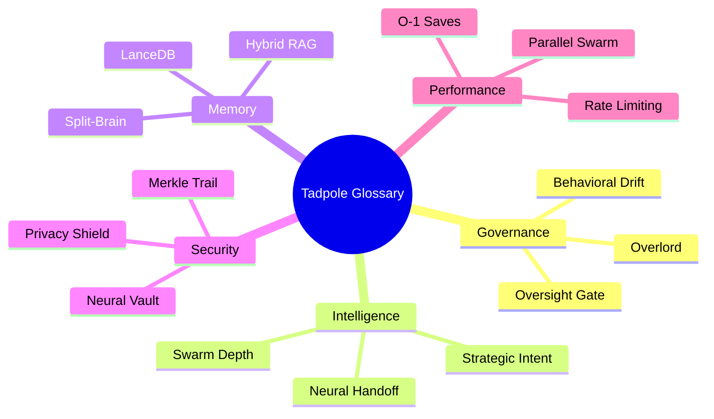

> [!IMPORTANT]
> **AI Assist Note (Knowledge Heritage)**:
> This document is part of the "Sovereign Reality" documentation.
> - **@docs ARCHITECTURE:Documentation**
> - **Failure Path**: Information drift, legacy terminology, or documentation mismatch.
> - **Telemetry Link**: Cross-reference with `execution/parity_guard.py` results.
>
> ### AI Assist Note
> Automated governance and architectural tracking.
>
> ### 🔍 Debugging & Observability
> Traceability via `parity_guard.py`.
> **AI Assist Note (Sovereign Semantic Standard)**:
> This document is the **Canonical Source of Truth** for the Tadpole OS lexicon.
> - **Glossary-First Rule**: New features or architectural changes MUST be defined here before appearing in any other documentation (Manual, READMEs).
> - **Synonym Resolution**: Maps operational terms (e.g., "Manual Reset") to their concrete implementation (`POST /v1/agents/:id/reset`).
> - **Hierarchy**: All terms are tagged by **Domain** (Governance, Memory, etc.) for O(1) semantic mapping.
> - **Verification**: Synchronized with `server-rs` via `parity_guard.py`.

# 📖 Tadpole OS: Glossary
**Intelligence Level**: High (ECC Optimized)
**Source of Truth**: All `docs/` files, `directives/`, and Rust source.
**Last Hardened**: 2026-04-01
**Standard Compliance**: ECC-GLOS (Enhanced Contextual Clarity - Semantic Standards)

> [!IMPORTANT]
> **AI Assist Note (Semantic Logic)**:
> This document is the canonical dictionary for the Tadpole OS Ecosystem.
> - **Intent Mapping**: When an agent encountered an unknown term (e.g., "Bunker", "Alpha Node"), it MUST refer to this document for the technical definition.
> - **Synonym Resolution**: Maps operational terms (e.g., "Manual Reset") to their API implementation (`POST /v1/agents/:id/reset`).
> - **Hierarchy**: All terms are categorized by domain (Governance, Memory, Security, etc.) for O(1) semantic lookups.

---

## 📖 Terminology Domains

---

# 📖 Tadpole OS: Glossary

> **Status**: Stable  
> **Version**: 1.1.13  
> **Last Updated**: 2026-04-17 (Alignment Patch)  
> **Classification**: Sovereign  

---

This document defines the core concepts and terminology used throughout the Tadpole OS ecosystem. It is organized by domain to allow both human operators and developers to quickly locate relevant definitions. Entries within each section are ordered alphabetically.

---

## Table of Contents

- [🤖 Agent Governance & Lifecycle](#-agent-governance--lifecycle)
- [🧠 Memory, RAG & Knowledge](#-memory-rag--knowledge)
- [🔒 Security & Compliance](#-security--compliance)
- [⚡ Performance & Runtime](#-performance--runtime)
- [🔌 Skills, Tools & Workflows](#-skills-tools--workflows)
- [🌐 API & Infrastructure](#-api--infrastructure)
- [🖥️ UI & Dashboard](#️-ui--dashboard)
- [🎙️ Voice & Audio](#️-voice--audio)
- [🏗️ Swarm Architecture](#️-swarm-architecture)

---

## 🤖 Agent Governance & Lifecycle

### Agent Health Monitoring
**(Domain: Performance)**  
A real-time telemetry system tracking failure counts and state transitions (Healthy, Degraded, Throttled). 
**Implementation Hook**: `server-rs/src/agent/runner/mod.rs` (tracks `failureCount` and `heartbeat_at`)

### Behavioral Drift
**(Domain: Security/AI)**  
Semantic auditing that measures the vector distance between an agent's output and its `IDENTITY.md`. 
**Implementation Hook**: `server-rs/src/agent/runner/analysis.rs` (`Behavioral Drift Detection`)

### Deep Hierarchical Synthesis
**(Domain: Swarm Architecture)**  
The convergence phase where Alpha Nodes merge findings from sub-agents across multiple specialist domains.
**Implementation Hook**: `server-rs/src/agent/runner/synthesis.rs`

### Manual Reset
**(Domain: Governance)**  
Administrative action to clear failure states and return an agent to `idle`.
**Implementation Hook**: `POST /v1/agents/:id/reset` -> `server-rs/src/routes/agent.rs` (`reset_agent`)

### Mission Analysis
**(Domain: Governance)**  
Automated post-mission debriefing triggered via the Success Auditor (Agent 99).
**Implementation Hook**: `server-rs/src/agent/runner/analysis.rs` (`spawn_post_mission_analysis`)

### Neural Oversight
**(Domain: Governance)**  
Cluster-wide strategic optimization identifying inefficiencies and surfacing proposals.
**Implementation Hook**: `server-rs/src/state/hubs/gov.rs`

### Optimization Proposal
**(Domain: Governance)**  
A structured `SwarmProposal` for improving mission efficiency (model upgrades, role changes).
**Implementation Hook**: `server-rs/src/agent/runner/analysis.rs`

### Overlord (Entity 0)
**(Domain: Governance)**  
The human operator and final authority for sensitive actions and strategic direction.
**Implementation Hook**: Standard user session with `admin` permissions.

### Oversight Gate (HITL)
**(Domain: Security)**  
Interception layer pausing execution during sensitive tool calls awaiting human approval.
**Implementation Hook**: `server-rs/src/routes/oversight.rs` & `server-rs/src/agent/runner/tools.rs`

### Requires Oversight
**(Domain: Governance)**  
Agent-level flag forcing all tool calls to hit the Oversight Gate.
**Implementation Hook**: `AgentConfig.safe_mode` in `server-rs/src/agent/types.rs`

### Self-healing Retry
**(Domain: Performance)**  
Automated recovery from malformed JSON errors during provider inference.
**Implementation Hook**: `server-rs/src/agent/groq.rs` (JSON repair filter)

### Strategic Command
**(Domain: UI/Governance)**  
The dashboard interface for reviewing and authorizing Swarm Proposals.
**Implementation Hook**: Frontend `HierarchyLayer` component.

### Self-Annealing (Agent 99)
**(Domain: Intelligence)**  
Autonomous recursive improvement of binary SOPs based on mission outcome data.
**Implementation Hook**: `server-rs/src/agent/runner/analysis.rs` -> `LONG_TERM_MEMORY.md`

### Success Auditor
**(Domain: Intelligence)**  
Persona of Agent ID 99 responsible for goal validation and efficiency auditing.
**Implementation Hook**: `server-rs/src/agent/runner/analysis.rs` (Hardcoded ID "99")

### Swarm Depth
**(Domain: Swarm Architecture)**  
Recursive level of sub-agent spawning, capped at `MAX_SWARM_DEPTH` to prevent agent storms.
**Implementation Hook**: `server-rs/src/agent/types.rs` (`MAX_SWARM_DEPTH = 5`)

### Swarm Lineage
**(Domain: Swarm Architecture)**  
Deterministic tracking of recruitment ancestry to prevent circular dependency loops.
**Implementation Hook**: `server-rs/src/agent/runner/mod.rs` (`RunContext.lineage`)

---

## 🧠 Memory, RAG & Knowledge

### Connector Config
**(Domain: Memory)**  
Agent-level config defining external data sources for background ingestion.
**Implementation Hook**: `AgentConfig.connectorConfigs` in `server-rs/src/agent/types.rs`

### Debounced Persistence
**(Domain: Performance/Memory)**  
Architectural pattern buffering high-frequency DB writes to reduce I/O contention.
**Implementation Hook**: `server-rs/src/agent/persistence.rs` (tracks `DEBOUNCE_INTERVAL`)

### Deduplication Thresholding
**(Domain: Memory)**  
Vector-based safety check preventing redundant insights from being written to long-term memory.
**Implementation Hook**: `LANCEDB_DEDUPE_THRESHOLD` used in `server-rs/src/agent/memory.rs`

### Heuristic Reranker
**(Domain: Memory)**  
Scoring function combining vector similarity with keyword overlap for relevance.
**Implementation Hook**: `server-rs/src/agent/memory.rs` (`Heuristic Reranker`)

### Hybrid RAG
**(Domain: Memory)**  
Advanced retrieval combining vector similarity (cosine) with keyword proximity (BM25).
**Implementation Hook**: `server-rs/src/agent/memory.rs` (`Hybrid RAG`)

### Ingestion Worker
**(Domain: Performance/Memory)**  
Background Tokio daemon periodically crawling data sources and embedding content.
**Implementation Hook**: `server-rs/src/agent/connectors.rs` (`IngestionWorker`)

### Layout-Aware Parsing
**(Domain: Memory)**  
Extraction strategy preserving structural metadata (headers, CSV rows) during chunking.
**Implementation Hook**: `server-rs/src/agent/parser.rs`

### Orphan Sweeper
**(Domain: Performance/Memory)**  
Maintenance task purging stale mission vector store directories (`scope.lance`).
**Implementation Hook**: `server-rs/src/agent/reaper.rs` (`OrphanSweeper`)

### RAG Scope
**(Domain: Memory)**  
Temporary, sandboxed vector space (`scope.lance`) for specific mission clusters.
**Implementation Hook**: `server-rs/src/agent/runner/mod.rs` (`resolve_paths`)

### Semantic Pruning
**(Domain: Intelligence/Memory)**  
Token-reduction strategy extracting critical pivot points from logs for mission debriefs.
**Implementation Hook**: `server-rs/src/agent/runner/analysis.rs`

### Split-Brain Architecture
**(Domain: Infrastructure)**  
Dual-database design: SQLite for relational data, LanceDB for vector embeddings.
**Implementation Hook**: `db.rs` (SQLite) & `memory.rs` (LanceDB)

### Structured Working Memory
**(Domain: Memory)**  
Persistent JSON scratchpad for agents to maintain chain-of-thought across turns.
**Implementation Hook**: `RunContext.working_memory` in `server-rs/src/agent/runner/mod.rs`

### SyncManifest
**(Domain: Memory)**  
SQLite record tracking sync state and checksums for incremental updates.
**Implementation Hook**: `sync_manifest` table in `server-rs/src/db.rs`

### Institutional Memory
**(Domain: Intelligence)**  
High-fidelity global knowledge record stored in `directives/LONG_TERM_MEMORY.md`.
**Implementation Hook**: Injected into all system prompts in `server-rs/src/agent/runner/mod.rs`

### Vector Neural Memory
**(Domain: Memory)**  
Integration of LanceDB and Apache Arrow for long-term semantic agent recall.
**Implementation Hook**: `server-rs/src/agent/memory.rs` (`VectorMemory`)

---

## 🔒 Security & Compliance

### Budget Guard
**(Domain: Security)**  
Financial enforcement module tracking USD expenditure in SQLite.
**Implementation Hook**: `server-rs/src/security/metering.rs`

### Emergency Vault Reset
**(Domain: Security)**  
Terminal protocol purging all encrypted configs from local storage.
**Implementation Hook**: Frontend `SessionHook` (clears `localStorage`)

### Lifecycle Hooks
**(Domain: Security)**  
Governance scripts (`pre-tool`, `post-tool`) executed before/after any tool call.
**Implementation Hook**: `server-rs/src/agent/runner/lifecycle.rs`

### Master Passphrase
**(Domain: Security)**  
User-defined key for Neural Vault, exists only in volatile memory.
**Implementation Hook**: Standard PBKDF2 in browser `SubtleCrypto`.

### Merkle Audit Trail
**(Domain: Security)**  
Tamper-evident cryptographic ledger where actions are SHA-256 linked.
**Implementation Hook**: `server-rs/src/security/audit.rs` (`MerkleTree`)

### Merkle Hub
**(Domain: Security)**  
Backend service managing the audit trail, signatures, and verification.
**Implementation Hook**: `server-rs/src/state/hubs/sec.rs`

### Merkle Integrity Score
**(Domain: Security)**  
Security rating derived from a cryptographic audit of the Merkle chain.
**Implementation Hook**: `server-rs/src/security/audit.rs` (`verify_integrity`)

### Neural Vault
**(Domain: Security)**  
Client-side encrypted storage for API keys using SubtleCrypto.
**Implementation Hook**: Frontend `VaultWorker.ts`

### Non-Repudiation
**(Domain: Security)**  
Property ensuring agent actions cannot be denied, secured via Ed25519 signatures.
**Implementation Hook**: `server-rs/src/security/audit.rs`

### Privacy Mode (Shield)
**(Domain: Security)**  
Hard gate blocking all outbound cloud traffic, routing to local swarm only.
**Implementation Hook**: `server-rs/src/state/hubs/sec.rs` (`Shield` status)

### Sandbox Detection
**(Domain: Infrastructure)**  
Primitive identifying containerized environments and adjusting security levels.
**Implementation Hook**: `server-rs/src/utils/sandbox.rs`

### Sandbox Isolation
**(Domain: Security)**  
Canonicalization of workspace paths to prevent directory escape vulnerabilities.
**Implementation Hook**: `server-rs/src/adapter/filesystem.rs` (uses `std::fs::canonicalize`)

### Sapphire Shield
**(Domain: Security)**  
Zero-trust scanner for Swarm Templates, refusing dangerous capabilities without HITL.
**Implementation Hook**: `server-rs/src/agent/skill_manifest.rs`

### Shell Safety Scanner
**(Domain: Security)**  
Pre-execution scanner identifying environment leaks or unsafe shell constructs.
**Implementation Hook**: `server-rs/src/agent/runner/tools.rs` (`SafetyScanner`)

---

## ⚡ Performance & Runtime

### Atomic Synchronization (Load-then-Swap)
**(Domain: Performance)**  
Fail-safe mechanism for hot-swapping the active memory registry without service interruption.
**Implementation Hook**: `server-rs/src/agent/skill_manifest.rs`

### Benchmark Analytics Hub
**(Domain: Performance)**  
Centralized system for tracking latency (mean, p95, p99) and performance regressions.
**Implementation Hook**: `server-rs/src/telemetry/benchmarks.rs`

### Budget USD (Fiscal Gate)
**(Domain: Performance/Security)**  
Real-time limit on mission monetary cost, automatically pausing upon exhaustion.
**Implementation Hook**: `AgentRunner::execute_intelligence_loop` in `server-rs/src/agent/runner/mod.rs`

### Continuity Scheduler
**(Domain: Performance)**  
Asynchronous daemon evaluating cron expressions for background missions.
**Implementation Hook**: `server-rs/src/agent/continuity/scheduler.rs`

### Fiscal Burn (TPM)
**(Domain: Performance)**  
Real-time tracking of aggregate token usage across the swarm.
**Implementation Hook**: `server-rs/src/telemetry/pulse.rs`

### Memory Pressure
**(Domain: Infrastructure/Performance)**  
Metric representing process RAM usage, triggering defensive dashboard alerts.
**Implementation Hook**: `server-rs/src/system/metrics.rs`

### Mission-Level Quotas
**(Domain: Performance)**  
Granular fiscal limits applied to specific mission clusters.
**Implementation Hook**: `Mission` struct in `server-rs/src/agent/types.rs`

### Parallel Swarming
**(Domain: Performance)**  
Concurrent tool execution using `FuturesUnordered` to reduce completion latency.
**Implementation Hook**: `server-rs/src/agent/runner/swarm.rs`

### Performance Delta
**(Domain: Performance)**  
Variance between benchmark runs used to detect improvements or regressions.
**Implementation Hook**: `server-rs/src/agent/benchmarks.rs`

### Process Guard (Execution Timeout)
**(Domain: Performance)**  
Watchdog enforcing a default 60-second limit on dynamic skill execution.
**Implementation Hook**: `server-rs/src/agent/script_skills.rs`

### Swarm Pulse (Binary Protocol)
**(Domain: Performance)**  
High-speed binary telemetry (10Hz) using MessagePack for real-time visualization.
**Implementation Hook**: `server-rs/src/telemetry/pulse.rs` (`0x02` header)

### MessagePack (`rmp-serde`)
**(Domain: Infrastructure)**  
Binary serialization format optimized for extreme density and zero-allocation parsing.
**Implementation Hook**: `server-rs/Cargo.toml` (`rmp-serde`)

### Swarm Visualizer (2D Force-Graph)
**(Domain: UI)**  
Dynamic topology map using D3-force to visualize agent mission relationships.
**Implementation Hook**: Frontend `SwarmVisualizer.tsx`

---

## 🔌 Skills, Tools & Workflows

### AI Services Category
**(Domain: Skills)**  
Registry namespace for capabilities autonomously discovered or generated by AI agents.
**Implementation Hook**: `Registry::auto_register` in `server-rs/src/agent/skill_manifest.rs`

### Auto-Registration
**(Domain: Skills/Intelligence)**  
Recursive mechanism capturing sub-agent capabilities for future cross-swarm reuse.
**Implementation Hook**: `server-rs/src/agent/runner/mod.rs` (`Swarm Auto-Registration`)

### Bulk Assignment (Skills Hub)
**(Domain: UI/Skills)**  
One-click sync of capabilities to multiple agent nodes simultaneously.
**Implementation Hook**: Frontend `BulkAssignmentModal.tsx`

### Capability Import
**(Domain: Skills)**  
Ingestion of `.md` or script-based definitions into the Tadpole OS registry.
**Implementation Hook**: `server-rs/src/agent/parser.rs`

### Deterministic Workflows
**(Domain: Skills/Performance)**  
Active execution pipelines with guaranteed step ordering and result propagation.
**Implementation Hook**: `server-rs/src/agent/workflows.rs` (`WorkflowExecutor`)

### Dynamic Skills
**(Domain: Skills)**  
User-defined tools with JSON schemas and sandboxed execution scripts.
**Implementation Hook**: `server-rs/src/agent/script_skills.rs`

### Import Preview
**(Domain: UI/Skills)**  
Safety modal allowing inspection of capability source before registry commitment.
**Implementation Hook**: Frontend `ImportPreviewModal.tsx`

### MCP (Model Context Protocol)
**(Domain: Infrastructure/Skills)**  
Standardized protocol unifying internal tools and local scripts as first-class citizens.
**Implementation Hook**: `server-rs/src/agent/mcp/mod.rs`

### Passive Workflows
**(Domain: Skills)**  
Markdown SOPs injected directly into an agent's system prompt at execution time.
**Implementation Hook**: `server-rs/src/agent/runner/mod.rs` (`ContextResolution` phase)

### Skill Synchronization
**(Domain: Skills)**  
Process ensuring agent assigned capabilities are loaded into their active `RunContext`.
**Implementation Hook**: `server-rs/src/agent/runner/lifecycle.rs`

### SOP Engine (Standard Operating Procedure)
**(Domain: Skills/Performance)**  
Sequential markdown parser ensuring fixed execution order and state propagation.
**Implementation Hook**: `server-rs/src/agent/workflows.rs`

### System Delegate
**(Domain: Skills)**  
Specialized MCP tool triggering internal engine logic (e.g., sub-agent recruitment).
**Implementation Hook**: `recruit_specialist` tool in `server-rs/src/agent/runner/mission_tools.rs`

### User Services Category
**(Domain: Skills)**  
Registry namespace for manually created or imported capabilities.
**Implementation Hook**: `Registry::user_services` in `server-rs/src/agent/skill_manifest.rs`

### Workflow Engine
**(Domain: Performance/Skills)**  
Pipeline manager orchestrating multi-step sequences with strict ordering.
**Implementation Hook**: `server-rs/src/agent/continuity/workflow.rs`

---

## 🌐 API & Infrastructure

### File-System Swarm Vaults
**(Domain: Infrastructure)**  
Directory where downloaded swarm templates are extracted and hot-loaded.
**Implementation Hook**: `server-rs/src/system/mod.rs` (`/data/swarm_config/`)

### Forward-Only Parity Gate
**(Domain: Infrastructure)**  
Development constraint blocking builds if features lack synchronous documentation.
**Implementation Hook**: `.github/workflows/parity.yml`

### GitHub Native Hub
**(Domain: Infrastructure)**  
Integration allowing the Template Store to browse sychronous registries on GitHub.
**Implementation Hook**: `server-rs/src/services/github.rs`

### HATEOAS
**(Domain: API)**  
Architectural constraint where API responses include `_links` for resource discovery.
**Implementation Hook**: `server-rs/src/types/hateoas.rs`

### Neural Engine Access Token
**(Domain: Security/Infrastructure)**  
Primary credential required for WebSocket and REST API authentication.
**Implementation Hook**: `NEURAL_TOKEN` in `server-rs/src/env_schema.rs`

### Neural Pulse
**(Domain: Performance/API)**  
High-frequency WebSocket event stream used for real-time telemetry.
**Implementation Hook**: `server-rs/src/telemetry/pulse.rs`

### Parity Guard
**(Domain: Infrastructure)**  
Service verifying synchronization between codebase and documentation.
**Implementation Hook**: `server-rs/src/startup.rs` (`Parity Guard Service`)

### Problem Details (RFC 9457)
**(Domain: API)**  
Standardized machine-readable error format used by the Tadpole OS API.
**Implementation Hook**: `server-rs/src/error.rs`

### Sovereign_Chat
**(Domain: UI/API)**  
Primary natural language interface for issued directives to the swarm.
**Implementation Hook**: `POST /v1/chat` -> `server-rs/src/routes/chat.rs`

### Swarm Template Ecosystem
**(Domain: Infrastructure)**  
Decentralized model for discovering and installing industry-specific agent swarms.
**Implementation Hook**: `swarm.json` in `server-rs/src/agent/types.rs`

### Test Trace (Handshake)
**(Domain: Infrastructure)**  
Connectivity diagnostic verifying provider configurations are reachable.
**Implementation Hook**: `AgentRunner::test_trace` in `server-rs/src/agent/runner/provider.rs`

---

## 🖥️ UI & Dashboard

### Benchmark Analytics Hub
**(Domain: UI/Performance)**  
Panel tracking engine performance metrics and deltas over time.
**Implementation Hook**: Frontend `BenchmarkDashboard.tsx`

### Bunker Discovery
**(Domain: Infrastructure/UI)**  
Protocol scanning local network for secondary Bunker nodes via mDNS.
**Implementation Hook**: `server-rs/src/system/discovery.rs`

### Capability Badge
**(Domain: UI)**  
Indicator on agent cards showing assigned skills, workflows, and tools.
**Implementation Hook**: Frontend `AgentCard.tsx`

### Cinematic Depth View
**(Domain: UI/Observability)**  
Modal providing full observability into individual neural transmissions.
**Implementation Hook**: Frontend `NeuralTransmissionModal.tsx`

### Detachable Tab Portal
**(Domain: UI)**  
Feature allowing dashboard sectors to be detached into separate windows.
**Implementation Hook**: Frontend `Portal_Window.tsx`

### Lazy Singleton Pattern
**(Domain: UI/Performance)**  
Initialization strategy deferring socket instantiation until first call.
**Implementation Hook**: Frontend `TadpoleOSSocket.ts`

### Lineage Stream
**(Domain: UI/Observability)**  
Sidebar visualizing instruction propagation via the swarm hierarchy.
**Implementation Hook**: Frontend `LineageSidebar.tsx`

### Mission Badge
**(Domain: UI)**  
Component displaying the current operational objective with scrollable directives.
**Implementation Hook**: Frontend `MissionHeader.tsx`

### Model Store
**(Domain: UI/Intelligence)**  
Interface for managing local intelligence assets via Hugging Face or Ollama.
**Implementation Hook**: Frontend `ModelStore.tsx`

### Multi-Tab Sovereign Interface
**(Domain: UI)**  
Navigation system for maintaining multiple operational contexts in one tab.
**Implementation Hook**: Frontend `DashboardLayout.tsx`

### Neural Forge
**(Domain: UI/Governance)**  
Interface for provisioning and configuring new model nodes.
**Implementation Hook**: Frontend `IntelligenceLab.tsx`

### Neural Map
**(Domain: UI/Observability)**  
SVG layer visualizing connection traces between swarm specialists.
**Implementation Hook**: Frontend `MissionClusterMap.tsx`

### Portal Style Sync
**(Domain: UI)**  
Process mirroring CSS variables and themes to detached portal windows.
**Implementation Hook**: Frontend `usePortalStyles.ts`

### Reactive Infrastructure
**(Domain: UI/Infrastructure)**  
Standard ensuring UI state and WebSocket connections stay synchronized.
**Implementation Hook**: Frontend `Zustand` stores + `SocketProvider.tsx`

### Sovereign Link
**(Domain: UI)**  
Direct navigation shortcut focusing chat on a specific agent node.
**Implementation Hook**: Frontend `CommandTable.tsx` (`SovereignLink` button)

### Sovereign Panel
**(Domain: UI)**  
Standardized glassmorphic container for principal UI components.
**Implementation Hook**: Frontend `SovereignPanel.tsx`

### Unified Tactical Header
**(Domain: UI/Governance)**  
Context-aware header dynamic metrics and adaptive action buttons.
**Implementation Hook**: Frontend `TacticalHeader.tsx`

---

## 🎙️ Voice & Audio

### Bunker Cache
**(Domain: Performance/Voice)**  
SQLite-backed audio cache bypassing neural synthesis for common phrases.
**Implementation Hook**: `server-rs/src/agent/audio_cache.rs`

### Groq Whisper
**(Domain: Intelligence/Voice)**  
Cloud STT model (`whisper-large-v3`) transcribing user voice for handoff.
**Implementation Hook**: `server-rs/src/agent/groq.rs`

### Neural Handoff
**(Domain: Voice/Swarm)**  
Pipeline delivering transcribed voice intent to the Agent of Nine.
**Implementation Hook**: `server-rs/src/agent/runner/mod.rs` (`Neural Handoff`)

### Neural Synthesis
**(Domain: Voice/Performance)**  
Process of generating vocal agent responses via text-to-speech engines.
**Implementation Hook**: `server-rs/src/agent/audio.rs`

### Neural VAD (Silero)
**(Domain: Voice/Performance)**  
Local voice activity detection identifying start/end of speech natively.
**Implementation Hook**: `server-rs/src/agent/audio.rs` (`vad.onnx`)

### PCM Streaming
**(Domain: Performance/Voice)**  
Low-latency transmission of raw audio chunks over binary WebSockets.
**Implementation Hook**: `server-rs/src/telemetry/pulse.rs`

### Sovereign STT (Whisper)
**(Domain: Voice/Security)**  
Local implementation of Whisper neural model for private transcription.
**Implementation Hook**: `server-rs/src/agent/audio.rs` (`whisper.onnx`)

### Sovereign TTS (Piper)
**(Domain: Voice/Security)**  
Local-first text-to-speech engine ensuring private audio responses.
**Implementation Hook**: `server-rs/src/agent/audio.rs` (`piper.onnx`)

---

## 🏗️ Swarm Architecture

### Context Bus
**(Domain: Swarm Architecture/Performance)**  
Shared broadcast layer for passive observation of agent progress in a mission.
**Implementation Hook**: `server-rs/src/telemetry/pulse.rs`

### Deep Hierarchical Synthesis
**(Domain: Swarm Architecture)**  
Convergence phase where Alpha Nodes merge findings from deep sub-agents.
**Implementation Hook**: `server-rs/src/agent/runner/synthesis.rs`

### Mission Cluster (Logical Cluster)
**(Domain: Swarm Architecture)**  
Organizational unit for agents sharing a common objective and context.
**Implementation Hook**: `Cluster` struct in `server-rs/src/agent/types.rs`

### Parallel Swarming
**(Domain: Swarm Architecture/Performance)**  
Concurrent execution of multiple sub-agent recruitments within a mission.
**Implementation Hook**: `server-rs/src/agent/runner/swarm.rs`

### Recursive Swarm Protocols
**(Domain: Swarm Architecture)**  
Formal patterns (CEO/COO) governing strategy and tactical coordination.
**Implementation Hook**: `directives/` (Protocol definitions)

### Single-Instance Detachment
**(Domain: UI)**  
State management where multiple windows share a single JavaScript heap.
**Implementation Hook**: Frontend `Zustand` store + `PortalWindow` sync.

### Workspace (Physical Sandbox)
**(Domain: Security/Infrastructure)**  
Backend directory providing secure isolation for an agent's file-based tools.
**Implementation Hook**: `server-rs/src/adapter/filesystem.rs` (`/data/workspaces/`)

