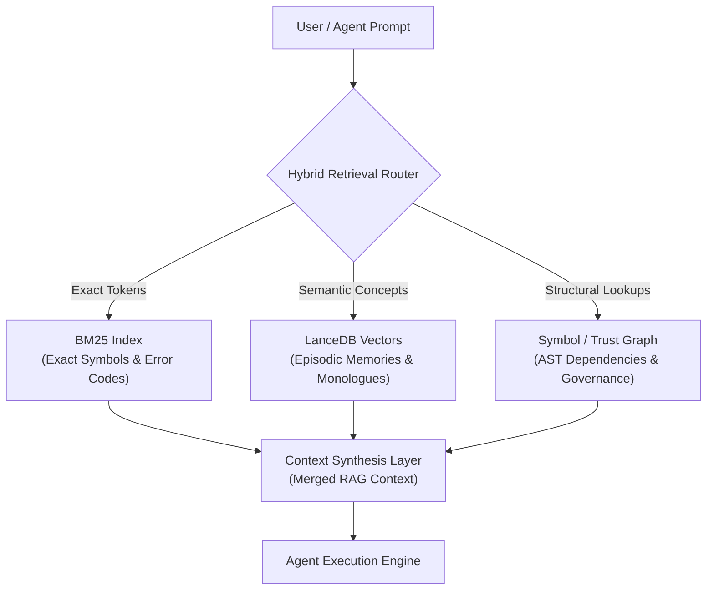

> [!IMPORTANT]
> **AI Context & Knowledge Heritage**
> - **Subsystem**: Architecture & Documentation / Core Docs / Knowledge_Memory
> - **Architecture**: `@docs ARCHITECTURE:Documentation`
> - **Failure Path**: Information drift, legacy terminology, or documentation mismatch.
> - **Observability**: Traceability via `execution/parity_guard.py`

# 🧠 Knowledge & Memory: The Hybrid "Tri-Engine" Architecture

**Intelligence Level**: High (ECC Optimized)
**Last Hardened**: 2026-08-18 (GraphRAG & Vector Feature-Flag Rationale)

> **@docs ARCHITECTURE:Retrieval**

Tadpole OS implements a high-performance **Tri-Engine Memory** architecture that separates deterministic relational data, structural code graphs, and high-dimensional semantic search.

---

## 🏗️ Memory Strategy: Deterministic vs. Graph vs. Semantic

Full cognitive autonomy requires three complementary retrieval primitives:

| Layer | Technology | Data Type | Purpose & Scope |
|:--- |:--- |:--- |:--- |
| **Deterministic Record** | **SQLite (`sqlx`)** | Logs, Budgets, Registries, OKF Metadata, Text Matching | Legal audit, financial state, non-repudiable truth, and non-vector keyword fallback |
| **Structural Graph** | **Graph Intelligence (`petgraph`, SQLite GraphStore)** | AST Symbol Callers/Callees, TrustGraph, OKF Nodes | Blast-radius isolation, dependency traversal, zero-hallucination routing |
| **Lexical Engine** | **BM25 (`bm25`)** | Exact tokens, error slugs, function identifiers | Instant in-memory search with mtime-aware caching to eliminate redundant disk I/O |
| **Dense Semantic Vector** | **LanceDB (`lancedb` + Apache Arrow)** | Embeddings (768-dim), episodic mission monologues | Conceptual fuzzy discovery, cross-mission semantic intuition |

---

## ⚖️ Architectural Decision: Why `vector-memory` is a Feature Flag

In `server-rs/Cargo.toml`, vector database integration is encapsulated under the optional `vector-memory` build flag:

```toml
[features]
default = []
vector-memory = ["dep:lancedb", "dep:arrow-schema", "dep:arrow-array"]
```

### Why Default Builds Omit `vector-memory` (Default-Off Rationale)
1. **Zero Build Friction & Maximum Portability**:
   - The core engine (Graph Intelligence + BM25 + SQLite) compiles in pure Rust across all commodity OS and legacy CPU environments without requiring C++ compilers, `libclang`, `protoc`, or native CMake toolchains.
2. **Zero-Cost Offline Air-Gapped Operation**:
   - Many Sovereign Bunker deployments operate 100% offline without local GPU accelerators or cloud embedding API keys. Graph + BM25 provides rich, instant codebase and SOP navigation at zero inference cost.
3. **Decoupled Upstream Versioning**:
   - LanceDB bundles deep Apache Arrow and DataFusion execution kernels. Isolating LanceDB behind a feature flag ensures core server routing and governance evolve without upstream Arrow version locksteps.

### Why You Enable `vector-memory` (When to Turn It On)
1. **Episodic Monologue & Dialogue Search**:
   - As swarms execute hundreds of multi-turn missions, agents generate extensive conversational context. Storing dense embeddings in LanceDB enables fuzzy recall of past debugging experiences and solution patterns.
2. **Latent Concept & Template Discovery**:
   - Natural language prompts (e.g., *"Set up wholesale escrow fulfillment"*) can retrieve matching Industry Templates (Wholesale & Distribution) even when zero exact keyword overlap exists with template identifiers.
3. **Multimodal Future-Proofing**:
   - LanceDB's Apache Arrow format natively supports multimodal vector representations (audio embeddings, UI screenshot vectors) alongside text.

---

## 🕸️ The GraphRAG Synergy: Graphs vs. Vectors

Graphs and Vector DBs are **not mutually exclusive**; they solve orthogonal retrieval problems:



- **Graphs** tell the agent *where components live, who has permission, and what downstream code breaks*.
- **LanceDB** tells the agent *what past mission experiences or unstructured documents feel conceptually related*.
- **BM25** tells the agent *exact token matches for IDs, environment variables, and error slugs*.

---

## 🛰️ The Data Ingestion Pipeline (4-Phase Model)

The engine converts raw documents into "Intelligence Assets" through a disciplined background pipeline:

### Phase 1: Multi-Factor Scoring (MFS)
Tadpole OS uses a **Multi-Factor Scoring (MFS)** engine to rank context snippets based on three primary signals:
1. **Vector Similarity**: Uses cosine distance (via LanceDB) for high-dimensional semantic mapping.
2. **Mission Affinity**: Contextually boosts results that match the active `Mission-ID`, ensuring relevant domain knowledge is prioritized.
3. **Temporal Recency**: Applies a decay factor to older memories, ensuring the agent uses the most up-to-date information while retaining long-term historical context.

The MFS engine reranks these signals into a unified relevance score ($0.0 - 1.0$) before passing top-K snippets to the LLM.

### Phase 2: Automated Connectors (`connectors.rs`)
Data sources are automatically synchronized via background workers:
- **`IngestionWorker`**: A Tokio daemon that crawls configured folders.
- **Incremental Sync**: Uses MD5-checksums to avoid re-embedding unchanged files.
- **Connectors**: Supports File-system watching with absolute path validation.

### Phase 3: Deterministic SOP Workflows (`workflows.rs`)
Beyond fuzzy RAG, the engine can execute **Structured SOPs**:
- **Markdown-to-State**: Parses `.md` files into executable steps.
- **Sequential Execution**: Ensures compliance-heavy tasks follow a strict order of operations.

### Phase 4: Layout-Aware Parsing & Dual-Write Atomicity (`store.rs`)
- **Transactional Dual-Write Atomicity**: `add_entry` wraps SQLite metadata inserts in an explicit transaction (`pool.begin()`) and commits only after LanceDB vector storage succeeds. If vector storage fails, the SQLite transaction rolls back, eliminating orphaned "ghost" metadata entries.
- **Vector Predicate Sanitization**: `get_peers` enforces strict input ID character validation (`c.is_alphanumeric() || c == '-' || c == '_'`) before constructing LanceDB filter predicates, preventing injection attacks.
- **Bounded OKF Playbook Cache (`okf_gate.rs`)**: Enforces maximum cache capacity (`MAX_CACHE_ENTRIES = 256`) with automatic TTL eviction for playbook requirements, eliminating static map memory leaks during large-scale swarm runs.
- **Zero-Allocation Requirement Parser**: Hot-loop allocation-free requirement extraction using precomputed static matchers (`pattern_colon`, `pattern_space`).

---

## 🧪 Vector Memory Management

### LanceDB + Apache Arrow
- **Zero-Copy Performance**: Uses Apache Arrow memory layout for ultra-low latency searches.
- **Orphan Sweeping**: A background daemon purges mission-specific temporary vector "scopes" once tasks are complete to prevent disk bloat.

### Local-First Embeddings
By default, the engine utilizes the **BGE-Small-EN-v1.5** model via ONNX for zero-latency local vectorization, ensuring no data ever leaves the bunker for memory processing.

### Swarm Context Compaction
To avoid token bloat and CPU load spikes during long-running agent missions, dialogue compaction is performed dynamically:
- **$O(N)$ Linear Compactor**: Iteratively filters dialogue history in linear time, stripping large codeblocks from older messages while preserving the last 4 reasoning turns fully intact.
- **Resilient Fallback**: Falls back to a regex-based parser if LLM summarization fails, guaranteeing zero loss of structural turn coherence.