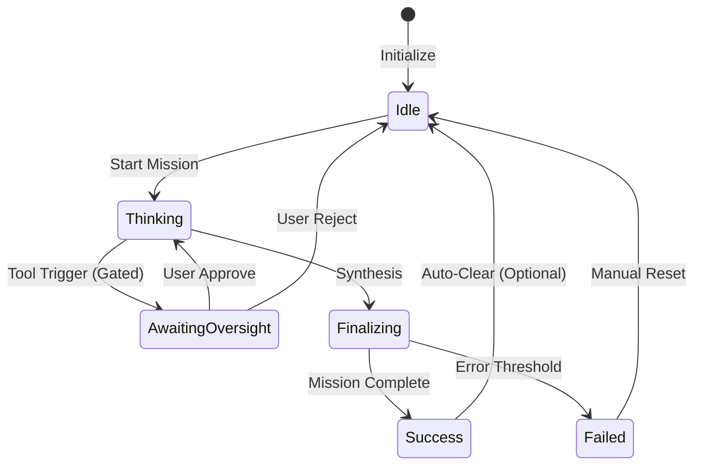

# 🧠 Tadpole OS: Operations Manual
**Intelligence Level**: High (ECC Optimized)
**Source of Truth**: `server-rs/src/services/mod.rs`, `src/services/TadpoleOSSocket.ts`
**Last Hardened**: 2026-04-01
**Standard Compliance**: ECC-OPS (Enhanced Contextual Clarity - Operational Standards)

> [!IMPORTANT]
> **AI Assist Note (Operational Logic)**:
> This manual defines the state machine of the Sovereign Interface.
> - **Primary States**: `Idle`, `Thinking`, `Awaiting Oversight` (Yield Phase), `Finalizing`, `Success`, `Failed`.
> - **Telemetry**: 10Hz binary pulse updates (100ms) via MessagePack for sub-millisecond swarm state parity.
> - **Identity**: Agents are recognized by UUID; clusters are recognized by `cluster_id`.
> - **Safety**: All destructive actions (Delete, Archive) require manual confirmation via the Oversight Gate.

---

## 🔄 Operational State Machine

---

# Tadpole OS: Operations Manual

- [1. Multi-Tab Sovereign Interface](#1-multi-tab-sovereign-interface)
  - [1.1 The Multi-Tab Bar](#11-the-multi-tab-bar)
  - [1.2 Unified Tactical Header](#12-unified-tactical-header)
  - [1.3 Neural & Communication Interfaces](#13-neural--communication-interfaces)
    - [1.3.1 Neural Chat Command](#131-neural-chat-command)
    - [1.3.2 Voice Interface](#132-voice-interface)
    - [1.3.3 Lineage Stream](#133-lineage-stream)
- [2. Core Operations](#2-core-operations)
  - [2.1 Operations Center](#21-operations-center)
  - [2.2 Agent Hierarchy Layer](#22-agent-hierarchy-layer)
  - [2.3 Mission Management](#23-mission-management)
    - [2.3.1 Mission Report: Operation Emerald Shield](#231-mission-report-operation-emerald-shield)
  - [2.4 Scheduled Jobs & Workflows](#24-scheduled-jobs--workflows)
  - [2.5 Oversight & Compliance](#25-oversight--compliance)
  - [2.6 Neural Footprint Monitoring](#26-neural-footprint-monitoring)
- [3. Communications & Assets](#3-communications--assets)
  - [3.1 Workspace Manager](#31-workspace-manager)
- [4. Intelligence Layer](#4-intelligence-layer)
  - [4.1 AI Provider Manager](#41-ai-provider-manager)
  - [4.2 Agent Swarm Manager](#42-agent-swarm-manager)
  - [4.3 Skills & Workflows](#43-skills--workflows)
  - [4.4 System Telemetry](#44-system-telemetry)
  - [4.5 Performance Analysis](#45-performance-analysis)
  - [4.6 SME Data Intelligence](#46-sme-data-intelligence)
- [5. System Knowledge & Settings](#5-system-knowledge--settings)
- [5.1 Knowledge Base](#51-knowledge-base)
- [5.2 System Configuration](#52-system-configuration)
- [5.3 Swarm Template Store](#53-swarm-template-store)
- [6. Local Swarm Orchestration](#6-local-swarm-orchestration)
  - [6.1 Swarm Discovery (mDNS)](#61-swarm-discovery-mdns)
  - [6.2 Integrated Model Store](#62-integrated-model-store)
  - [6.3 Privacy Mode & Shield](#63-privacy-mode--shield)
  - [6.4 Model Residency & Storage](#64-model-residency--storage)
  - [6.5 Federated Model Management](#65-federated-model-management-swarm-gateway)
- [7. Headless Functions](#7-headless-functions)
- [8. Security Protocols](#8-security-protocols)

---

## 1. Multi-Tab Sovereign Interface

The primary navigation system of Tadpole OS, allowing for multi-context orchestration within a single, high-performance environment. **Multi-Monitor Friendly**: All tabs can be detached into sovereign windows for distributed oversight.

> [!NOTE]
> **Runtime Governance Anchor**: All persistence paths (workspaces, memory stores, connector paths) resolve from backend `AppState.base_dir`, ensuring multi-node and local-dev deployments use the same deterministic root.

### 1.1 The Multi-Tab Bar
Located permanently at the top of the viewport (below the Header), the Multi-Tab Bar manages your active operational contexts.
- **Dynamic Contexts**: Tabs represent individual pages (Dashboard, Missions, Hierarchy, etc.).
- **Context Preservation**: Switching tabs preserves the state of each page, enabling seamless multitasking.
- **Detachable Portals**: Operators can "pop out" a tab into a native browser window for dedicated monitor orchestration by clicking the **External Link** icon revealed upon hover or selection.
- **Header Sync**: The global `PageHeader` automatically updates its tactical metrics and action controls to match the active tab.

### 1.2 Unified Tactical Header (`PageHeader`)
A persistent command surface at the top of every page.
- **Engine Status**: Real-time connectivity indicator (**🟢 ONLINE**).
- **Page-Specific Actions**: Contextual controls (e.g., "New Mission" on the Missions page).
- **Core Metrics**: High-level telemetry tailored to the active operation.

### 1.3 Neural & Communication Interfaces

These interfaces provide ambient awareness and direct interaction channels with the swarm.

### 1.3.1 Neural Chat Command (`Sovereign_Chat`)
The primary natural language interface for issuing directives to the swarm. It supports deep-context isolation and scope-based communication.

**Operational Scopes:**
- **Agent Scope**: Isolated 1:1 communication with a selected agent. Context is limited to that agent's local memory.
- **Cluster Scope**: Group-level directives. All messages are tagged for the specific Mission Cluster (e.g., `#Beta`).
- **Swarm Scope**: Global broadcast. All active agents receive the packet via the unified pulse.

**Command Syntax:**

> [!TIP]
> Use targeted syntax to bypass the active scope and route directives precisely.

- **Standard Input**: Type a message and hit `Enter` to send in the active scope.
- **Targeted Agent**: Use `@AgentName <Message>` to force-route a message to a specific agent regardless of active scope.
- **Targeted Cluster**: Use `#ClusterName <Message>` to broadcast to all agents in a specific cluster.

**Interactive Elements:**
- **[Toggle] Neural Safety**: Enable to prevent agents from executing destructive tools in response to chat directives.
- **[Button] Detach Interface**: Pop out the chat into a dedicated window for multi-screen orchestration.
- **[Button] Neural Dock**: Minimize the interface into a floating, non-obtrusive "Zap" icon.
- **[Selector] Scope Tab**: Instantly switch between Agent, Cluster, and Swarm layers.
- **[Breadcrumb] Neural Lineage**: Displays the parentage/hierarchy of the currently targeted agent.

---

### 1.3.2 Voice Interface (`VoiceClient` / `Standups`)
A multimodal extension providing both ephemeral input within the chat and a dedicated "Neural Sync" screen for high-fidelity coordination.

#### 10.0.0.1 Neural Sync Interface (Screen Details)
The primary screen for managing direct voice handshakes with agents or clusters.

**Core Interface Elements:**
- **Neural Sync Header**: A high-impact display featuring a "Users" icon and a pulse-active boundary. Displays the real-time status (e.g., `ENCRYPTED LIVE CHANNEL` vs `Ready for Handshake`).
- **Target Selection Matrix**: A dedicated control box for defining the handshake destination.
    - **Toggle (Agent Node)**: Restricts the uplink to a single sovereign agent.
    - **Toggle (Mission Cluster)**: Broadcasts the audio capture to all agents assigned to a specific cluster.
    - **Handshake Selector (Dropdown)**: A precision target list for active agents or cluster IDs.
- **Biometric Audio Visualizer**: A multi-spectrum bar graph that reflects the volume and throughput of the current neural transmission.
- **Sync Command Bar**:
    - **[Button] Start/End Sync**: Large emerald/red control for opening or terminating the encrypted channel.
    - **[Button] Local Mic Capture**: Individual toggle for suppressing local audio without closing the sync channel.
- **Neural Activity Log (Live Transcript)**:
    - **Identity Attribution**: Color-coded glyphs identifying speakers (`U` for User, `A` for Agent).
    - **Sync Telemetry**: Displays `REC` (Recording) vs `IDLE` status and real-time "X is speaking..." feedback.

#### 10.0.0.1 Chat Integration
Operational controls embedded directly within the **SovereignChat** window.

- **[Button] Neural Listening (STT)**: Toggles transcription. Supports **Groq Cloud** or **Whisper (Local)**.
- **[Button] Neural Output (TTS)**: Toggles vocal responses. Supports **OpenAI Cloud** or **Piper (Local)**.
- **[Display] Neural PCM Visualizer**: A small, four-bar visualizer next to the scope readout that pulses during active agent synthesis. When using local Piper, this reflects raw PCM throughput.

### 10.0.0.1 Swarm Visualizer Handshake
The **Sovereign_Chat** is deeply integrated with the **Swarm_Visualizer**. Clicking any node in the visualizer automatically focuses that agent's mission context in the chat, allowing for instant "Telepresence" style coordination.

---

### 1.3.3 Detachable Tab Portals (`PortalWindow`)
A high-performance feature designed for multi-monitor command centers.

**Operational Features:**
- **Zero-Latency Sync**: Detached windows share the same JavaScript memory as the main application. Real-time data streams and agent thoughts appear in detached windows instantly without server-side latency.
- **Visual Consistency**: All theme settings (Zinc/Slate) and custom styling are mirrored across all windows automatically.
- **Native Window Management**: Detached tabs become native OS windows that can be resized, snapped, or moved to secondary displays.

**Interactive Controls:**
- **[Button] Detach to New Window**: Click the **External Link** icon on a tab to detach it.
- **[Button] Recall Sector (Re-attach)**: To return a detached window to the main dashboard:
    1. Click the **Return/Minimize** icon on the detached tab in the Tab Bar.
    2. Or, click the **Recall Sector** button in the main dashboard placeholder view.
    3. Or, simply close the detached browser window.

---

### 1.3.4 Lineage Stream (`LineageStream`)
A real-time telemetry sidebar that visualizes the propagation of data and instructions through the neural hierarchy.

**Operational Features:**
- **Real-time Feed**: Scrollable timeline of every agent event, tool call, and system broadcast.
- **Propagation Tracking**: Visualizes the path an instruction took from the root CORE_EXECUTIVE through departments to the final agent node.
- **Transmission Payload**: Displays the raw text content of individual agent thoughts and communications.

**Interactive Elements:**
- **[Sidebar] Resizable Boundary**: Drag the left edge of the stream to expand the telemetry view.
- **[Card] Event Node**: Click any card in the stream to open the **Cinematic Depth View**.
- **[Overlay] Cinematic Depth View**: A high-density modal showing full lineage paths, agent configuration (Model/Slot), and timestamped metadata.
- **[Indicator] Pulse Waveform**: Visual feedback showing active data transmission on the neural wire.

#### 1.3.1 Cinematic Depth View
A high-fidelity analysis modal triggered by selecting any event in the Lineage Stream. It provides 360-degree observability into a single neural transmission.

**Data Panels:**
- **Neural Transmission Payload**: The focal point of the view. Displays the full text of the instruction, thought, or tool output in a high-contrast, cinematic container.
- **Propagation Lineage Path**: A horizontal breadcrumb showing the exact chain of command (e.g., `CORE_EXECUTIVE` → `ENGINEERING` → `SYSTEM_ARCHITECT`).
- **Telemetry Sidebar**:
    - **Agent Configuration**: Displays the active Model ID and the currently engaged Neural Slot (1, 2, or 3).
    - **Lineage Depth Meter**: A visual progress bar tracking the complexity of the recruitment chain.
    - **Verification Signature**: Confirming the transmission was audited by the human-in-the-loop oversight ledger.

**Interactive Controls:**
- **Workspace Manipulator**: Click and drag the header to move the modal across the neural canvas.
- **Dimensional Scaling**: Use the resize handle in the bottom-right corner to expand or contract the analysis window.
- **Node Escape**: Press `ESC` or click the 'X' to terminate the depth view and return to the primary stream.

---

## 2. Core Operations

These pages form the "Core Ops" section of the primary navigation sidebar.

### 2.1 Operations Center (`OpsDashboard`)
The central nervous system of the engine. Provides real-time telemetry and immediate agent control.

**Interactive Elements:**
- **[Button] Discover Nodes:** Scans the network for available neural compute nodes.
- **[Button] Deploy [NODE]:** Triggers a high-speed deployment pipeline to a selected remote node (e.g., Bunker-2).
- **[Button] Initialize New Agent:** (Inside Agent Grid) Opens the Configuration Panel to provision a new agent node.
- **[Display] Real-time Log Stream:** Scrollable terminal feed of all agent thoughts, tool calls, and engine events.
- **[Metric] Active Swarm:** Count of agents currently assigned to active mission clusters.
- **[Metric] Swarm Cost:** Cumulative compute cost tracking in real-time.
- **[Metric] Swarm Capacity:** Budget utilization percentage.
- [Metric] System Health: Live connectivity status of the core Rust engine.
- [Icon] Neural Health Shield: A color-coded indicator (Green: Healthy, Orange: Degraded, Red: Throttled) displayed on each agent node. Clicking the shield opens the **Swarm Health Monitor**.
- **[Component] God View (Swarm Visualizer):** (New) A high-performance, real-time 2D force-graph visualization of the swarm's topology.
    - **Live Binary Pulse**: Driven by a 10Hz MessagePack stream (`0x02` header) for sub-millisecond status parity.
    - **Dynamic Force Layout**: Automatically arranges agents and their active mission relationships (edges).
    - **Agent Telepresence**: Clicking a node in the graph instantly focuses the agent and their mission logs in the Sovereign Chat.
    - **Visual Cues**: Neon glow indicates status (Cyan: Busy, Zinc: Idle, Red: Error).
- [Grid] Live Agent Status: Interactive cards for### 6. Security & Governance Dashboard
The Oversight dashboard provides real-time monitoring of swarm state and financial health.

#### 6.1 Token Quota & Budget Enforcement
Tadpole OS uses a **Debounced Persistence** layer for high-concurrency token tracking.
- **Sync Interval**: Usage is flushed to SQLite every **10 seconds**.
- **Enforcement**: The `BudgetGuard` aggregates both database and in-memory buffers for real-time budget checks.
- **Fail-Safe**: If the background sync fails, the engine continues to enforce based on the in-memory buffer to prevent over-spending.

- **Active State**: Displays the specific objective or task currently being processed (e.g., "Reviewing PR #405").
- **Idle State**: When an agent has no active assignment, the field displays **"System Idle • Standing By..."** in a low-opacity monospace font. This indicates the node is powered on and awaiting instructions from the Alpha or Overlord.
- **Auto-Sync**: This field is updated in real-time via the high-frequency telemetry stream from the Rust engine.

#### 2.1.1 Agent Task Monitoring
Every agent card features a dedicated **Task Box** that visualizes the node's current cognitive focus.

- **Active State**: Displays the specific objective or task currently being processed (e.g., "Reviewing PR #405").
- **Idle State**: When an agent has no active assignment, the field displays **"System Idle • Standing By..."** in a low-opacity monospace font. This indicates the node is powered on and awaiting instructions from the Alpha or Overlord.
- **Auto-Sync**: This field is updated in real-time via the high-frequency telemetry stream from the Rust engine.

#### 2.1.2 System Log (`SystemLog`)
A high-priority terminal component integrated into the **Operations Center**. Refactored into a standalone functional unit for maximum rendering efficiency.

**Functional Details:**
- **Dynamic Attribution**: Every log entry is tagged with its origin, identifying whether it came from the `[System]` kernel or a specific `[Agent:ID]`.
- **Severity Coding**:
    - **CRITICAL / ERROR (Red)**: Fatal engine failures or blocked tool calls.
    - **SUCCESS (Green)**: Completed deployments, agent provisioning, or mission successes.
    - **WARNING (Amber)**: Throttling alerts, low-budget warnings, or network retries.
    - **INFO (Zinc)**: Standard engine telemetry and agent thought processes.
- **Buffer Management**: To maintain dashboard performance, the UI retains the last 100 system events.
- **Auto-Sync**: The log stream automatically scrolls to the most recent entry unless the operator manually interacts with the scrollbar.

---

### 2.2 Agent Hierarchy Layer (`OrgChart.tsx`)
Graph-based visualization of the neural command hierarchy.

*   **Tiered Architecture**: Visualizes the **Alpha Root -> Nexus Coordinator -> Strategic Chains** hierarchy.
*   **Pulsating Connections**: Dynamic neural-pulse animations indicating active communication and status updates.
*   **Integrated Node Configuration**: Direct access to agent configuration panels (Role, Model, Workflow) via hierarchy nodes.
*   **Swarm Coordination Indicator**: Real-time status badge for system-wide sync verification.
*   **Interactive Elements**:
    *   **[Visual] Hierarchy Tree**: Interactive canvas showing parent-child node relationships.
    *   **[Button] Recenter View**: Resets the chart to the 'Alpha' root node.
    *   **[Display] Depth Indicator**: Current recruitment depth vs. architecture limits.

#### 2.2.1 Neural Strategic Command
The Hierarchy Layer is enhanced with a **Neural Oversight** engine that proactively suggests cluster optimizations.

**Operational Workflow:**
1.  **Identification**: Look for the pulsing **"Brain" icon** located below the "ACTIVE" badge on Alpha Node cards. This indicates a pending optimization proposal.
2.  **Review**: Click the icon to reveal the floating **Swarm Oversight** card.
3.  **Neural Reasoning Trace**: Review the justification provided by the Alpha Node (e.g., "Analyzing mission objective: 'Security Audit'").
4.  **Action Commands**:
    *   **Authorize Strategy**: (Coming Soon) Apply the suggested changes to the cluster.
    *   **Dismiss Strategy**: Permanently reject the proposal and remove the notification icon.
    *   **Close (X)**: Hide the card from view without removing the proposal. Clicking the Brain icon again will restore it.

---

### 2.3 Mission Management (`Missions.tsx`)
Command-and-control interface for high-level goal orchestration and swarm deployment. Refactored into a modular suite of specialized sub-components (`ClusterSidebar`, `AgentTeamView`, `NeuralMap`).

*   **Cluster Inventory**: Dynamic list of active and idle mission clusters.
*   **Interactive Elements**:
    *   **New Mission**: Initialize a new sovereign objective.
    *   **Mission Objective**: Multi-line terminal for defining core mission directives.
    *   **Assign Agents**: Interactive selection from the recruitment pool.
    *   **Neural Map**: SVG-rendered visualization of node collaborations and Alpha hierarchy.
    *   **Swarm Treasury Allocation**: Granular budget controls ($USD) for each cluster.
    *   **Sovereign Audit**: Toggle between live mission analysis and security audit logs.
    *   **Run Mission**: Dispatches final handshake to the cluster Alpha.
*   **Operational Note**: Real-time throughput and cost metrics are primarily monitored via the **Operations Center (OpsDashboard.tsx)**.

#### 2.3.1 Mission Report: Operation Emerald Shield

**Status**: COMPLETED | **Cluster ID**: `cl-alpha-09` | **Theme**: Emerald/Onyx

**Mission Objective**: 
Execute a comprehensive audit of the `ProviderStore` state machine to ensure zero-latency key rotation and verify NeuralVault isolation during high-frequency telemetry spikes.

**Swarm Composition**:
1. **Alpha Node**: "Atlas" (Orchestrator) - Mission Logic & Delegation.
2. **Security Analyst**: "Ghost" - Cryptographic Verification.
3. **Performance Engineer**: "Pulse" - Telemetry & Load Analysis.

**Operational Briefing**:
Atlas decomposed the objective into parallel sub-tasks. Ghost verified AES-GCM IV uniqueness and salt randomization in `crypto.worker.ts`. Pulse confirmed that CPU spikes remained within the Web Worker thread, maintaining 60fps on the main dashboard.

**Final Alpha Briefing**:
"The swarm has successfully stress-tested the core crypto-telemetry pipeline. Operation Emerald Shield confirms that the Tadpole Engine can maintain high-frequency monitoring while concurrently handling hardware-accelerated encryption without user-perceived lag."

---

### 2.4 Scheduled Jobs & Workflows (`agent/continuity/mod.rs`)
An administrative interface for managing temporal mission persistence and autonomous swarm orchestration.

**Operational Features:**
- **Mission Persistence**: Define tasks that agents execute automatically at recurring intervals (Jobs) or follow deterministic multi-step paths (Workflows).
- **Temporal Resilience**: Automatically scales agent recruitment based on complexity.
- **Workflow Engine**: Groups multiple agents into a sequential pipeline where findings from Step A are propagated as context to Step B.

**Interactive Elements:**
- **[Button] New Job / New Workflow**: Opens the configuration modal to provision a new autonomous thread.
- **[Form] Workflow Configuration**:
    - **Step Sequences**: Define a linear or branching path of agent tasks.
    - **Context Injection**: Findings from previous steps are automatically merged into the next agent's system prompt.
- **[Form] Job Configuration**:
    - **Target Agent**: Assigns the mission to a specific agent node.
    - **Cron Expression**: Defines the execution frequency (Standard 6-field syntax).
    - **Mission Prompt**: The primary instruction set.
    - **Budget Cap (USD)**: Prevents financial bleed.
- **[Expanded] Run History**: Displays the mission prompt preview and execution results (Status, Cost, and Mission ID).

---

### 2.5 Oversight & Compliance (`Oversight` / `SecurityDashboard`)
The governance layer for approving agent actions, auditing behavioral drift, and monitoring the swarm's security posture.

#### 2.5.1 Approval Queue
- **[List] Pending Actions:** Tool calls blocked by the kernel awaiting manual user confirmation. This includes tools used by agents with the **"Requires Oversight"** flag enabled, as well as globally protected operations.
- **[Button] Approve / Reject:** Permits or blocks the specific skill execution.

#### 2.5.2 Security Dashboard (New)
A high-fidelity monitoring surface for the system's defensive layers.
- **[Gauge] Budget Quotas**: Real-time visualization of USD expenditure vs. persistent daily/weekly limits.
- **[Metric] Merkle Integrity Score**: A real-time safety score (0-100%) indicating the state of the cryptographic audit chain. A score < 100% indicates audit link corruption.
- **[Alert] RAM Pressure Monitor**: Visual warning systems for system and process memory usage. Alerts when the engine approaches OOM (Out Of Memory) thresholds.
- **[Indicator] Sandbox Awareness**: Displays whether the engine is running in **Docker**, **Kubernetes**, or a **Virtual Machine**.
- [Status] Shell Safety Scanner: Indicators for proactive detection of secret leakage in scripts.
- [Metric] Swarm Health Monitor: Detailed success/failure ratios, last failure timestamps, and manual intervention controls for every active node.

**Emergency Controls:**

> [!CAUTION]
> These actions are non-reversible and impact current mission persistence.

- **[Button] HALT AGENTS:** Suspends all active agent reasoning cycles immediately while keeping the engine online.
- **[Button] KILL ENGINE:** Triggers a full backend process shutdown (requires `SHUTDOWN` string confirmation).

**Swarm Intelligence Monitoring:**
- **[Display] Neural Reasoning Trace (Agent 99Analysis)**: Alpha-Node logs and Agent 99 debriefs explaining the rationale behind swarm optimization proposals.
- **[Display] Proposed Reallocations**: Real-time suggestions for changing agent roles, models, or skillsets to improve mission efficiency.
- **[Component] Action Ledger:** A comprehensive, filterable table of every audited tool call, its parameters, and the execution result.
- [Search] Memory Matrix: Global semantic search across all agent long-term memories via the Command Palette (`Ctrl+P`).

#### 2.5.3 Swarm Health Monitor & Troubleshooting
When an agent experiences consecutive failures (e.g., API throttling or network faults), the engine automatically tracks the `failureCount`. 

**Health States:**
- **Healthy (🟢)**: 0 failures. Agent is operating at peak efficiency.
- **Degraded (🟠)**: 1-2 failures. System is monitoring for persistent faults.
- **Throttled (🔴)**: 3+ failures. The agent is automatically suspended to prevent budget waste or recursive failure loops.

**Manual Intervention:**
Operators can troubleshoot failures by clicking the **Neural Health Shield** on any agent card.
- **Diagnostics**: View the exact failure count and the timestamp of the last incident.
- **Reset Agent**: Click **"Reset Agent"** to clear the failure count and return the agent to **Idle** status. This is the primary recovery path for resolving temporary connectivity issues or clearing throttled states without restarting the engine.

---

### 2.6 Neural Footprint Monitoring (`CommandTable.tsx`)
A high-density observability matrix providing a granular view of the swarm's compute usage and operational costs.

*   **Telemetry Grid**:
    *   **Agent Node**: Identifier of the source agent.
    *   **Instruction**: Truncated view of the prompt sent to the model.
    *   **Response Output**: Live stream of the model's completion.
    *   **Latency**: Execution time in milliseconds.
    *   **Sovereign Cost**: Real-time calculated cost in USD.
*   **Interactive Controls**:
    *   **Establish Sovereign Link**: Direct icon button to refocus the neural chat on a specific agent.
    *   **Hover Overlays**: Reveal full prompt/response data.
    *   **Filters**: Sort by agent node, cost, or timestamp.

**Interactive Elements:**
- **[Button] Establish Sovereign Link**: Click the message icon to immediately focus the neural chat on that specific agent node.
- **[Telemetry] Latency Monitor**: Real-time display of system-wide processing latency (displayed in the table footer).

---

## 3. Communications & Assets

These pages form the "Comms & Assets" section of the primary navigation sidebar.

### 3.1 Workspace Manager (`Workspaces`)
Centralized coordination of mission-based storage paths, collaborator clusters, and code repository synchronization.

**Operational Features:**
- **Mission Clusters**: Collaborative workspaces that group agents by department (Engineering, Product, etc.) into shared file paths.
- **Alpha Node Leadership**: Every cluster identifies a primary leader node (marked with a gold halo) responsible for overall mission execution.
- **Task Branching Workflow**: Agents propose changes to the cluster via temporary "Task Branches" rather than committing directly to the root path.
- **Environment Detection**: Automatic scanning of the workspace for active developer environments (VS Code, Kubernetes Nodes, Headless Servers).

**Interactive Elements:**
- **[List] Active Cluster Section**: Displays the cluster name, assigned department, and the root file path (e.g., `/workspaces/strategic-command`).
- **[Grid] Collaborator Roster**: Visual list of all agent nodes assigned to the cluster.
- **[View] Cluster Root Telemetry**: Displays the active storage footprint (e.g., `3.4GB ACTIVE`) and synchronization status.
- **[Log] Active Task Branches**: A live queue of proposed merge requests awaiting human (or Alpha Node) approval.
    - **[Button] Approve Branch**: Merges the proposed changes into the cluster's primary mission path.
- **[Button] Reject Branch**: Discards the proposed changes and notifies the originating agent.
- **[Section] Legacy Agent Silos**: Displays orphaned agent nodes operating outside of collaborative mission clusters.

---

## 4. Core Intelligence Management Suite
 
 These pages form the "Intelligence" section of the primary navigation sidebar, managing the heavy lifting of provider connections, agent nodes, and autonomous skills.

### 4.1 AI Provider Manager (`ModelManager`)
The administrative vault for credentials and model node provisioning.

> [!IMPORTANT]
> Requires a Master Passphrase to unlock. Keys are never displayed in plaintext after initial commit.

**Interactive Elements:**
- **[Input] Master Passphrase:** Hardware-accelerated password field required to unlock the Neural Vault and edit keys.
- **[Button] Commit Authorization:** Dispatches the handshake to the crypto-worker to decrypt provider configurations.
- **[Button] Emergency Vault Reset:** Located at the bottom of the unlock screen. Use this if the master passphrase is lost or if configurations are corrupted. **Warning: This purges all encrypted keys.**
- **[Button] Add Provider:** Register a new AI provider (e.g., OpenAI, Anthropic, Local Engine).
- **[Card] Provider Config:** Click to open a side-panel for editing API URLs and Security Keys.
- **[Table] Intelligence Inventory:** List of all available model nodes.
- **[Button] Add Node:** Provision a new specific model (e.g., `gpt-4o`, `llama-3.3`) to the inventory.
- **[Toggle] Show TPM Limits:** Expands the row to reveal Rate Limits (Requests/Min, Tokens/Day).

#### 4.1.1 Secure Context Requirements
The NeuralVault utilizes the **SubtleCrypto API**, which requires a **Secure Context**.
- **Local Access**: `localhost` and `127.0.0.1` are considered secure by default.
- **Remote Access**: Accessing Tadpole OS via a remote IP address (e.g. `http://10.0.0.1:5173`) will disable cryptographic functions. You MUST use **HTTPS** for remote orchestration.

#### 4.1.1 Provider Configuration Panel (`ProviderConfigPanel`)
A granular administrative panel for managing individual AI provider infrastructure.

**Interactive Elements:**
- **Provider Identity Header**: Editable Name and Icon. Features the unique Internal ID for node tracking.
- **Authorization Layer (Neural Vault)**:
    - **[Input] Secure API Key**: Password-masked input for provider credentials. Encrypted at rest.
    - **[Input] Network Endpoint**: Base URL for API routing (e.g., `https://api.openai.com/v1` or local node URLs).
    - **[Input] External Identifier**: Custom ID sent in HTTP headers for request attribution on the provider's side.
- **Transmission Protocol**:
    - **[Selector] Hybrid Protocol**: Defines the communication standard (OpenAI, Anthropic, Google, Ollama, DeepSeek, Inception).
    - **[Button] Test Trace**: Initiates a "Neural Handshake" to verify API connectivity and protocol integrity.
    > [!NOTE]
    > For local Ollama setup, see the [Qwen3.5-9B Local Integration Guide](file:///d:/TadpoleOS-Dev/docs/QWEN_LOCAL_INTEGRATION.md) for endpoint and key placeholder details.

- **Advanced Metadata**:
    - **[Textarea] Custom HTTP Headers**: JSON-formatted field for adding additional request parameters.
- **Audio Service Configuration**:
    - **[Input] Primary Transcription Model**: Defines the model ID used for Neural Sync transcription (STT).
- **Intelligence Forge (Model Catalog)**:
    - **[Button] Add Node**: Provision a new specific model node to the provider.
    - **[Row] Forge Item**: Editable grid of model details including ID, Modality (LLM, Vision, Voice, Reasoning), and Rate Limits (RPM, TPM, RPD, TPD).

---

#### 4.3 Skills & Workflows (`Skills`)
Management of active skills, passive workflows, and external MCP tools.

**Interactive Elements:**
- **[Tab] Active Skills:** Management of executable Python/Scripts.
- **[Tab] Passive Workflows:** Markdown-based protocols and SOPs.
- **[Tab] MCP Tools:** Interactive list of external tools connected via Model Context Protocol.
- **[Registry] User Registry:** Custom skills and workflows loaded from the local `.agent` directory or manually imported are mapped to the **User** category.
- **[Registry] AI Services:** Capabilities discovered or generated by sub-agents are automatically registered here.
- **[Action] Import .md:** (New) One-click file browser to import skills and workflows from markdown documentation.
- **[Action] Assign to Agents:** Triggers the bulk assignment modal, allowing for multi-node capability syncing in a single operation.

#### 4.3.1 Importing Capabilities
Tadpole OS supports native ingestion of skill and workflow definitions from `.md` files.

**Operational Workflow:**
1.  **Selection**: Click the **"Import .md"** button in the Skills & Workflows header.
2.  **File Choice**: Select a compatible markdown file (formatted per Tadpole OS standards).
3.  **Safety Preview**: Review the **Import Preview Modal**. This screen displays the parsed **ID**, **Name**, **Description**, and **Raw Source** for verification.
4.  **Registration**: Click **"Confirm Import"** to register the capability into the **User Services** registry.

#### 4.3.2 Swarm Auto-Registration
The engine features a recursive "Knowledge Capture" system that monitors sub-agent activity.

- **Automatic Discovery**: When a sub-agent utilizes a unique tool or logic pattern, the engine captures the definition.
- **AI Registry**: These discovered capabilities are automatically injected into the **AI Services** registry.
- **Cross-Mission Reuse**: Once registered, these skills are immediately available to the human operator for assignment to other agents, creating a permanent repository of swarm intelligence.

---

### 4.2 Agent Swarm Manager (`AgentManager`)
The command surface for provisioning, role-balancing, and neural configuration of sovereign agent nodes.

**Operational Features:**
- **Capability Badges**: Agent cards display real-time badges for **Skills**, **Workflows**, and **MCP Tools**. 
- **Interactive Tooltips**: Hovering over a badge reveals the specific names of assigned capabilities for rapid inventory audits.
- **Capacity Enforcement**: The system maintains a hard-coded safety limit of 25 agent nodes per neural sector.

**Interactive Elements:**
- **[Grid] Agent Inventory**: A visual layout featuring **Capability Badges** (Code, File, and Terminal icons) that track tool density per agent.

#### 4.2.1 Neural Node Configuration Panel (`AgentConfigPanel`)
A high-fidelity configuration surface for managing the internal cognitive state and skill matrix of a specific agent.

**Cognitive Extensions Panel (Cognition Tab):**
- **MCP Tools Manager**: A dedicated multi-select grid for activating and deactivating external MCP tools.
- **Skill & Workflow Toggles**: Standard capability controls with real-time sync.

**Budget & Oversight Panel (Governance Tab):**
- **[Toggle] Requires Oversight**: When enabled, ALL tool calls from this agent are routed to the Approval Queue before execution, effectively creating a dedicated "Junior Agent" gate.
- **[Slider] Personal Budget Limit (USD)**: Defines the hard fiscal cap for this specific agent node.
- **[Display] Cost Accrual**: Real-time tracking of the agent's lifetime and session expenditure.

**Identity Panel5. **Cognition Tab**:
   - **Skills & MCP Tools**: Toggle capabilities for the agent.
   - **Working Memory**: View and manually reset the agent's persistent reasoning scratchpad.
   - **Model Settings**: Configure model, provider, and temperature.

---

### 4.4 System Telemetry (`EngineDashboard`)
Real-time monitoring center for the Tadpole Engine backend. Visualizes high-frequency system telemetry via Neural Pulse event streams.

**Interactive Elements:**
- **[Metric] CPU Usage**: Computational load of the Tadpole OS backend engine, including aggregate system load.
- **[Metric] Memory Pressure**: Total RAM allocated to agent contexts vs. total host capacity.
- **[Metric] Inference Latency**: Average round-trip time for agent-to-model inference cycles.
- **[Monitor] Swarm Telemetry Matrix**: Displays Active Agents, Max Swarm Depth, TPM (Tokens Per Minute), and cumulative Recruitment Count.
- **[Monitor] Neural Engine Assets**: Displays the load status of Piper (TTS), Whisper (STT), and Silero (VAD) ONNX sessions.
- **[Visualizer] WebSocket Telemetry Link**: A scrolling bar graph reflecting the live high-frequency pulse of the WebSocket stream.

---

### 4.5 Performance Analysis (`agent/benchmarks.rs`)
Deep system performance metrics and wall-clock latency analysis for sovereign neural nodes.

**Interactive Elements:**
- **[Button] Benchmark Triggers**: Initiate standardized tests for the Runner, Database (DB), and Rate-Limiter (RL) subsystems.
- **[Tool] Delta Analysis (Comparison)**: Side-by-side comparison of historical runs to calculate variance and regression.
- **[Table] Historical Runs**: Log of p95/p99 percentiles against target system requirements.

---

### 4.6 SME Data Intelligence
The data intelligence layer provides background synchronization and structured execution for SME environments.

**Operational Features:**
- **[Phase 1] Hybrid RAG**: Automatic dual-signal retrieval (vector + keyword) in the `search_mission_knowledge` tool to prevent domain-specific hallucination.
- **[Phase 2] Data Connectors**: Configured in the `AgentConfigPanel` (Memory Tab). Sets the `IngestionWorker` to crawl external directories (e.g., `fs` type) every `SME_SYNC_INTERVAL_MINS`. Monitored via the SyncManifest status UI.
- **[Phase 3] Deterministic Workflows**: Markdown SOPs in `data/workflows/` that override the standard agent loop. Visible in the capabilities grid, these force zero-deviation execution.
- **[Phase 4] Layout-Aware Parser**: Background parsing that maps document structure (`.csv` rows, `.md` headers) to semantic chunks, ensuring context is preserved in the LanceDB vector store.

---

## 5. System Knowledge & Settings

### 5.1 Knowledge Base (`Docs`)
A high-fidelity research interface providing access to the Tadpole OS semantic core and technical documentation.

**Interactive Elements:**
- **[Input] Search Docs**: Full-text search across categorized repositories (Engineering, Product, Executive).
- **[Viewer] Markdown Interface**: Reader for system architecture, SOPs, and project documentation.

---

### 5.2 System Configuration (`Settings`)
Global engine parameters and UI preferences.

**Interactive Elements:**
- **[Input] Engine Connection**: Configures the API URL (Default: `http://localhost:8000`) and the **Neural Engine Access Token** (formerly Neural Token) required for secure backend handshakes.
- **[Select] UI Preferences**: Controls Theme (Zinc/Slate) and Density (Compact/Comfortable).
- **[Section] Template Ecosystem (New)**:
    - **[Button] Open Template Store**: Access the in-app marketplace to download pre-configured, industry-specific agent swarms directly into your workspace.
    - **[Info] GitHub Native Registry Status**: Verify the connection latency between your instance and the central GitHub Template Repository.
- **[Section] Agent Defaults**:
    - **Default Intelligence Model**: The baseline model (e.g., GPT-4o) assigned to new agents or unconfigured nodes.
    - **Default Temperature**: A slider (0.0 to 2.0) defining the default creativity level for the swarm.
- **[Toggle] Auto-Approve Safe Skills**: Global bypass for low-risk oversight items (Reasoning, Search, Weather).
- **[Toggle] Privacy Shield (Shield)**: High-security "Hard Gate" that blocks all external cloud traffic at the engine level. 
- **[Static] Environment Authority**: Displays the current `base_dir` (Workspace Root) being used by the engine for sovereign persistence.
- **[Section] Swarm Architecture & Limits**:
    - **[Slider] Max Active Agents**: Hard limit on concurrent neural nodes across all clusters.
    - **[Slider] Max Mission Clusters**: Threshold for simultaneous mission branches.
    - **[Slider] Max Recruitment Depth**: Controls the allowed levels of recursive agent delegation.
    - **[Input] Max Task Token Limit (Tokens)**: Precision threshold for individual instructions using native BPE tokenization.
    - **[Input] Base Mission Budget (USD)**: Initial fiscal allocation for newly initialized missions.

#### 5.2.1 Administration & Throttle Mapping
For headless environments or high-scale orchestration, the following environment variables override UI-set defaults and define hard system throttles:

| UI Control | Environment Variable | Default | Impact |
|:---|:---|:---|:---|
| Auto-Approve Safe Skills | `AUTO_APPROVE_SAFE_SKILLS` | `true` | Bypasses oversight for low-risk tool calls. |
| Max Active Agents | `MAX_AGENTS` | `50` | Prevents RAM exhaustion from excessive node provisioning. |
| Max Mission Clusters | `MAX_CLUSTERS` | `10` | Caps the number of independent mission branches. |
| Max Recruitment Depth | `MAX_SWARM_DEPTH` | `5` | Prevents "Agent Storms" (recursive runaway spawning). |
| Max Task Token Limit | `MAX_TASK_LENGTH` | `32768` | Prevents runaway inference costs on large contexts. |
| Base Mission Budget | `DEFAULT_AGENT_BUDGET_USD` | `1.0` | Initial safety gate for new agent expenditure. |
| Workspace Root | `WORKSPACE_ROOT` / `base_dir` | `.` | Absolute path to the project root used for all persistence (SQLite, registries). |

---

### 5.3 Swarm Template Store (`TemplateStore`)
The in-app marketplace for discovering and deploying industry-specific agent swarms natively via the GitHub Template Registry.

**Operational Features:**
- **Swarm Discovery**: Search and filter the global registry by industry (Legal, Healthcare, SaaS) and company size (Seats).
- **GitHub Native Sync**: Templates are fetched in real-time from the official `Tadpole-OS-Industry-Templates` repository.
- **Dimensional Preview**: Before installation, operators can perform a deep audit of the `swarm.json` blueprint to verify agent roles, cognitive workflows, and skill requirements.
- **Sovereign Installation**: High-speed hot-loading of the entire swarm hierarchy directly into the active neural workspace.

**Interactive Elements:**
- **[Button] Open Template Store**: (In Settings) Navigates to the discovery surface.
- **[Button] Pre View Swarm Configuration**: Triggers the audit modal for a selected template.
- **[Modal] Swarm Blueprint View**: 
    - **Configuration Source**: Displays the raw `swarm.json` data for transparency.
    - **Security Status**: Confirms Sapphire Shield verification for the template's skill manifest.
- **[Button] Install Configuration to Tadpole OS**: Finalizes the handshake and deploys the agents to the engine.

#### 5.3.1 Local Sovereign Kits (SME Suite)
For offline or high-security deployments where external registry access is restricted, Tadpole OS includes a suite of local **Sovereign Starter Kits**.

- **Marketing & Growth ("Artemis")**: For strategy and content automation.
- **Customer Success & Triage ("Beacon")**: For feedback analysis and support.
- **Finance & Compliance ("Ledger")**: For autonomous auditing.

These kits are located in the `starter_kits/` directory. See the [Starter Kits Guide](file:///d:/TadpoleOS-Dev/docs/STARTER_KITS.md) for full persona profiles and workflows.

---

---

## 4. Swarm Observability ("God View")
Access the **God View** via the mission dashboard to see real-time swarm execution.
- **Node Status**: Cyan pulse indicates an active "Neural Node" (running).
- **Tool Tracing**: Hover over nodes to see execution duration and data flow.
- **Filtering**: Use the Global/Mission filter to isolate specific swarm branches.

## 5. NeuralVault Security & Multi-Window Sync
The NeuralVault now supports seamless cross-window synchronization.
- **Unlock Everywhere**: Unlocking the vault in the Model Manager will automatically unlock the Detached Chat and Mission Dashboards.
- **Detached Windows**: Chat windows opened via the "Detach" button inherit the unlock state of the parent automatically.
- **Global Emergency Lock**: Locking the vault in *any* window will instantly lock all other open Tadpole OS windows.

## 6. Local Swarm Orchestration
Tadpole OS enables decentralized, local-first agent swarms that function entirely behind a firewall.

### 6.1 Swarm Discovery (mDNS)
Zero-configuration Bunker discovery on your local area network (LAN).
- **Automatic Presence**: Any machine running a "Bunker" instance of Tadpole OS automatically appears in the Registry.
- **Node Status**: Track live status (**Online**, **Offline**, **Throttled**) of all discovered peers.
- **Resource Awareness**: View total VRAM/RAM capacity per node for intelligent mission routing.

### 6.2 Integrated Model Store
A sovereign interface for managing your intelligence assets.
- **Hugging Face Hub**: Browse and pull models directly from the UI.
- **Hardware Profile Matching**: The system automatically hides models that exceed your hardware's VRAM capacity, preventing "Out of Memory" failures.
- **Inference Orchestration**: Start or stop your local inference engine (e.g., Ollama, LM Studio) directly from the **Intelligence Lab**.

### 6.3 Privacy Mode & Shield
A high-visibility "Hard Gate" for mission-critical privacy.
- **Cloud Blackout**: When Privacy Mode is **ON**, the engine explicitly blocks all traffic to external cloud providers (OpenAI, Gemini, etc.).
- **Local Routing**: Missions are automatically routed to the **Local Swarm** nodes.
- **Hard Gate Monitoring**: The `PrivacyGuard` background service monitors your network interfaces. If unauthorized external connectivity is detected while in Privacy Mode, a critical audit alert is logged to the Merkle ledger.

### 6.4 Model Residency & Storage (Path Awareness)
Tadpole OS maintains a clear separation between distributed swarm intelligence and localized system resources.

| Model Category | Managed By | Primary Storage Path (Default) |
| :--- | :--- | :--- |
| **Distributed LLMs** | Ollama | **Windows**: `%USERPROFILE%\.ollama\models` **Linux**: `/usr/share/ollama/.ollama/models` |
| **System Neural Engine** | Tadpole OS | `server-rs/data/models/` |

**Operational Notes:**
- **Swarm LLMs**: These models reside on the physical target node. When you "pull" a model to a remote Bunker, it remains on that Bunker's disk.
- **System Models**: Used for local Speech-to-Text (Whisper) and Text-to-Speech (Piper). These are lazy-loaded into the backend's data directory.
- **Customization**: To move Swarm LLMs to a different drive, set the `OLLAMA_MODELS` environment variable on the target host.

### 6.5 Federated Model Management (Swarm Gateway)
Tadpole OS implements a **Unified Swarm Gateway** pattern to simplify distributed intelligence management.
- **Single Port Entry**: All nodes expose a standard management port (default `8000`) for all swarm operations.
- **Transparent Proxying**: The Engine automatically proxies `/v1/api/pull` requests to the localized Ollama instance (default `11434`), eliminating the need for complex multi-port firewall configurations or CORS adjustments on remote Bunkers.
- **Swarm Authentication**: Node-to-node management traffic is secured via the `NEURAL_TOKEN` Bearer authentication, ensuring only authorized Overlords can initiate model deployments across the swarm.

---

## 7. Headless Functions (Headless Engine Orchestration)

Tadpole OS runs several critical background processes that do not have a dedicated UI but drive system health. These are centrally managed and monitored via the `startup::spawn_background_tasks` module in the Rust backend.

- **Heartbeat Health Loop**: Synchronizes UI with engine status every 3 seconds via WebSocket.
- **Continuity Scheduler**: Drives autonomous scheduled missions based on Cron expressions and failure thresholds.
- **Memory Cleanup Service**: Automatically prunes orphaned context and stale vector fragments.
- **Bunker Cache Sync**: Manages the SQLite-backed semantic audio cache for zero-latency TTS playback.
- **Neural VAD Watchdog**: Continuous local voice activity detection (Silero) for intelligent speech segmentation.
- **Hydra-RS Code Graph**: Maintains a semantic map of the local codebase for agent reference and tool-based research.
- **Ingestion Worker (SME Sync)**: A Tokio-spawned daemon that periodically crawls configured data sources (local directories, future: Slack, Notion) and embeds new/changed content into each agent's `VectorMemory` via the `SyncManifest` system. Frequency is controlled by the `SME_SYNC_INTERVAL_MINS` environment variable (default: 30 minutes).
- **Parity Guard Service**: An automated "Consistency Gate" that verifies 100% synchronization between live Rust routes, OpenAPI specifications, and human-readable documentation. If drift is detected, the `execution/verify_all.py` suite fails, preventing un-documented features from reaching production.

---

## 8. Security Protocols

### 8.1 NeuralVault Infrastructure
The Tadpole OS employs the **NeuralVault** design pattern to protect sensitive AI provider credentials (API Keys).

**Technical Specifications:**
- **Encryption Standard**: Industry-standard **AES-256-GCM** client-side encryption.
- **Master Key Logic**: All keys are encrypted using a user-defined **Master Passphrase**. 

> [!WARNING]
> This passphrase is the only way to unlock the vault. If lost, you must use the **Emergency Vault Reset** button on the Models page to purge the vault and re-provision API credentials.

- **Neural Synchronization**: Decryption occurs in a dedicated **Web Worker** to prevent main-thread blocking during high-frequency telemetry spikes.
- **Secure Context Barrier**: Operations are automatically restricted if the UI is not served over a secure TLS/SSL channel or local host alias.

> [!NOTE]
> Keys are never persisted to disk, local storage, or IndexedDB in their raw form to prevent cold-boot or forensic extraction.

- **Session Locking**:
    - **Manual Lock**: Clicking "Lock Session" immediately wipes the Master Key from memory, rendering all external provider nodes inactive.
    - **Inactivity Auto-Lock**: The engine monitors for idle states. If no user interaction or agent activity is detected for **30 minutes**, the session is automatically "Deep Frozen," requiring manual re-authorization.
- **Governance Audit (Merkle Hub)**: All high-risk tool calls are logged and cross-referenced with the Merkle Audit ledger.
- **Non-Repudiation (Ed25519)**: Every audit entry is cryptographically signed. Verification requires the sovereign public key corresponding to the **`AUDIT_PRIVATE_KEY`** set in the engine environment. Production deployments strictly require this key to enable non-repudiation features.
- **Forward-Only Parity Gate**: Documentation is treated as a first-class citizen. Features cannot be committed or deployed unless the **Parity Guard** confirms documentation parity. This ensures the source of truth is always synchronous with the binary.
- **Merkle Hash-Chaining**: Every critical action is SHA-256 linked to the previous state. Tampering with the database is cryptographically impossible without breaking the chain.
- **Shell Safety Scanning**: Proactive regex detection blocks agents from writing code that leaks environment secrets or sensitive tokens (using **AUDIT** or **ENFORCE** modes).
- **Graceful Shutdown**: SIGTERM handling ensures all active agent states, budgets, and audit links are persisted before exit.
- **Cold Storage Archival**: Missions are automatically archived to cold storage (Parquet files in `archival/`) upon completion to manage disk bloat effectively.

## Monitoring Swarm Telemetry

As of Tadpole OS 1.0, agent operations are traced using OpenTelemetry. Traces can be monitored live via the **Neural Waterfall (Gantt)** and **Lineage Stream** views in the UI. When multiple agents collaborate, their execution spans are hierarchically linked, allowing operators to visually debug the nested 'Chain of Thought'.

---

## 9. Maintenance & System Reliability

To ensure long-term stability and peak performance of the Tadpole OS swarm, regular maintenance of the underlying assets and databases is recommended.

### 9.1 Model File Management
System-level models (Search, TTS, STT) are managed within the `server-rs/data/models/` directory. 
- **Local Embedding Engine**: The default model is `bge-small-en-v1.5.onnx`. 
- **Configuration**: The path is defined via the `EMBEDDING_MODEL_PATH` environment variable in your `.env` file.
- **Updates**: When upgrading models, ensure the new `.onnx` file is placed in the `data/models/` directory and the `.env` is updated accordingly.

### 9.2 Database Hygiene
Tadpole OS utilizes a hybrid storage model (SQLite + LanceDB).
- **SQLite (`tadpole.db`)**: Stores agent configurations, mission logs, and audit trails. Periodic backups of this file are recommended.
- **LanceDB (`memory.lance`)**: Manages high-dimensional vector embeddings. 
- **Orphan Sweeping**: The engine includes a background "Orphan Sweeper" that automatically prunes temporary `scope.lance` directories from completed or failed missions to prevent unbounded disk growth.

### 9.3 Environment Parity
Always verify that your `.env` file aligns with the latest `.env.example`. Use the `parity_guard.py` tool located in `execution/` to identify any drifts between your configuration, the source code, and the documentation.
