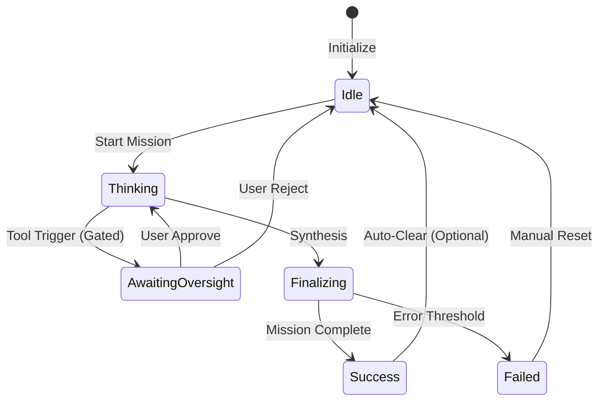

> [!IMPORTANT]
> **AI Assist Note (Knowledge Heritage)**:
> This document is part of the "Sovereign Reality" documentation.
> - **@docs ARCHITECTURE:Documentation**
> - **Failure Path**: Information drift, legacy terminology, or documentation mismatch.
> - **Telemetry Link**: Cross-reference with `execution/parity_guard.py` results.
>
> ### AI Assist Note
> Automated governance and architectural tracking.
>
> ### 🔍 Debugging & Observability
> Traceability via `parity_guard.py`.

> [!IMPORTANT]
> **AI Assist Note (Knowledge Heritage)**:
> This document is part of the "Sovereign Reality" documentation.
> - **@docs ARCHITECTURE:Documentation**
> - **Failure Path**: Information drift, legacy terminology, or documentation mismatch.
> - **Telemetry Link**: Cross-reference with `execution/parity_guard.py` results.

# 🧠 Tadpole OS: Operations Manual

> **Intelligence Level**: High-Fidelity (ECC Optimized)  
> **Status**: Verified Production-Ready  
> **Version**: 1.1.17
> **Last Hardened**: 2026-05-01 (Mythos Hardening & ACT Pass)  
> **Classification**: Sovereign  

---

## 📖 Terminology & Intelligence

To navigate the Sovereign Reality of Tadpole OS, operators must understand the core concepts that drive the swarm.

- **Alpha Node** [DEFINE: Alpha Node]: The "Lead" agent in a cluster, responsible for strategic planning and specialist recruitment.
- **Mission Cluster** [DEFINE: Mission Cluster]: A collaborative workspace grouping multiple agents toward a single high-level objective.
- **Swarm Depth** [DEFINE: Swarm Depth]: The levels of delegation from the Overlord down to terminal specialist nodes (Max: 5).
- **Neural Vault** [DEFINE: Neural Vault]: The secure, client-side encrypted repository for all provider credentials and API keys.
- **Sovereign Reality** [DEFINE: Sovereign Reality]: The high-stakes, autonomous operational environment where agents exercise agency under human oversight.

> [!TIP]
> **Complete Lexicon**: For a full technical breakdown of over 400+ system terms, refer to the [GLOSSARY.md](./GLOSSARY.md). Every term marked with a `[DEFINE:]` tag corresponds to a high-fidelity entry in the glossary.

---

## 🗺️ Operational Tiers (Table of Contents)

### Tier 1: The Operator (Interface & Mission Ops)
*For human users managing agents and missions.*
- [1. Multi-Tab Sovereign Interface](#1-multi-tab-sovereign-interface)
  - [1.1 The Multi-Tab Bar](#11-the-multi-tab-bar)
  - [1.2 Neural & Communication Interfaces](#13-neural--communication-interfaces)
  - [1.3 Sovereign Chat & Voice Sync](#131-neural-chat-command)
- [2. Primary Mission Management](#23-mission-management)
  - [2.1 Initializing Objectives](#23-mission-management)
  - [2.2 Workspace & Asset Coordination](#31-workspace-manager)

### Tier 2: The Administrator (Governance & Intelligence)
*For managing engine configuration, providers, and security.*
- [3. Intelligence Management Suite](#4-core-intelligence-management-suite)
  - [3.1 LLM & Provider Configuration](#41-ai-provider-manager)
  - [3.2 Skill & Workflow Registry](#43-skills--workflows)
- [4. System Governance & Settings](#5-system-knowledge--settings)
  - [4.1 Global Engine Parameters](#41-global-engine-parameters)
  - [4.2 Deep Reasoning & ACT Tuning](#42-deep-reasoning--act-tuning)
  - [4.3 Swarm Template Store](#53-swarm-template-store)

### Tier 3: The Architect (Observability & Protocols)
*For deep-technical analysis, debugging, and system internals.*
- [5. Sovereign Protection Hub](#security--sovereign-protection-hub)
  - [5.1 Oversight Gate & Approval Queue](#251-approval-queue)
  - [5.2 Security Dashboard & Compliance](#252-security-dashboard)
- [6. The Swarm Heartbeat (Observability)](#the-swarm-heartbeat-hub)
  - [6.1 Real-time Telemetry & Performance](#44-system-telemetry)
  - [6.2 Headless Functions & Backends](#7-headless-functions)

- [Appendix A: Technical State Machines & Diagrams](#appendix-a-technical-state-machines--diagrams)
- [Appendix B: Maintenance & Reliability](#9-maintenance--system-reliability)

---

## 1. Multi-Tab Sovereign Interface

The primary navigation system of Tadpole OS, allowing for multi-context orchestration within a single, high-performance environment. **Multi-Monitor Friendly**: All tabs can be detached into sovereign windows for distributed oversight.

> [!NOTE]
> **Runtime Governance Anchor**: All persistence paths (workspaces, memory stores, connector paths) resolve from backend `AppState.base_dir`, ensuring multi-node and local-dev deployments use the same deterministic root.

### 1.1 The Multi-Tab Bar
Located permanently at the top of the viewport (below the Header), the Multi-Tab Bar manages your active operational contexts.
- **Dynamic Contexts**: Tabs represent individual pages (Dashboard, Missions, Hierarchy, etc.).
- **Context Preservation**: Switching tabs preserves the state of each page, enabling seamless multitasking.
- **Detachable Portals**: Operators can "pop out" a tab into a native browser window for dedicated monitor orchestration by clicking the **External Link** icon revealed upon hover or selection.
- **Header Sync**: The global `PageHeader` automatically updates its tactical metrics and action controls to match the active tab.

### 1.2 Unified Tactical Header (`PageHeader`)
A persistent command surface at the top of every page.
- **Engine Status**: Real-time connectivity indicator (**🟢 ONLINE**).
- **Page-Specific Actions**: Contextual controls (e.g., "New Mission" on the Missions page).
- **Core Metrics**: High-level telemetry tailored to the active operation, synchronized via specialized hooks (`useEngineStatus`).

### 1.3 Neural & Communication Interfaces

These interfaces provide ambient awareness and direct interaction channels with the swarm.

### 1.3.1 Neural Chat Command (`Sovereign_Chat`)
The primary natural language interface for issuing directives to the swarm. It supports deep-context isolation and scope-based communication.

**Operational Scopes:**
- **Agent Scope** [DEFINE: RAG Scope]: Isolated 1:1 communication with a selected agent. Context is limited to that agent's local memory.
- **Cluster Scope** [DEFINE: Mission Cluster]: Group-level directives. All messages are tagged for the specific Mission Cluster (e.g., `#Beta`).
- **Swarm Scope** [DEFINE: Swarm Pulse]: Global broadcast. All active agents receive the packet via the unified pulse.

**Command Syntax:**

> [!TIP]
> Use targeted syntax to bypass the active scope and route directives precisely.

- **Standard Input**: Type a message and hit `Enter` to send in the active scope.
- **Targeted Agent**: Use `@AgentName <Message>` to force-route a message to a specific agent regardless of active scope.
- **Targeted Cluster**: Use `#ClusterName <Message>` to broadcast to all agents in a specific cluster.

**Interactive Elements:**
- **[Toggle] Neural Safety**: Enable to prevent agents from executing destructive tools in response to chat directives.
- **[Button] Detach Interface**: Pop out the chat into a dedicated window for multi-screen orchestration.
- **[Button] Neural Dock**: Minimize the interface into a floating, non-obtrusive "Zap" icon.
- **[Selector] Scope Tab**: Instantly switch between Agent, Cluster, and Swarm layers.
- **[Breadcrumb] Neural Lineage**: Displays the parentage/hierarchy of the currently targeted agent.

---

### 1.3.2 Voice Interface (`VoiceClient` / `Standups`)
A multimodal extension providing both ephemeral input within the chat and a dedicated "Neural Sync" screen for high-fidelity coordination.

#### 10.0.0.1 Neural Sync Interface (Screen Details)
The primary screen for managing direct voice handshakes with agents or clusters.

**Core Interface Elements:**
- **Neural Sync Header**: A high-impact display featuring a "Users" icon and a pulse-active boundary. Displays the real-time status (e.g., `ENCRYPTED LIVE CHANNEL` vs `Ready for Handshake`).
- **Target Selection Matrix**: A dedicated control box for defining the handshake destination.
    - **Toggle (Agent Node)**: Restricts the uplink to a single sovereign agent.
    - **Toggle (Mission Cluster)**: Broadcasts the audio capture to all agents assigned to a specific cluster.
    - **Handshake Selector (Dropdown)**: A precision target list for active agents or cluster IDs.
- **Biometric Audio Visualizer**: A multi-spectrum bar graph that reflects the volume and throughput of the current neural transmission.
- **Sync Command Bar**:
    - **[Button] Start/End Sync**: Large emerald/red control for opening or terminating the encrypted channel.
    - **[Button] Local Mic Capture**: Individual toggle for suppressing local audio without closing the sync channel.
- **Neural Activity Log (Live Transcript)**:
    - **Identity Attribution**: Color-coded glyphs identifying speakers (`U` for User, `A` for Agent).
    - **Sync Telemetry**: Displays `REC` (Recording) vs `IDLE` status and real-time "X is speaking..." feedback.

#### 10.0.0.1 Chat Integration
Operational controls embedded directly within the **SovereignChat** window.

- **[Button] Neural Listening (STT)**: Toggles transcription. Supports **Groq Cloud** or **Whisper (Local)**.
- **[Button] Neural Output (TTS)**: Toggles vocal responses. Supports **OpenAI Cloud** or **Piper (Local)**.
- **[Display] Neural PCM Visualizer**: A small, four-bar visualizer next to the scope readout that pulses during active agent synthesis. When using local Piper, this reflects raw PCM throughput.

### 10.0.0.1 Swarm Visualizer Handshake
The **Sovereign_Chat** is deeply integrated with the **Swarm_Visualizer**. Clicking any node in the visualizer automatically focuses that agent's mission context in the chat, allowing for instant "Telepresence" style coordination.

---

### 1.3.3 Detachable Tab Portals (`Portal_Window`)
A high-performance feature designed for multi-monitor command centers.

**Operational Features:**
- **Zero-Latency Sync**: Detached windows and components share the same JavaScript memory as the main application. Real-time data streams and agent thoughts appear in detached windows instantly.
- **Visual Consistency**: All theme settings (Zinc/Slate) and custom styling are mirrored across all windows automatically.
- **Native Window Management**: Detached tabs and sectors become native OS windows that can be resized, snapped, or moved to secondary displays.

**Interactive Controls:**
- **[Button] Detach to New Window**: Click the **External Link** icon on a tab or High-Fidelity component (like Swarm Pulse) to detach it.
- **[Button] Recall Sector (Re-attach)**: To return a detached component to the main dashboard:
    1. Click the **Return/Minimize** icon on the detached window.
    2. Or, click the **Recall Sector** button in the dashboard's "Detached" placeholder view.
    3. Or, simply close the detached browser window.

---

### 1.3.4 Lineage Stream (`Lineage_Stream`)
A real-time telemetry sidebar that visualizes the propagation of data and instructions through the neural hierarchy.

**Operational Features:**
- **Real-time Feed**: Scrollable timeline of every agent event, tool call, and system broadcast.
- **Propagation Tracking**: Visualizes the path an instruction took from the root CORE_EXECUTIVE through departments to the final agent node.
- **Transmission Payload**: Displays the raw text content of individual agent thoughts and communications.

**Interactive Elements:**
- **[Sidebar] Resizable Boundary**: Drag the left edge of the stream to expand the telemetry view.
- **[Card] Event Node**: Click any card in the stream to open the **Cinematic Depth View**.
- **[Overlay] Cinematic Depth View**: A high-density modal showing full lineage paths, agent configuration (Model/Slot), and timestamped metadata.
- **[Indicator] Pulse Waveform**: Visual feedback showing active data transmission on the neural wire.

#### 1.3.1 Cinematic Depth View
A high-fidelity analysis modal triggered by selecting any event in the Lineage Stream. It provides 360-degree observability into a single neural transmission.

**Data Panels:**
- **Neural Transmission Payload**: The focal point of the view. Displays the full text of the instruction, thought, or tool output in a high-contrast, cinematic container.
- **Propagation Lineage Path**: A horizontal breadcrumb showing the exact chain of command (e.g., `CORE_EXECUTIVE` → `ENGINEERING` → `SYSTEM_ARCHITECT`).
- **Telemetry Sidebar**:
    - **Agent Configuration**: Displays the active Model ID and the currently engaged Neural Slot (1, 2, or 3).
    - **Lineage Depth Meter**: A visual progress bar tracking the complexity of the recruitment chain.
    - **Verification Signature**: Confirming the transmission was audited by the human-in-the-loop oversight ledger.

**Interactive Controls:**
- **Workspace Manipulator**: Click and drag the header to move the modal across the neural canvas.
- **Dimensional Scaling**: Use the resize handle in the bottom-right corner to expand or contract the analysis window.
- **Node Escape**: Press `ESC` or click the 'X' to terminate the depth view and return to the primary stream.

---

## 2. Primary Mission Management

Effective swarm orchestration begins with clear objective definition and isolated workspace management.

### 2.1 Missions & Objectives (`Missions`)
Command-and-control interface for high-level goal orchestration.
- **New Mission**: Initialize sovereign objectives.
- **Mission Objective**: Terminal for defining core mission directives.
- **Assign Agents**: Strategic selection from the recruitment pool.
- **Neural Map**: SVG-rendered visualization of node collaborations.

### 2.2 Workspace & Asset Coordination (`Workspaces`)
Centralized coordination of mission-based storage paths and collaborator clusters.
- **Mission Clusters**: Shared file paths for agent departments.
- **Alpha Leadership**: Primary leader node responsible for execution.
- **Environment Detection**: Auto-scanning for active developer environments.

### 2.3 Operations Center & Hierarchy (`Ops_Dashboard`)
The central nervous system for real-time telemetry and command chains.
- **Operations Center**: Real-time agent control and engine health monitor.
- **Agent Hierarchy**: Graph-based visualization of Alpha Root -> Nexus Coordinator.
- **Scheduled Jobs**: Administrative interface for temporal mission persistence.

---

# 5. Sovereign Protection Hub

The "Sovereign Protection Hub" is the central governance and defensive layer of Tadpole OS. It ensures that every agent action is audited, authorized, and aligned with human intent.

## 5.1 Oversight Gate & Approval Queue (`Oversight`)
The governance layer for approving agent actions, auditing behavioral drift, and monitoring the swarm's security posture.

### 5.1.1 Approval Queue
- **[List] Pending Actions:** Tool calls blocked by the kernel awaiting manual user confirmation. This includes tools used by agents with the **"Requires Oversight"** flag enabled, as well as globally protected operations.
- **[Button] Approve / Reject:** Permits or blocks the specific skill execution.

### 5.1.2 Security Dashboard
A high-fidelity monitoring surface for the system's defensive layers.
- **[Gauge] Budget Quotas**: Real-time visualization of USD expenditure vs. persistent daily/weekly limits.
- **[Metric] Merkle Integrity Score**: A real-time safety score (0-100%) indicating the state of the cryptographic audit chain. A score < 100% indicates audit link corruption.
- **[Alert] RAM Pressure Monitor**: Visual warning systems for system and process memory usage. Alerts when the engine approaches OOM (Out Of Memory) thresholds.
- **[Indicator] Sandbox Awareness**: Displays whether the engine is running in **Docker**, **Kubernetes**, or a **Virtual Machine**.
- **[Status] Shell Safety Scanner**: Indicators for proactive detection of secret leakage in scripts.
- **[Metric] Swarm Health Monitor**: Detailed success/failure ratios, last failure timestamps, and manual intervention controls for every active node.

**Emergency Controls:**

> [!CAUTION]
> These actions are non-reversible and impact current mission persistence.

- **[Button] HALT AGENTS:** Suspends all active agent reasoning cycles immediately while keeping the engine online.
- **[Button] KILL ENGINE:** Triggers a full backend process shutdown (requires `SHUTDOWN` string confirmation).

### 5.1.3 Swarm Health Monitor & Troubleshooting
When an agent experiences consecutive failures (e.g., API throttling or network faults), the engine automatically tracks the `failureCount`. 

**Health States:**
- **Healthy (🟢)**: 0 failures. Agent is operating at peak efficiency.
- **Degraded (🟠)**: 1-2 failures. System is monitoring for persistent faults.
- **Throttled (🔴)**: 3+ failures. The agent is automatically suspended to prevent budget waste or recursive failure loops.

**Manual Intervention:**
Operators can troubleshoot failures by clicking the **Neural Health Shield** on any agent card.
- **Diagnostics**: View the exact failure count and the timestamp of the last incident.
- **Reset Agent**: Click **"Reset Agent"** to clear the failure count and return the agent to **Idle** status. This is the primary recovery path for resolving temporary connectivity issues or clearing throttled states without restarting the engine.

## 5.2 Dynamic Policy & Security Protocols
Tadpole OS manages high-level operational parameters via a dynamic SQLite-backed registry.

### 5.2.1 NeuralVault Security
The Tadpole OS employs the **NeuralVault** design pattern to protect sensitive AI provider credentials (API Keys).
- **Encryption Standard**: Industry-standard **AES-256-GCM** client-side encryption.
- **Master Key Logic**: All keys are encrypted using a user-defined **Master Passphrase**. 
- **Secure Context**: SubtleCrypto required. Access via `localhost` or `HTTPS`.

### 5.2.2 Merkle Audit Ledger
- **Merkle Ledger**: A cryptographically linked, tamper-evident audit trail of all actions.
- **Non-Repudiation**: Every tool call is SHA-256 linked to its predecessor, ensuring a verifiable history of swarm decisions.

---

## 3. Communications & Assets

These pages form the "Comms & Assets" section of the primary navigation sidebar.

### 3.1 Workspace Manager (`Workspaces`)
Centralized coordination of mission-based storage paths, collaborator clusters, and code repository synchronization.

**Operational Features:**
- **Mission Clusters**: Collaborative workspaces that group agents by department (Engineering, Product, etc.) into shared file paths.
- **Alpha Node Leadership**: Every cluster identifies a primary leader node (marked with a gold halo) responsible for overall mission execution.
- **Task Branching Workflow**: Agents propose changes to the cluster via temporary "Task Branches" rather than committing directly to the root path.
- **Environment Detection**: Automatic scanning of the workspace for active developer environments (VS Code, Kubernetes Nodes, Headless Servers).

**Interactive Elements:**
- **[List] Active Cluster Section**: Displays the cluster name, assigned department, and the root file path (e.g., `/workspaces/strategic-command`).
- **[Grid] Collaborator Roster**: Visual list of all agent nodes assigned to the cluster.
- **[View] Cluster Root Telemetry**: Displays the active storage footprint (e.g., `3.4GB ACTIVE`) and synchronization status.
- **[Log] Active Task Branches**: A live queue of proposed merge requests awaiting human (or Alpha Node) approval.
    - **[Button] Approve Branch**: Merges the proposed changes into the cluster's primary mission path.
- **[Button] Reject Branch**: Discards the proposed changes and notifies the originating agent.
- **[Section] Legacy Agent Silos**: Displays orphaned agent nodes operating outside of collaborative mission clusters.

---

## 4. Core Intelligence Management Suite
 
 These pages form the "Intelligence" section of the primary navigation sidebar, managing the heavy lifting of provider connections, agent nodes, and autonomous skills.

### 4.1 AI Provider Manager (`ModelManager`)
The administrative vault for credentials and model node provisioning.

> [!IMPORTANT]
> Requires a Master Passphrase to unlock. Keys are never displayed in plaintext after initial commit.

**Interactive Elements:**
- **[Input] Master Passphrase:** Hardware-accelerated password field required to unlock the Neural Vault and edit keys.
- **[Button] Commit Authorization:** Dispatches the handshake to the crypto-worker to decrypt provider configurations.
- **[Button] Emergency Vault Reset:** Located at the bottom of the unlock screen. Use this if the master passphrase is lost or if configurations are corrupted. **Warning: This purges all encrypted keys.**
- **[Button] Add Provider:** Register a new AI provider (e.g., OpenAI, Anthropic, Local Engine).
- **[Card] Provider Config:** Click to open a side-panel for editing API URLs and Security Keys.
- **[Table] Intelligence Inventory:** List of all available model nodes.
- **[Button] Add Node:** Provision a new specific model (e.g., `gpt-4o`, `llama-3.3`) to the inventory.
- **[Toggle] Show TPM Limits:** Expands the row to reveal Rate Limits (Requests/Min, Tokens/Day).

#### 4.1.1 Secure Context Requirements
The NeuralVault utilizes the **SubtleCrypto API**, which requires a **Secure Context**.
- **Local Access**: `localhost` and `127.0.0.1` are considered secure by default.
- **Remote Access**: Accessing Tadpole OS via a remote IP address (e.g. `http://10.0.0.1:5173`) will disable cryptographic functions. You MUST use **HTTPS** for remote orchestration.

#### 4.1.1 Provider Configuration Panel (`ProviderConfigPanel`)
A granular administrative panel for managing individual AI provider infrastructure.

**Interactive Elements:**
- **Provider Identity Header**: Editable Name and Icon. Features the unique Internal ID for node tracking.
### 3.1.2 Automated Model Discovery (IMR-01)
Tadpole OS implements automated feature inference for all discovered models.
- 👁️ **multimodal**: Supports image/video input.
- 🛠️ **tools**: Optimized for function calling.
- 🧠 **reasoning**: Internal chain-of-thought (o1, DeepSeek-R1).

### 3.2.1 Agent Node Configuration (`AgentConfigPanel`)
Fine-grained control over cognitive state, model assignment, and governance.
- **Cognition**: Toggle skills and working memory persistence.
- **Governance**: Set personal budget caps and "Requires Oversight" gates.
- **Identity**: Manage model, provider, and temperature per node.
- **Mythos Configuration**: Fine-tune **Reasoning Depth** (1-16 turns) and **ACT Threshold** (Halting confidence) for the Recurrent Intelligence Engine.

---

### 6.5 Local Swarm Orchestration
Tadpole OS enables decentralized, local-first agent swarms.
- **Swarm Discovery (mDNS)**: Zero-configuration Bunker discovery on your LAN.
- **Resource Awareness**: View total VRAM/RAM capacity per node for intelligent routing.

---

### 4.6 SME Data Intelligence
The data intelligence layer provides background synchronization and structured execution for SME environments.

**Operational Features:**
- **[Phase 1] Multi-Factor Scoring (MFS)**: Automatic three-signal retrieval (Vector + Mission Affinity + Recency) in the `search_mission_knowledge` tool. Implements **MEM-01** security hardening via `escape_lancedb_string_literal` to prevent predicate-based injection during filtering.
- **[Phase 2] Data Connectors**: Configured in the `AgentConfigPanel` (Memory Tab). Sets the `IngestionWorker` to crawl external directories (e.g., `fs` type) every `SME_SYNC_INTERVAL_MINS`. Monitored via the SyncManifest status UI.
- **[Phase 3] Deterministic Workflows**: Markdown SOPs in `data/workflows/` that override the standard agent loop. Visible in the capabilities grid, these force zero-deviation execution.
- **[Phase 4] Layout-Aware Parser**: Background parsing that maps document structure (`.csv` rows, `.md` headers) to semantic chunks, ensuring context is preserved in the LanceDB vector store.

---

## 5. System Knowledge & Settings

### 5.1 Knowledge Base (`Docs`)
A high-fidelity research interface providing access to the Tadpole OS semantic core and technical documentation.

**Interactive Elements:**
- **[Input] Search Docs**: Full-text search across categorized repositories (Engineering, Product, Executive).
- **[Viewer] Markdown Interface**: Reader for system architecture, SOPs, and project documentation.

---

### 5.2 System Configuration (`Settings`)
Global engine parameters and UI preferences.

**Interactive Elements:**
- **[Input] Engine Connection**: Configures the API URL (Default: `http://localhost:8000`) and the **Neural Engine Access Token** (formerly Neural Token) required for secure backend handshakes.
- **[Select] UI Preferences**: Controls Theme (Zinc/Slate) and Density (Compact/Comfortable).
- **[Section] Template Ecosystem (New)**:
    - **[Button] Open Template Store**: Access the in-app marketplace to download pre-configured, industry-specific agent swarms directly into your workspace.
    - **[Info] GitHub Native Registry Status**: Verify the connection latency between your instance and the central GitHub Template Repository.
- **[Section] Agent Defaults**:
    - **Default Intelligence Model**: The baseline model (e.g., GPT-4o) assigned to new agents or unconfigured nodes.
    - **Default Temperature**: A slider (0.0 to 2.0) defining the default creativity level for the swarm.
- **[Toggle] Auto-Approve Safe Skills**: Global bypass for low-risk oversight items (Reasoning, Search, Weather).
- **[Toggle] Privacy Shield (Shield)**: High-security "Hard Gate" that blocks all external cloud traffic at the engine level. 
- **[Static] Environment Authority**: Displays the current `base_dir` (Workspace Root) being used by the engine for sovereign persistence.
- **[Section] Swarm Architecture & Limits**:
    - **[Slider] Max Active Agents**: Hard limit on concurrent neural nodes across all clusters.
    - **[Slider] Max Mission Clusters**: Threshold for simultaneous mission branches.
    - **[Slider] Max Recruitment Depth**: Controls the allowed levels of recursive agent delegation.
    - **[Input] Max Task Token Limit (Tokens)**: Precision threshold for individual instructions using native BPE tokenization.
    - **[Input] Base Mission Budget (USD)**: Initial fiscal allocation for newly initialized missions.

#### 5.2.1 Administration & Throttle Mapping
For headless environments or high-scale orchestration, the following environment variables override UI-set defaults and define hard system throttles:

| UI Control | Environment Variable | Default | Impact |
|:---|:---|:---|:---|
| Auto-Approve Safe Skills | `AUTO_APPROVE_SAFE_SKILLS` | `true` | Bypasses oversight for low-risk tool calls. |
| Max Active Agents | `MAX_AGENTS` | `50` | Prevents RAM exhaustion from excessive node provisioning. |
| Max Mission Clusters | `MAX_CLUSTERS` | `10` | Caps the number of independent mission branches. |
| Max Recruitment Depth | `MAX_SWARM_DEPTH` | `5` | Prevents "Agent Storms" (recursive runaway spawning). |
| Max Task Token Limit | `MAX_TASK_LENGTH` | `32768` | Prevents runaway inference costs on large contexts. |
| Base Mission Budget | `DEFAULT_AGENT_BUDGET_USD` | `1.0` | Initial safety gate for new agent expenditure. |
| Workspace Root | `WORKSPACE_ROOT` / `base_dir` | `.` | Absolute path to the project root used for all persistence (SQLite, registries). |

### 4.2 Deep Reasoning & ACT Tuning

The Mythos Engine allows agents to perform recurrent internal monologues. For complex research tasks, operators should tune these parameters to balance depth with efficiency:

1.  **Reasoning Depth (1-16)**:
    - **Levels 1-4**: Standard operations. Good for deterministic tool calls.
    - **Levels 5-12**: Strategic planning. Required for multi-step engineering tasks.
    - **Levels 13-16**: Infinite exploration. Use only for open-ended research (Warning: High latency).
2.  **ACT Threshold (0.0 - 1.0)**:
    - Set higher (e.g., `0.98`) to force the agent to be extremely certain before halting.
    - Set lower (e.g., `0.80`) for faster responses in ambiguous tasks.
3.  **Monologue Hygiene**: 
    - The engine automatically summarizes long reasoning chains to prevent context overflow. No manual intervention is required for missions of high depth.

---

### 4.3 Swarm Template Store
 (`TemplateStore`)
The in-app marketplace for discovering and deploying industry-specific agent swarms natively via the GitHub Template Registry.

**Operational Features:**
- **Swarm Discovery**: Search and filter the global registry by industry (Legal, Healthcare, SaaS) and company size (Seats).
- **GitHub Native Sync**: Templates are fetched in real-time from the official `Tadpole-OS-Industry-Templates` repository.
- **Dimensional Preview**: Before installation, operators can perform a deep audit of the `swarm.json` blueprint to verify agent roles, cognitive workflows, and skill requirements.
- **Sovereign Installation**: High-speed hot-loading of the entire swarm hierarchy directly into the active neural workspace.

**Interactive Elements:**
- **[Button] Open Template Store**: (In Settings) Navigates to the discovery surface.
- **[Button] Pre View Swarm Configuration**: Triggers the audit modal for a selected template.
- **[Modal] Swarm Blueprint View**: 
    - **Configuration Source**: Displays the raw `swarm.json` data for transparency.
    - **Security Status**: Confirms Sapphire Shield verification for the template's skill manifest.
- **[Button] Install Configuration to Tadpole OS**: Finalizes the handshake and deploys the agents to the engine.

#### 5.3.1 Local Sovereign Kits (SME Suite)
For offline or high-security deployments where external registry access is restricted, Tadpole OS includes a suite of local **Sovereign Starter Kits**.

- **Marketing & Growth ("Artemis")**: For strategy and content automation.
- **Customer Success & Triage ("Beacon")**: For feedback analysis and support.
- **Finance & Compliance ("Ledger")**: For autonomous auditing.

These kits are located in the `starter_kits/` directory. See the [Starter Kits Guide](./STARTER_KITS.md) for the current built-in kits and workflows.

---

---

---

# 5. Sovereign Protection Hub

Managed by the **Security Dashboard**, this tier enforces the Sapphire Shield defensive protocols.

## 5.1 Oversight Gate & Approval Queue (`Oversight`)
The governance layer for approving agent actions and auditing behavioral drift.
- **Approval Queue**: Tool calls blocked by the kernel awaiting manual user confirmation.
- **Merkle Ledger**: A cryptographically linked, tamper-evident audit trail of all actions.
- **Shell Safety Scanner**: Proactive detection of secret leakage in scripts.

## 5.2 Dynamic Policy & NeuralVault Security
- **NeuralVault**: AES-256-GCM client-side encryption for API keys (SubtleCrypto).
- **Session Locking**: Inactivity auto-lock (30 mins) and manual "Deep Freeze" controls.
- **Budget Quotas**: Persistent daily/weekly limits in USD with auto-halt triggers.

---

# 6. The Swarm Heartbeat Hub (Observability)

## 6.1 God View (Swarm Visualizer)
High-performance force-graph visualization of the swarm's topology.
- **Live Binary Pulse**: Driven by a 10Hz MessagePack stream.
- **Agent Telepresence**: Click nodes to focus agent chat contexts.

## 6.2 Neural Footprint Monitoring (`CommandTable.tsx`)
A high-density observability matrix for compute usage and interaction costs.
- **Instruction/Response Logs**: Live stream of every model completion.
- **Latency Monitor**: Precision execution time in milliseconds.

## 6.3 Performance Analysis & Benchmarks
- **Benchmarking**: Standardized tests for Runner, DB, and Rate-Limiter subsystems.
- **SME Sync**: Tokia-spawned ingestion workers monitoring local data sources.

---

# Appendix A: Technical State Machines & Diagrams

### Tadpole OS: Operational State Machine
The following state machine defines the high-level cognitive and interface states of the Sovereign Interface.

---

# Appendix B: Maintenance & Reliability

### B.1 Model File Management
System-level models (Search, TTS, STT) are managed within the `data/models/` directory. 
- **Local Embedding Engine**: Default model: `bge-small-en-v1.5.onnx`.
- **Customization**: Set `OLLAMA_MODELS` to relocate Swarm LLM storage.

### B.2 Database Hygiene
- **SQLite (`tadpole.db`)**: Stores agent configurations and logs.
- **LanceDB (`memory.lance`)**: High-dimensional vector embeddings. 
- **Orphan Sweeping**: Background task automatically prunes temporary mission directories.

### B.3 Autonomic Recovery (OBLITERATUS)
The engine implements **Recursive Quantization Fallback**. If an agent receives an OOM error, it automatically retries with lower quantization (e.g., `:q4_K_M`).

[//]: # (Metadata: [OPERATIONS_MANUAL])

[//]: # (Metadata: [OPERATIONS_MANUAL])
