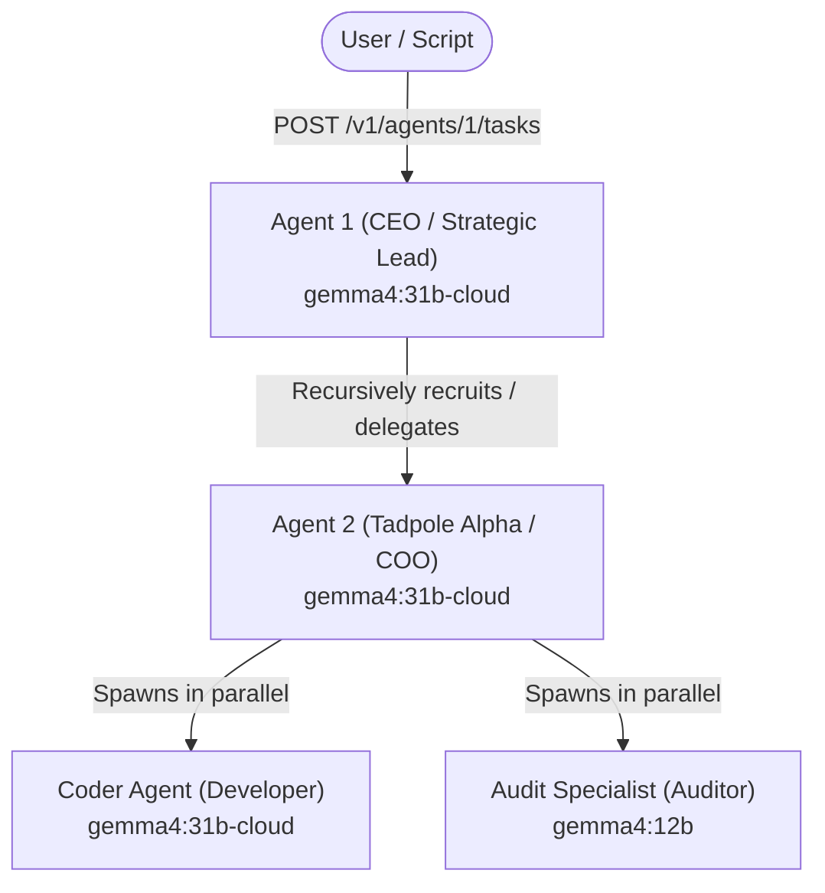

> [!IMPORTANT]
> **AI Assist Note (Knowledge Heritage)**:
> This document is part of the "Sovereign Reality" documentation.
> - **@docs ARCHITECTURE:Documentation**
> - **Failure Path**: Information drift, legacy terminology, or documentation mismatch.
> - **Telemetry Link**: Search `[token_telemetry_mission]` in audit logs.
>
> ### AI Assist Note
> Token Telemetry Verification Swarm
>
> ### 🔍 Debugging & Observability
> Traceability via `parity_guard.py`.

# Token Telemetry Verification Swarm

This document details a multi-agent validation mission designed to verify the fidelity and propagation of token consumption and cost metrics throughout the Tadpole OS codebase.

---

## 1. Swarm Architecture & Mission Design

This mission runs a **4-agent cluster** structured in a hierarchical command hierarchy:



### The Mission Objective
> *"Perform a multi-agent token telemetry validation audit. Delegate task analysis to Tadpole Alpha (ID: 2). Instruct Tadpole Alpha to spawn coder to draft a documentation summary of token tracking, and spawn audit_specialist to verify the database schema of token tracking. Ensure they return their findings in a synthesized report."*

---

## 2. Token Propagation Flow

When the mission runs, token consumption propagates from the LLM provider to the SQLite database and finally to the React UI:

### Step A: Provider Interaction & Turn Usage
Every model call (Ollama, Gemini, OpenAI, etc.) returns a response containing token usage:
- `input_tokens` (prompt size)
- `output_tokens` (completion size)
- `total_tokens` (sum of both)

### Step B: Finalization & Persistence
1. The **Swarm Dispatcher** (defined in [dispatcher.rs](file:///d:/TadpoleOS-Dev/server-rs/src/agent/runner/swarm/dispatcher.rs)) manages execution loops.
2. Upon completion of each agent's execution turn, [finalize.rs](file:///d:/TadpoleOS-Dev/server-rs/src/agent/runner/finalize.rs) is called:
   - **Accumulates Tokens**: `agent.economics.tokens_used += u.total_tokens`
   - **Calculates Cost**: Using pricing models defined in `server-rs/src/agent/rates.rs` based on model ID, updates `agent.economics.cost_usd`.
   - **DB Persistence**: Saves the updated record to the SQLite database `data/tadpole.db` under the `agents` table (via `save_agent_db`).
   - **Mission Aggregation**: Updates the `mission_history` table's `cost_usd` column (via `update_mission` in [mission.rs](file:///d:/TadpoleOS-Dev/server-rs/src/agent/mission.rs)).

### Step C: API Endpoints Delivery
The backend exposes the updated state through these REST endpoints:
- `GET /v1/agents` returns a JSON array of all registered agents containing:
  ```json
  {
    "id": "coder",
    "tokens_used": 430941,
    "cost_usd": 0.928362,
    "input_tokens": 124500,
    "output_tokens": 306441,
    ...
  }
  ```
- `GET /v1/agents/{id}` returns the details of a single agent.
- `GET /v1/agents/graph` returns the active mission structure and telemetry.

### Step D: Frontend React UI Integration
1. The frontend React app queries the endpoints and triggers reactive state updates.
2. The [useDashboardData](file:///d:/TadpoleOS-Dev/src/hooks/use_dashboard_data.ts) hook fetches the agent registry into the Zustand `agent_store`.
3. It performs a reactive aggregation (reduce) over the agents:
   - `total_cost = agents.reduce((acc, curr) => acc + (curr.cost_usd || 0), 0)`
   - `total_tokens = agents.reduce((acc, curr) => acc + (curr.tokens_used || 0), 0)`
4. The [Ops_Dashboard.tsx](file:///d:/TadpoleOS-Dev/src/pages/Ops_Dashboard.tsx) renders these values in key telemetry cards at the top of the command panel.

---

## 3. How to Run the Telemetry Verification

### Option A: Run via Verification Script (Automated)
Run the automated validation tool to inspect starting values, dispatch the mission, poll for progression, and display the final telemetry updates:

```powershell
python execution/verify_token_propagation.py
```

### Option B: Run via UI (Manual)
1. Navigate to the **Missions Board** in the UI.
2. Create or select a cluster named `Telemetry Audit Swarm`.
3. Assign the following agents to the cluster:
   - **Agent of Nine** (ID: `1`) - Configure as the **Alpha Node** (Orchestrator).
   - **Tadpole Alpha** (ID: `2`)
   - **coder**
   - **audit_specialist**
4. Paste the **Mission Objective** text (from Section 1) into the objective input field.
5. Click **Run Mission**.
6. Switch to the **Ops Dashboard** to see the real-time update of `Total Cost` and `Total Tokens` as the agents execute.

[//]: # (Metadata: [token_telemetry_mission])
