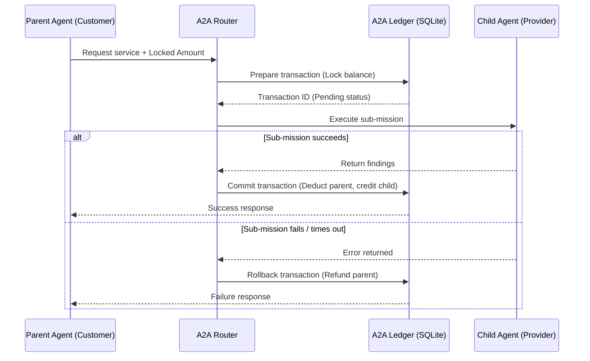

# 💰 Agent-to-Agent (A2A) Economics Guide

Tadpole OS integrates a decentralized **Agent-to-Agent (A2A) Economic Layer** that enables autonomous agents within a swarm to pay each other for specialized services. This localized micro-economy enforces resource constraint management, limits runaway execution costs, and allows agents to lease tool-access or sub-agent expertise.

---

## 1. Core Economic Concept

Instead of treating the entire swarm as a single unbounded token-consuming entity, Tadpole OS allocates a specific **USD Budget** to a project mission.
- When an agent (the customer) needs a specialized capability (e.g. AST blast-radius parsing or a deep semantic web search), it can recruit a child agent (the provider) that owns that capability.
- The child agent charges a fee (computed dynamically or set statically as a service rate).
- The parent agent pays this fee from its allocated budget.
- This creates an incentive-based optimization loop where agents prioritize cost-efficient execution paths.

---

## 2. Two-Phase Commit (2PC) Transaction Protocol

To prevent double-spending, orphaned fund allocations, or race conditions during asynchronous swarm executions, the transaction layer implements a strict **Two-Phase Commit (2PC)** protocol.

### The Two Phases:

1. **Prepare Phase (`prepare_transaction`)**:
   - The ledger creates a transaction log with `Pending` status.
   - The requested amount is locked and deducted from the parent agent's available budget.
   - If the parent's budget is insufficient, the transaction is immediately rejected.
2. **Commit or Rollback Phase**:
   - **Commit (`commit_transaction`)**: On successful sub-mission execution, the locked amount is permanently transferred to the child agent's balance, and the status changes to `Committed`.
   - **Rollback (`rollback_transaction`)**: If the sub-mission fails, throws a validation error, or is aborted, the locked amount is refunded back to the parent agent's available budget, changing status to `RolledBack`.

> [!IMPORTANT]
> **Graceful Teardown Rollbacks**:
> In the event of system interruptions, SIGINT, or graceful engine shutdown, any transaction remaining in a `Pending` state is automatically rolled back on engine teardown to ensure database budget consistency.

---

## 3. Mailbox Protocol and Message Routing

Agent-to-agent communication is structured around **Mailboxes** and routed via the **A2A Router**:
- **Mailboxes (`a2a_mailbox.rs`)**: Every active agent has a secure message mailbox to queue incoming task requests, coordination status updates, and payment validation challenges. In alignment with standard A2A specifications, envelopes sent via mailboxes preserve the model's active reasoning traces and list of file artifacts.
- **Routing & Budget Guards (`a2a_router.rs`)**: Handles transaction routing and evaluates daily spend limit caps across Economic Zones (Dev, Staging, Prod). The global `PaymentRouter` checks the limit by summing up both confirmed expenditures and pending locked amounts from `transaction_locks` before initiating the 2PC prepare sequence.

---

## 4. SQLite Transaction Ledger

All financial transactions are persisted to the local database in the `transaction_ledger` table. This provides a non-repudiable audit trail of all swarm expenditures.

### Database Schema Reference

| Field | Type | Description |
|:---|:---|:---|
| `id` | TEXT | Unique transaction identifier (UUID) |
| `transaction_type` | TEXT | Type of transaction (`TRANSFER`, `BUY`, `SELL`, `FEE`) |
| `buyer_address` | TEXT | Address of the paying agent (`local:agent_id` or `web3:address`) |
| `seller_address` | TEXT | Address of the receiving agent (`local:agent_id` or `web3:address`) |
| `asset_id` | TEXT | Optional reference to a specific registered asset |
| `amount` | INTEGER | Transaction amount (u64 representation, e.g., micro-USDC) |
| `status` | TEXT | `PENDING`, `COMMITTED`, or `ROLLED_BACK` |
| `audit_signature` | TEXT | Cryptographic signature of the transaction hash |
| `created_at` | INTEGER | Unix epoch timestamp (seconds) |

---

## 5. Security & Observability

- **USD Burn telemetry**: Operators can monitor real-time transaction flows from the **Cost Monitoring** tab in the dashboard.
- **Circuit Breakers**: If a sub-agent executes too many failing paid tasks, the router flags it as degraded, preventing further financial drain.

[//]: # (wiki-page: Administration/A2A-Economics)

[//]: # (Metadata: [wiki-admin])
