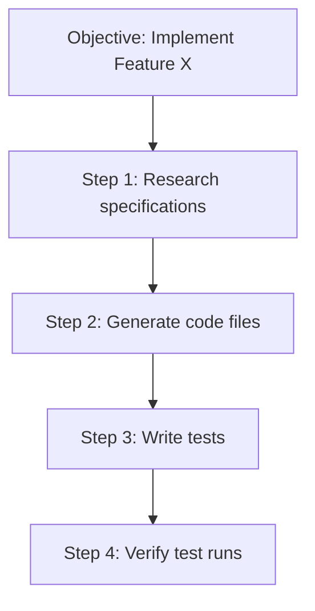

# 🐝 AI-Tadpole-OS Swarm Orchestration Guide

This guide details the swarm orchestration features built into **AI-Tadpole-OS**, focusing on Conductor DAG planning, topological task scheduling, context sandboxing, and the Completions Gateway.

---

## 1. Conductor DAG Planning & Scheduling

For complex objectives, AI-Tadpole-OS breaks tasks down into structured execution steps, represented as a **Directed Acyclic Graph (DAG)**.

### Topological Scheduling
To execute steps in the correct logical sequence, the **Conductor** uses a **Topological Sort** (`topological_sort_conductor_steps`) on step dependencies:
- **Dependency Tracking**: Steps are scheduled to run in parallel if they share no dependencies, or in series if they rely on predecessor results.
- **Cycle Protection**: Kahn's/DFS sorting verifies that there are no circular task loops (e.g. Step A depending on Step B, which depends on Step A), blocking execution early to protect compute budget.

---

## 2. Heuristic Fast-Path (System 1)

For simple, single-turn user queries, the orchestration engine initiates a **Heuristic Fast-Path** routing (analogous to cognitive System 1 thinking):
- **Query Complexity Check**: Checks if the query can be resolved in a single step (e.g., "what is the current budget status?").
- **Gate Bypass**: If classified as simple, the request bypasses the hierarchical Sentinel Gate and spawns a single-turn reasoning process, reducing query latency by up to 80%.

---

## 3. OpenAI Completions Gateway

AI-Tadpole-OS exposes an OpenAI-compatible Completions API (`POST /v1/agents/chat/completions`) directly to the Swarm:
- **Synchronous Swarming**: External developer clients can issue standard chat completion requests, targeting a specific Agent ID as the "model".
- **Transparent Execution**: The gateway receives the prompt, spins up the stateful `AgentRunner` to orchestrate tools or sub-agents, and returns the final synthesized result inside standard OpenAI choice objects.

---

## 4. Context Sandboxing (`visible_transcript`)

To scale swarm execution without hitches or token bloat, child sub-agents run in a strict information sandbox:
- **Transcript Stripping**: The parent agent's internal monologue, tool-invocation logs, and technical telemetry are stripped out before prompting the child.
- **Observation Injection**: The child is provided only with its direct instructions and the `visible_transcript` of verified observations, preventing prompt clutter and protecting sensitive parent deliberations.

---

## 5. Builder-Debugger Slot Swapping

When specialist agents execute files, write code, or run commands, failures can occur. AI-Tadpole-OS handles this via automated **Model Slot Swapping**:
- **Three-Slot Configuration**: Each agent is configured with Primary (Builder), Secondary (Debugger), and Tertiary model slots.
- **Auto-Swap on Fault**: If a tool fails (e.g., cargo compilation error, test suite failure, or validation error), the runner automatically swaps the active execution slot to the Secondary (Debugger) slot.
- **Resolution Loop**: The debugging model parses the error, edits the target files to fix the issue, verifies the results, and returns control back to the Primary slot.

[//]: # (wiki-page: Operations/AI-Tadpole-OS-Orchestration)

[//]: # (Metadata: [wiki-ops])
