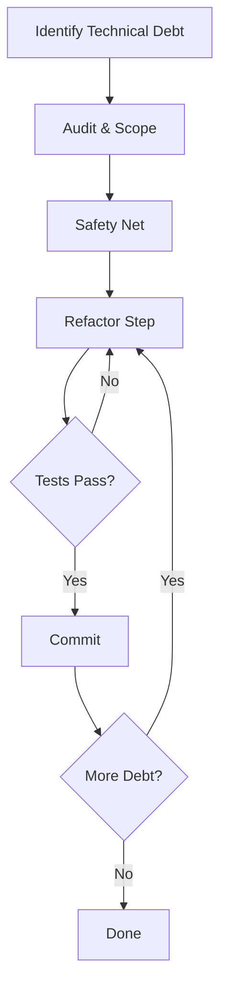

> [!IMPORTANT]
> **AI Assist Note (Knowledge Heritage)**:
> This document is part of the "Sovereign Reality" documentation.
> - **@docs ARCHITECTURE:Core**
> - **Failure Path**: Information drift, legacy terminology, or documentation mismatch.
> - **Telemetry Link**: Cross-reference with `execution/parity_guard.py` results.
>
> ### AI Assist Note
> Automated governance and architectural tracking.
>
> ### 🔍 Debugging & Observability
> Traceability via `parity_guard.py`.

> [!IMPORTANT]
> **AI Assist Note (Knowledge Heritage)**:
> This document is part of the "Sovereign Reality" documentation.
> - **@docs ARCHITECTURE:Core**
> - **Failure Path**: Information drift, legacy terminology, or documentation mismatch.
> - **Telemetry Link**: Cross-reference with `execution/parity_guard.py` results.

---
name: refactor-plan
description: Workflow for modernizing legacy codebases safely.
---

# Refactoring Protocol

Refactoring is the process of improving the internal structure of code without changing its external behavior. It is essential for long-term project health.

## Architecture

### 1. Audit & Scope
Identify the "Rot". Is it a monolithic class? Spaghetti dependencies? Deprecated libraries? Define the *boundary* of the refactor.

### 2. Safety Net
**CRITICAL**: Ensure there are high-coverage tests for the code being changed. If not, write "Characterization Tests" (tests that lock in current behavior, even bugs) first.

### 3. The Refactor
Make small, incremental changes (e.g., "Extract Method", "Rename Variable"). Commit often.

## When to Use
- **Paying Debt**: Allocating 20% of sprint time to cleanup.
- **Pre-Feature**: Cleaning up an area before adding complexity to it.

## Operational Principles
1. **Boy Scout Rule**: Leave the code cleaner than you found it.
2. **Don't Mix Features**: Do not add new features while refactoring.
3. **Tests are Holy**: If you break a test, you broke the refactor.
