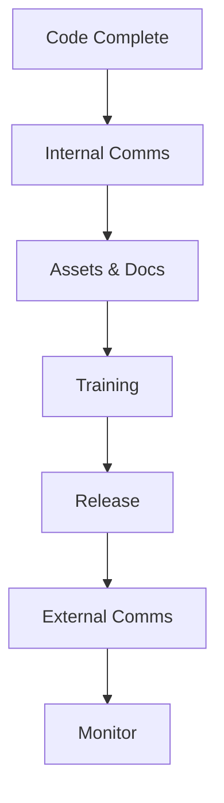

> [!IMPORTANT]
> **AI Assist Note (Knowledge Heritage)**:
> This document is part of the "Sovereign Reality" documentation.
> - **@docs ARCHITECTURE:Core**
> - **Failure Path**: Information drift, legacy terminology, or documentation mismatch.
> - **Telemetry Link**: Cross-reference with `execution/parity_guard.py` results.
>
> ### AI Assist Note
> Automated governance and architectural tracking.
>
> ### 🔍 Debugging & Observability
> Traceability via `parity_guard.py`.

> [!IMPORTANT]
> **AI Assist Note (Knowledge Heritage)**:
> This document is part of the "Sovereign Reality" documentation.
> - **@docs ARCHITECTURE:Core**
> - **Failure Path**: Information drift, legacy terminology, or documentation mismatch.
> - **Telemetry Link**: Cross-reference with `execution/parity_guard.py` results.

---
name: feature-launch
description: Go-to-market coordination for releasing new features.
---

# Feature Launch Protocol

Launching a feature is more than just deploying code. It requires coordination across Support, Marketing, and Sales.

## Architecture

### 1. Internal Comms
Notify the company *before* the customers. No surprises for Sales/Support.

### 2. Assets & Docs
- **Help Center**: Write the FAQ.
- **Marketing**: Blog post, screenshots, video.
- **Sales**: Battle cards (how to sell it).

### 3. Training
Walk through the feature with the Support team so they can answer tickets.

### 4. Release & Comms
Flip the feature flag. Send the email/tweet.

## When to Use
- **Major Features**: Anything user-facing.

## Operational Principles
1. **One Voice**: Messaging must be consistent across blog, email, and sales decks.
2. **Soft Launch**: Ideally, beta test with friendly users before the big announcement.
3. **Success Metrics**: Define *before* launch what success looks like (e.g., "10% adoption in week 1").
